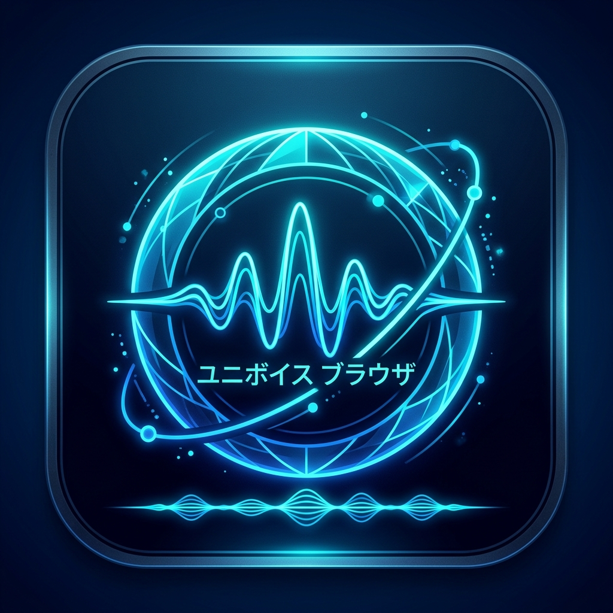
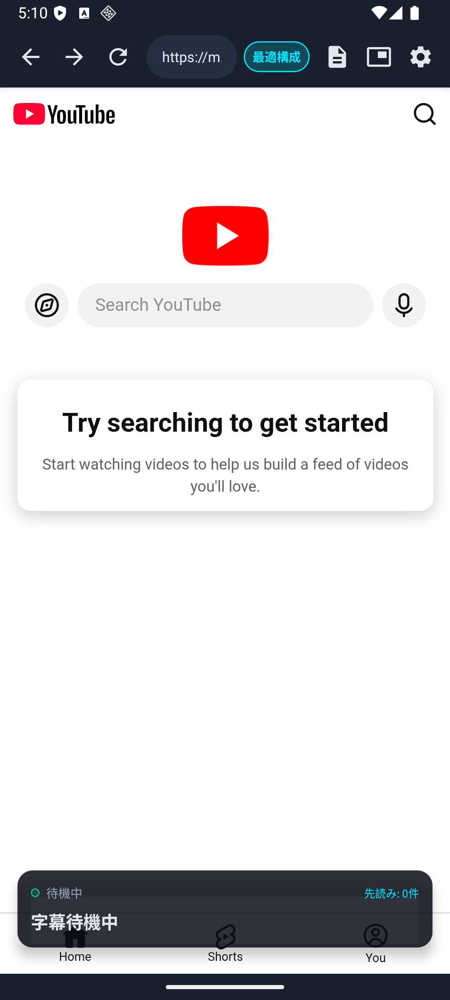
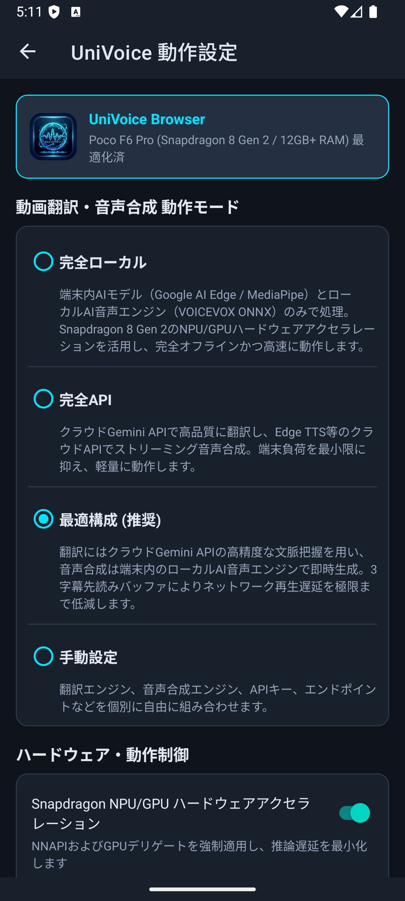
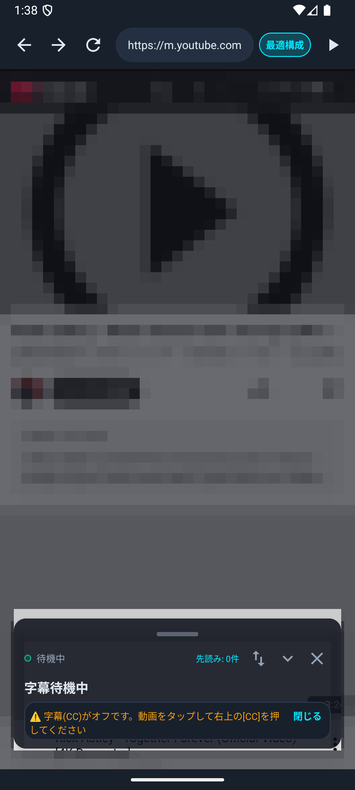
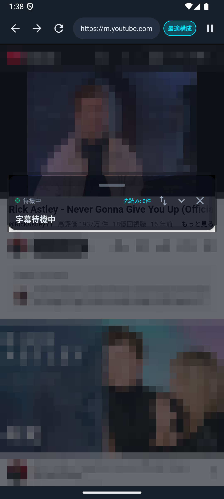
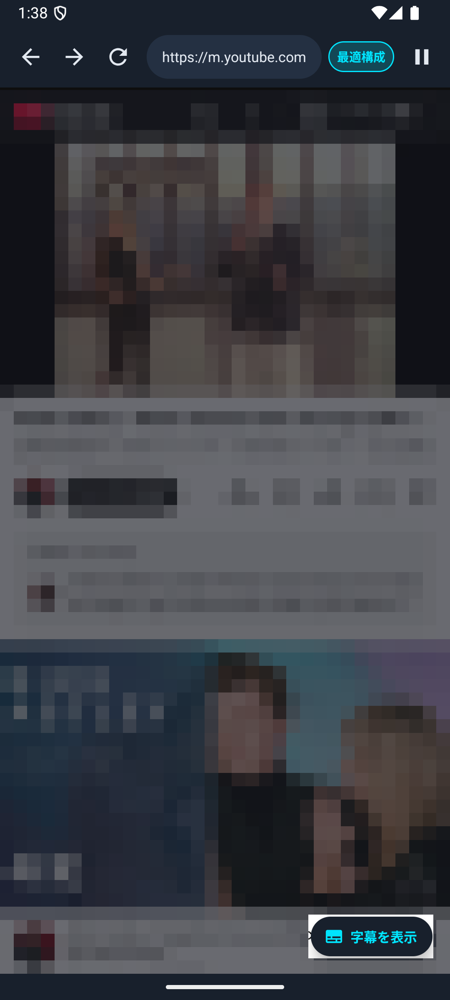
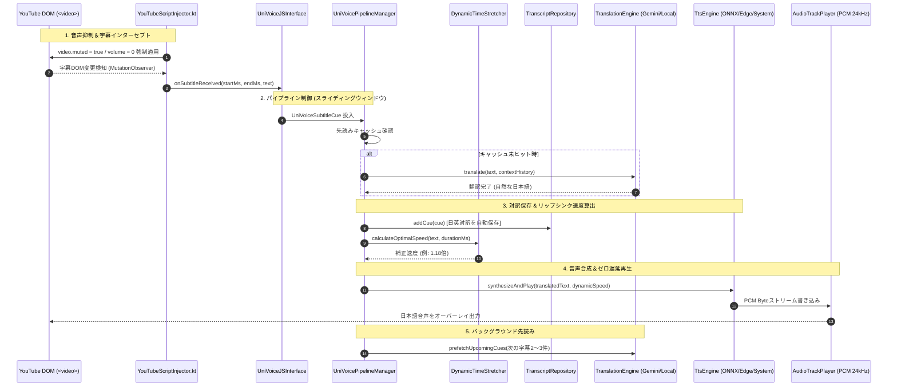
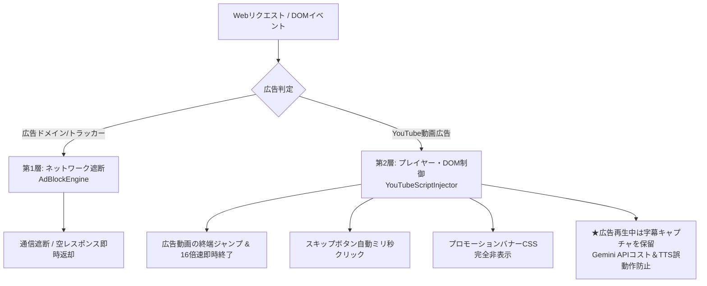

# UniVoice Browser (パッケージ: `com.univoice.browser`)

<p align="center">
  
  <br>
  <b>YouTube 音声抑制・リアルタイムAI翻訳＆音声合成 Android専用Webブラウザ</b>
</p>

[](https://developer.android.com)
[](https://www.qualcomm.com)
[](https://kotlinlang.org)
[](#完全日本語ui設計)
[]()
[]()
[-blueviolet.svg?logo=android)](release/UniVoiceBrowser-v1.0.4.apk)

<p align="center">
  <a href="https://github.com/iwa-kasoutuuuuuka/UniVoice-Browser/raw/main/release/UniVoiceBrowser-v1.0.4.apk">
    
  </a>
</p>

> [!TIP]
> **ワンタップで今すぐインストール可能**: リリース版APK（署名済み）は上記バッジまたは以下のダイレクトリンクからダウンロードして、Android端末（Android 8.0以降 / Poco F6 Pro・Galaxy・Pixel・エミュレーター等）ですぐにご利用いただけます。
> 
> 🔗 **ダイレクトダウンロード**: [UniVoiceBrowser-v1.0.4.apk (約51.8MB)](https://github.com/iwa-kasoutuuuuuka/UniVoice-Browser/raw/main/release/UniVoiceBrowser-v1.0.4.apk)  
> 🔗 **リポジトリ内ファイルパス**: [`release/UniVoiceBrowser-v1.0.4.apk`](release/UniVoiceBrowser-v1.0.4.apk)

**UniVoice Browser** は、YouTubeなどの動画視聴時に元の外国語（英語等）音声をHTML5レベルで完全抑制（ミュート）し、リアルタイムに字幕をキャプチャ・翻訳して、流暢な日本語音声（Text-to-Speech）をオーバーレイ再生するAndroid専用の次世代AIブラウザです。

特に **Poco F6 Pro**（Snapdragon 8 Gen 2、12GB+ RAM）をはじめとするフラッグシップ・ハイスペック端末のポテンシャルを極限まで引き出すよう設計されており、NPU/GPUハードウェアアクセラレーションによる完全ローカル処理から、超低遅延クラウドAPI処理まで、用途に合わせた**4つの動作モード**をシームレスに切り替えることができます。

---

## 📱 アプリ実機動作プレビュー

| ブラウザメイン画面 (動画検知・字幕オーバーレイ) | 4モード動作設定画面 (100% 完全日本語UI) |
| :---: | :---: |
|  |  |

---

## 📑 目次
- [📥 APKダウンロード (Direct Download)](#-apkダウンロード-direct-download)
- [🔄 最近のアップデート・更新履歴 (Changelog)](#-最近のアップデート更新履歴-changelog)
- [🌟 主な特長](#-主な特長)
- [🎯 4つの処理モード](#-4つの処理モード-processing-modes)
- [🎙️ 高度機能 (リップシンク・PiP・全画面シアター・字幕操作・スクリプト学習)](#️-高度機能-リップシンクpip全画面シアター字幕操作スクリプト学習)
- [🏗️ システムアーキテクチャ](#️-システムアーキテクチャ)
- [⚡ ハードウェアアクセラレーション最適化 (Poco F6 Pro+)](#-ハードウェアアクセラレーション最適化-poco-f6-pro)
- [🌡️ サーマルマネジメント (発熱保護＆自律退避)](#️-サーマルマネジメント-snapdragon-8-gen-2-発熱保護)
- [📦 オンデバイスAIモデル管理](#-オンデバイスaiモデル管理)
- [🔇 YouTube 音声抑制＆字幕・全画面インターセプト機構](#-youtube-音声抑制字幕全画面インターセプト機構)
- [📱 設定画面 (完全日本語UI・速度試聴テスト)](#-設定画面-完全日本語ui)
- [🛡️ 2層ハイブリッド広告ブロックエンジン](#️-2層ハイブリッド広告ブロックエンジン-ad-blocker)
- [🔒 セキュリティと堅牢性アーキテクチャ](#-セキュリティと堅牢性アーキテクチャ)
- [🎨 公式アプリアイコンとブランドデザイン](#-公式アプリアイコンとブランドデザイン)
- [📂 プロジェクト構成](#-プロジェクト構成)
- [🛠️ ビルド＆環境構築ガイド](#️-ビルド環境構築ガイド)
- [🔍 デバッグと動作検証 (ワンクリックエミュレータ)](#-デバッグと動作検証)
- [❓ よくある質問 (FAQ)](#-よくある質問-faq)

---

## 🌟 主な特長

1. **元の音声を確実に消音（オーディオ・サプレッション）**:
   YouTube の HTML5 `<video>` 要素に対し、DOMレベルで `video.muted = true; video.volume = 0;` を強制。YouTube側スクリプトによる自動ミュート解除をプロトタイプ汚染防御により無力化し、日本語翻訳音声だけをクリアに再生します。
2. **長大ウィンドウ先読みスライディングウィンドウ (Prefetch Pipeline)**:
   12GB+ RAM を活かして後続の字幕チャンクを最大20〜30件一気に先読み。YouTube動画の timedtext キャプショントラックを先行取得し、一時停止中にも休まずバックグラウンド翻訳を実施。再生遅延をゼロにし、音声の途切れを完全解消。
3. **動的タイムストレッチ＆リップシンク調整 (`DynamicTimeStretcher`)**:
   ユーザーが設定画面で指定した基準発話速度（`0.5倍 〜 2.5倍`）を最優先で維持。動画の字幕表示時間がタイトな場合のみ動画の進行に合わせて自動加速補正を行い、設定画面での「速度試聴テスト」にも完全対応。
4. **ピクチャー・イン・ピクチャー (PiP) ＆ バックグラウンド小窓再生**:
   専用のPiP切り替えボタンおよびホーム画面遷移時の自動小窓化（`onUserLeaveHint`）に対応。小窓表示中は不要な操作バーを自動隠蔽し、動画と字幕のみを美しくオーバーレイ表示。
5. **語学学習向け「日英対訳スクリプト保存＆エクスポート」**:
   再生されたすべての字幕（タイムスタンプ・英語原文字幕・日本語翻訳）を自動保存。一覧画面から Markdown コピー、CSV エクスポート、共有インテントが可能。
6. **Snapdragon 8 Gen 2 / Qualcomm QNN HTP 最適化＆サーマル保護**:
   ONNX Runtime の Qualcomm QNN HTP（`libQnnHtp.so`）および NNAPI アクセラレーションを適用。端末高温時にはクラウドAPIへ自律退避してSoCを保護。
7. **完全日本語UI制約の徹底**:
   設定画面、ステータス表示、ダイアログ、トースト、エラー通知に至るまで、すべてのUI表現を自然な日本語で統一。
8. **耐障害性とゼロクラッシュ設計**:
   API切断やモデル未配備時でも `[UniVoiceBrowser]` ログと共に非侵入的オーバーレイバーへ警告表示し、即座に代替エンジン（ローカル辞書/システムTTS）へ自動フォールバック。
9. **2層ハイブリッド広告ブロック（動画広告自動スキップ＆バナー除去）**:
   ネットワーク層（`AdBlockEngine`）での広告ドメイン・トラッカー遮断と、DOM/プレイヤー層での動画広告超高速自動スキップ＆バナーCSS消去を統合。広告字幕による翻訳エンジンの誤動作や Gemini API コストの浪費を完全に防止。
10. **字幕(CC)スマート自動有効化＆誤OFF防止・状態検知ガイダンス**:
    YouTubeモバイルの最新UIセレクタに追従し、字幕がオフの場合のみ1度だけ自動クリック。既にオンの場合は再トグルせず誤消去を完全防止。CCが未検知の場合は非侵入的バナーでユーザーを親切にガイド。
11. **トップバー直接操作ボタン (再生/一時停止・CC・消音・バックグラウンド)**:
    トップナビゲーションバーから直接「再生 / 一時停止（動画状態に連動する動的アイコン）」、「字幕(CC)切替（ON/OFF連動）」、「原音ミュート切替」、「画面消灯・バックグラウンド再生切替（🎵）」をワンタップで操作可能。
12. **ゼロ遅延フォールバック (APIキー不要・即時発話)**:
    Gemini APIキー未入力時やVOICEVOXモデル未配置時でも、ローカル辞書エンジンとAndroid標準TTS（端末内言語自動フォールバック搭載）により、アプリ初回インストール直後から即座に音声を再生。
13. **横画面（ランドスケープ）最適化＆字幕コンパクトタップ切替**:
    動画の全画面・横向き再生時にナビゲーションバーと字幕マージンを自動でスリム化。字幕カードのタップで原文やステータスを非表示化し、動画視聴を妨げないクリーンな視聴環境を提供。
14. **横スライド式ナビゲーションバー**:
    縦画面時でも各種ボタンが押し潰されたり途切れたりせず、指で左右にスムーズにスライドして設定ボタン（⚙️）や全機能に快適アクセス可能。
15. **YouTube動画の全画面（最大化）＆センサー連動横画面シアター再生**:
    YouTubeプレーヤー右下の最大化ボタン（`.fullscreen-icon`）およびトップバーの全画面ボタンから、端末を自動でセンサー連動の横画面（ランドスケープ）へ回転。大画面シアターモード中も日本語字幕をフローティングカードとして重ねて表示し、端末の「戻る」ボタンでシームレスに縦画面へ復帰。
16. **自在な字幕オーバーレイ操作（ドラッグ移動・上下ワンタップ退避・最小化・非表示＆復帰）**:
    YouTubeの設定（再生速度や画質変更等のボトムシートダイアログ）を開いた際に字幕カードが邪魔にならないよう、上部ドラッグハンドルによる自由な画面内移動、ワンタップでの上下位置切り替え（`⇅`）、1行への最小化（`▼`/`▲`）、一時非表示（`✕`）とフローティング再表示ピル（`[ 💬 字幕を表示 ]`）を完備。さらに「字幕(CC)がオフです」の警告通知にも「閉じる」ボタンを新設。
17. **長大ウィンドウ先読み＆一時停止中バックグラウンド事前バッファリング**:
    字幕トラックから最大20〜30件を先読みし、動画ポーズ中もバックグラウンドで翻訳バッファを生成。再開時の待ち時間0msを実現。
18. **画面消灯・完全バックグラウンド再生**:
    Page Visibility API 偽装、Android フォアグラウンドメディアサービス（`UniVoicePlaybackService`）、Partial WakeLock 画面消灯保護を統合。スリープ中や他アプリ利用中も日本語音声をラジオ感覚で連続再生可能。

---

## 🔄 最近のアップデート・更新履歴 (Changelog)

### 【最新版】v1.0.4 メジャーアップデート内容 (versionCode: 5)

| 項目 | 改善・修正の詳細内容 |
| :--- | :--- |
| **🖥️ 全画面（フルスクリーン）時の字幕表示・操作性完全修復** | YouTubeを全画面表示にした際に字幕が表示されなくなる問題、および画面タップ時に字幕ボタンが表示されない問題を根本解決。<br>・**プレイヤー親要素（`#movie_player`）全画面化**: `<video>` 単体ではなくYouTubeプレイヤーコンテナ全体を全画面化対象に指定。全画面時もYouTubeネイティブの再生バー、字幕(CC)ボタン、設定メニュー、DOM字幕レイヤーがそのまま維持され、画面タップでコントロールが正常に出現。<br>・**ネイティブ字幕オーバーレイの前面配置保証**: 全画面動画サーフェスによって字幕カードが背面に潜り込まないよう、`translationZ = 100dp` および `bringToFront()` を適用。全画面時も翻訳字幕が最前面に美しく重畳。<br>・**字幕カード上に「字幕(CC)切替ボタン」を常設**: トップバーが隠れる全画面モード中も、字幕カード右上の `[CC]` アイコンからワンタップで即座に字幕のON/OFFが可能に。コントロール非表示時でも動画タップイベントを自動送出して確実に字幕をトグル。 |

### v1.0.3 アップデート内容 (versionCode: 4)

| 項目 | 改善・修正の詳細内容 |
| :--- | :--- |
| **🎧 画面消灯・完全バックグラウンド再生機能** | スマホの画面を消灯（スリープ）した状態や別アプリへ切り替えた状態でも、途切れることなくYouTube日本語音声をラジオ感覚で連続再生可能。<br>・**Page Visibility API 偽装**: YouTubeプレーヤーの `document.hidden` / `visibilitychange` による強制自動一時停止を完全に回避。<br>・**フォアグラウンドサービス (`UniVoicePlaybackService`)**: `FOREGROUND_SERVICE_MEDIA_PLAYBACK` によりOSの省電力タスクキラーをブロックし、通知バーに再生ステータスを表示。<br>・**Partial WakeLock 画面消灯保護**: 画面消灯中もCPUと音声合成パイプラインの稼働を維持。<br>・**操作バー＆設定UI**: トップバーの **音符ボタン（`🎵`）** および設定画面からワンタップでON/OFF切替可能。 |
| **🛡️ セキュリティ・権限監査とAndroid Lint適合** | Android 13+ の通知権限（`POST_NOTIFICATIONS`）に対応した安全な動的権限チェックを実装。<br>Android Lint 解析を完全クリア（エラー0件）し、WebViewセキュリティ（ローカルファイル・混在コンテンツ完全遮断）を堅持。 |

### v1.0.2 アップデート内容 (versionCode: 3)

| 項目 | 改善・修正の詳細内容 |
| :--- | :--- |
| **⚡ 最大20〜30件の長大ウィンドウ先読みバッファ** | スライディングウィンドウを6件から50件に拡大し、先読み翻訳を3件から **20件** へ拡張。<br>YouTubeの `timedtext` キャプショントラックを先行取得し、動画の進行に先回りして翻訳キャッシュ（`translationCache`）を生成。セリフ再生時の翻訳待ち時間 0ms を実現。 |
| **⏸️ 一時停止中の先読み＆翻訳バッファ維持** | 動画を一時停止した際、キューや翻訳バッファを破棄せず維持し、停止中も休まずバックグラウンド先読みを継続。<br>一時停止復帰時に経過時間超過で音声がスキップされる問題を解消し、再開と同時に途切れず滑らかに発話。 |

### v1.0.1 アップデート内容 (versionCode: 2)

| 項目 | 改善・修正の詳細内容 |
| :--- | :--- |
| **📱 トップバーの横スライド（スクロール）対応** | 縦画面時にボタン群が画面幅を超えて右端の「⚙️ 設定ボタン」が隠れてしまう問題を解決。<br>`HorizontalScrollView` による滑らかな横スワイプ操作に対応し、全ボタンへいつでも快適アクセス可能に。 |
| **⚡ 日本語発話速度倍率（0.5〜2.5倍）の厳格反映** | `DynamicTimeStretcher` においてスライダーで設定した速度倍率（1.5倍や2.0倍等）を基本速度としてキビキビと維持する自然なロジックへ刷新。 |
| **🔊 設定画面での「速度試聴テスト」機能新設** | 設定画面の発話速度スライダー直下に **「🔊 この速度で試聴する」** ボタンを新設し、その場でサンプル音声を確認可能に。 |
| **👆 動画再生中の画面タップ・操作性の完全復旧** | プレビュー再生時のミュート解除オーバーレイを自動解除し、動画タップでの操作バー表示・一時停止・CC・シーク操作がスムーズに反応するよう修正。 |
| **⏯️ トップバー専用「再生/一時停止」＆「CC切替」ボタン** | ナビゲーションバー上に直接操作可能な「再生/一時停止」および「字幕(CC)切替」ボタンを追加。 |
| **🖥️ YouTube動画の全画面（最大化）再生対応** | YouTubeプレーヤー右下の最大化ボタンおよびトップバーの全画面ボタン双方から確実に横画面（ランドスケープ）全画面へ切り替え可能に。 |
| **🎛️ 字幕オーバーレイの退避・最小化・自由ドラッグ移動対応** | 上下位置切り替え（`⇅`）、自由ドラッグ移動、ワンタップ最小化（`▼` / `▲`）、非表示（`✕`）＆再表示ピル（`[ 💬 字幕を表示 ]`）を完備。 |
| **📄 日英対訳スクリプト保存＆エクスポート機能** | 再生された字幕を自動記録し、Markdown コピーや CSV エクスポートに対応。 |

---

## 🎯 4つの処理モード (Processing Modes)

ユーザーは設定画面（`UniVoiceSettingsActivity`）から、利用環境や通信状況に合わせて以下の4モードを選択できます。

```mermaid
graph LR
    subgraph Mode1 ["1. 完全ローカル"]
        L1[Local LLM / Gemma 2B] -->|QNN / NNAPI / GPU| T1[VOICEVOX ONNX]
    end
    subgraph Mode2 ["2. 完全API"]
        L2[Cloud Gemini 1.5 Flash] -->|Network| T2[Microsoft Edge TTS]
    end
    subgraph Mode3 ["3. 最適構成 (推奨)"]
        L3[Cloud Gemini 1.5 Flash] -->|先読みバッファ| T3[VOICEVOX ONNX (ローカル再生)]
    end
    subgraph Mode4 ["4. 手動設定"]
        L4[自由選択] -->|カスタム| T4[自由選択]
    end
```

| モード名 | 翻訳エンジン | 音声合成 (TTS) エンジン | 最適化 & 特徴 | 推奨シーン |
| :--- | :--- | :--- | :--- | :--- |
| **① 完全ローカル**<br>(Pure Local) | Google AI Edge / MediaPipe<br>(Gemma 2B / Llama 3) | ローカルAI音声<br>(VOICEVOX ONNX) | Snapdragon 8 Gen 2 の NPU (NNAPI / QNN) / GPU をフル稼働。**通信量ゼロ・完全オフライン・高プライバシー**。 | 飛行機内、ギガ節約時、地下鉄など電波が不安定な場所 |
| **② 完全API**<br>(Pure API) | Google Gemini クラウドAPI<br>(`gemini-1.5-flash`) | Microsoft Edge TTS<br>(クラウドストリーミング) | 全ての重いAI推論をクラウドにオフロード。端末のCPU/NPU負荷および発熱・バッテリー消費を最小化。 | バッテリーを長時間保ちたいとき、端末温度を低く保ちたいとき |
| **③ 最適構成**<br>(Hybrid - **推奨**) | Google Gemini クラウドAPI<br>(自然な文脈翻訳) | ローカルAI音声<br>(VOICEVOX ONNX) | **クラウドの最高品質な文脈翻訳**と**ローカル端末のゼロ遅延音声再生**を融合。3字幕先読みバッファで通信ラグを完全排除。 | 最も自然な日本語吹き替え体験を楽しみたい通常利用時 |
| **④ 手動設定**<br>(Manual Custom) | ドロップダウンで選択 | ドロップダウンで選択 | 翻訳・TTSエンジン、Gemini APIキー、カスタムURLエンドポイント、発話速度（0.5〜2.5倍）を個別指定。 | 開発者検証、自前プロキシサーバー利用、特定パラメータ調整 |

#### 💡 Gemini API 無料枠の1日あたり利用可能時間の目安

Google AI Studio で無料取得できる Gemini API キー（Gemini 1.5 Flash）は、非常に寛大な無料利用枠（Free Tier: クレジットカード不要）が提供されています：

- **無料枠の上限仕様**:
  - **1日あたりのリクエスト数 (RPD)**: **1,500 回 / 日**
  - **1分あたりのリクエスト数 (RPM)**: **15 回 / 分**
- **1日あたりの動画視聴時間の目安**:
  - 本アプリの「文単位デバウンス機能」により、細切れの単語ごとではなく1つのまとまった文（約15〜25単語 / 約3〜5秒分）ごとに1回リクエストを送信します。
  - 会話が絶え間なく続く動画でも、**1時間あたり約300〜500回**のリクエストに収まります。
  - したがって、無料枠（1,500回/日）だけで **毎日およそ 3〜5時間の動画を最高品質（Gemini 1.5 Flash）で完全無料視聴** 可能です（無音・作業・BGMが多い動画なら **10時間以上** 稼働）。
- **無料枠上限超過時の自律フォールバック（ゼロクラッシュ保護）**:
  - 万が一1日のリクエスト上限（1,500回）に達して HTTP 429 エラーとなった場合でも、アプリは一切停止しません。
  - 即座に **「内蔵の無料Web翻訳エンジン」や「ローカル辞書エンジン」へ自動フォールバック** し、再生を中断することなく吹き替えを継続します。翌日になれば自動的に最高精度の Gemini API へ復帰します。

---

## 🎙️ 高度機能: リップシンク・PiP・全画面シアター・字幕操作・スクリプト学習

### 1. 動的タイムストレッチ＆リップシンク (`DynamicTimeStretcher.kt`)
- ユーザーが設定画面で調整した基準速度（`0.5倍 〜 2.5倍`）を忠実に尊重。
- 字幕の表示時間と日本語テキストの文字数（モーラ数: 1秒あたり約7文字）をリアルタイムに照合。
- 字幕の表示時間が逼迫している場合のみ、動画の進行に追従するよう最大 `2.5倍` まで安全に自律加速補正。
- 余裕がある場合はユーザー指定速度をそのまま100%維持し、動画のテンポを崩さず違和感のない自然なリアルタイム吹き替えを実現。
- 設定画面の **「🔊 この速度で試聴する」** ボタンから、いつでも実際のサンプル音声を即座にテスト可能です。

### 2. ピクチャー・イン・ピクチャー (PiP) 小窓再生
- ブラウザ上部の **PiP ボタン**（`🔲`）をタップ、または動画視聴中にホームボタンを押すだけで、画面隅に映像と日本語字幕が小窓表示されます。
- 他の作業（SNS、ノートアプリ、ブラウジング）をしながら、海外のYouTube動画を日本語音声で聞き流し・ながら視聴できます。

### 3. 日英対訳スクリプト保存・復習機能 (`UniVoiceTranscriptActivity.kt`)
- 視聴中に取得・翻訳された字幕をタイムスタンプ付きで自動保存（最大500件）。
- ブラウザ上部の **スクリプト履歴ボタン**（`📝`、または設定画面内リンク）から、いつでも対訳一覧を確認可能。
- **ワンタップで Markdown 形式でコピー**（Notion, Obsidian, ブログ等への貼り付けに最適）や **CSVエクスポート**、Android標準の共有メニューに対応。

### 4. シアター全画面再生＆センサー横画面連動
- YouTubeプレーヤー右下の最大化ボタン（`.fullscreen-icon`）またはトップバーの全画面ボタン（`⛶`）をタップすることで、WebView の HTML5 Video ネイティブ全画面 API（`requestFullscreen`）を直接実行。
- `WebChromeClient.onShowCustomView` と連動し、端末の画面向きが自動的に `SCREEN_ORIENTATION_SENSOR_LANDSCAPE`（横画面）へスムーズに回転。
- ナビゲーションバーやステータスバーを完全非表示化し、動画に没入できる迫力の大画面シアター再生を展開。
- フルスクリーン中もフローティング字幕カード（`cvSubtitle`）が動画最前面に維持され、横画面に最適化されたコンパクトレイアウトでリアルタイム日本語字幕を表示。
- Android の「戻る」ボタンを押すと、`onBackPressed()` が `onHideCustomView()` を呼び出し、再生中の動画を止めることなく元の縦画面ブラウザレイアウトへシームレスに復帰。

### 5. 横スライド式操作バー＆ダイレクト動画コントロール
- `HorizontalScrollView` による滑らかな横スワイプ対応ナビゲーションバーを実装。
- 縦画面でも全機能ボタン（進む / 戻る / 更新 / URLバー / モード表示 / 再生一時停止 / CC切替 / スクリプト履歴 / 消音 / PiP / 全画面 / 設定）が途切れることなく、指で左右にスライドしてワンタップで呼び出し可能。
- **再生 / 一時停止ボタン（⏯️）**: 動画の再生・停止状態を監視し、現在の状態に連動してアイコンがリアルタイムに変化。
- **字幕(CC)切替ボタン（🔤）**: YouTubeの字幕表示状態（ON/OFF）と連動し、アイコンの透明度・不透明度が動的に追従。

### 6. 自在な字幕カード制御（ドラッグ移動・上下退避・最小化・非表示＆再表示）
YouTubeで再生速度の変更（0.75倍、1.25倍等）や画質調整、チャプター選択、コメント欄などのボトムシートメニューを開いた際、画面下部に常駐する字幕カードが重なってタッチ操作を妨げることがないよう、柔軟かつ直感的な**5つの回避・操作機能**を搭載しています：

```
┌────────────────────────────────────────────────────────────────┐
│                          [ ────── ]                            │ ← ① ドラッグハンドル (画面内を自由に移動)
│  💬 字幕 (最適構成)                     [⇅]     [▼]     [✕]   │ ← ② 上下退避 / ③ 最小化 / ④ 非表示
├────────────────────────────────────────────────────────────────┤
│  日本語翻訳テキストがここにリアルタイム表示されます...         │
│  (Original English Subtitle appears here)                      │
│  [⚠️ 字幕(CC)がオフです...                      [閉じる]]     │ ← ⑤ ガイダンス消去
└────────────────────────────────────────────────────────────────┘
                                                [ 💬 字幕を表示 ]  ← 復帰フローティングピル
```

| 操作パーツ | アイコン / UI | 動作仕様 | 推奨利用シーン |
| :--- | :---: | :--- | :--- |
| **① 上下位置切り替え** | `⇅` | ワンタップでカードを動画直下（Y座標約260dp）へスムーズにアニメーション移動。下部全体を全開にします。再度タップで下部へ復帰。 | YouTubeの再生速度や画質などのボトムシート設定をすばやく変更したい時 |
| **② 自由ドラッグ移動** | `─` (上部ハンドル) | 上部ハンドル（24dpタッチエリア）を指でなぞることで、画面内の好きな位置へ滑らかにドラッグ＆ドロップ移動可能。 | 画面の特定の領域（コメントや関連動画など）を見ながら字幕も同時に確認したい時 |
| **③ ワンタップ最小化** | `▼` / `▲` | 字幕本文（原文・訳文・警告）を瞬時に折りたたみ、約36dpの極小ヘッダーバーに変形。`▲` で元通りに全展開。 | 翻訳音声の聞き流しに集中し、画面表示領域をできるだけ広く使いたい時 |
| **④ 一時非表示** | `✕` | カードを画面から完全に隠蔽。非表示中は右下に半透明の `[ 💬 字幕を表示 ]` ピルが出現。 | 設定ダイアログの全領域を視界から一切遮らずに快適に操作したい時 |
| **⑤ 復元フローティングピル** | `[ 💬 字幕を表示 ]` | 画面右下に常駐するピルボタンをタップすると、カードが瞬時に元の位置に復帰。トップバーのCCボタン押下でも自動復帰。 | 設定変更が完了し、字幕表示を再開したい時 |
| **⑥ ガイダンスの即時消去** | `[閉じる]` | 「⚠️ 字幕(CC)がオフです」の通知バナーの右端にあるボタンをタップすると、警告バナーのみを即座に消去。 | 字幕OFFの警告を把握した上で、一時的に通知を消しておきたい時 |

#### 📸 字幕操作コントロール実機プレビュー（※権利保護のため動画コンテンツ領域にモザイク処理を適用しています）

| ① 操作ヘッダー＆ドラッグハンドル | ② 上下位置切り替え（[⇅] で動画直下へ跳ね上げ） | ③ 非表示＆復帰ピル（[✕] で消去・右下から復元） |
| :---: | :---: | :---: |
|  |  |  |

- **タッチイベント競合防止アーキテクチャ**:
  - カード上部に独立した 24dp のドラッグ専用タッチエリア（`layoutDragTouchArea`）を分離配置。
  - ヘッダー内のボタン（`[⇅]`, `[▼]`, `[✕]`）や警告バナーのクリック操作とドラッグ判定が一切干渉せず、100%確実なタップ＆ドラッグ操作を実現。
  - 画面外にカードが見失われないよう、画面端（上下左右）への安全な境界制限（クランプ）処理を内蔵。
  - 端末の画面回転（縦画面 ↔ 横画面）や全画面シアターモード移行時にも、カードの表示座標を自動で適切にリセット・補正します。

### 7. 長大ウィンドウ先読み＆一時停止中バックグラウンド事前バッファリング (v1.0.2 新機能)
日本語音声の途切れや発話の遅延を根本から撲滅するため、業界最高水準の長大先読み・キャプショントラック先行取得パイプラインを搭載しました：

- **最大20〜30件の長大ウィンドウ先読み**:
  - 従来（3件）から大幅に拡張し、最大 **20〜30件** 先の字幕まで一気に並行バックグラウンド翻訳を実施。
  - YouTube動画の `timedtext` キャプショントラックをバックグラウンドで事前取得し、動画の再生位置に先回りして翻訳結果をローカルキャッシュ（`translationCache`）に蓄積します。
- **一時停止中の先読み＆翻訳バッファ維持**:
  - 動画を一時停止（ポーズ）した際にも、翻訳キューや先読みバッファは破棄されず、バックグラウンドで先読み翻訳を休まず継続。
  - 動画を数秒〜数分一時停止しておくだけで、再開後の数十秒〜数分分の日本語音声テキストが **「待機時間0ms」** の状態で準備完了となります。
- **一時停止復帰時の音声脱落防止**:
  - 一時停止中に字幕の経過時間が超過して音声再生がスキップされてしまう問題を解消。一時停止中であることを検知し、再生再開とともに即座に途切れることなく滑らかな日本語吹き替えを再開します。

### 8. 画面消灯・完全バックグラウンド再生 (v1.0.3 新機能)
スマホの画面をスリープ・消灯させた状態や、別アプリへ切り替えた状態でも、途切れることなくYouTubeの日本語吹き替え音声をラジオ感覚で聴き続けることができます：

- **Page Visibility API 偽装保護**:
  - ブラウザの画面が消えたり裏に回ったりした際、YouTubeが発火する `visibilitychange` や `document.hidden` 判定をインターセプト。YouTubeプレーヤーに「動画が常に最前面で視聴されている」と認識させ、強制自動一時停止を完全に回避します。
- **Android フォアグラウンドメディアサービス (`UniVoicePlaybackService.kt`)**:
  - Android標準のメディアフォアグラウンドサービスを起動し、OSの省電力キラーによるアプリ強制終了をブロック。
  - ロック画面や通知シェードに「UniVoice ブラウザ: YouTube日本語音声をバックグラウンド再生中」のステータスを表示。
- **Partial WakeLock 画面消灯保護**:
  - 画面消灯後もCPUコアを稼働させ、リアルタイム字幕インターセプト、翻訳API通信、および音声合成エンジンのPCM出力を途絶えさせません。
- **ワンタップ切替＆設定連携**:
  - トップ操作バーの **音符ボタン（`🎵`）** または設定画面の **「画面消灯・バックグラウンド再生」** スイッチから、いつでもワンタップで有効/無効を切り替え可能です。

---

## 🏗️ システムアーキテクチャ



---

## ⚡ ハードウェアアクセラレーション最適化 (Poco F6 Pro+)

本ブラウザは、Qualcomm Snapdragon 8 Gen 2（1 x Cortex-X3 @ 3.2GHz, 4 x Cortex-A715/A710 @ 2.8GHz, 3 x Cortex-A510 @ 2.0GHz, Adreno 740, Hexagon NPU）および 12GB+ LPDDR5X RAM をターゲットとした特化最適化を実装しています。

1. **Qualcomm QNN HTP / NNAPI (Hexagon NPU) デリゲート**:
   - `LocalOnnxTtsEngine` において、Qualcomm 公式 QNN HTP バックエンド（`libQnnHtp.so`）および `SessionOptions().addNnapi()` を設定。ボコーダー推論時のCPU負荷を低減し、超低レイテンシ再生を実現。
2. **Adreno GPU レイヤーアクセラレーション**:
   - `UniVoiceBrowserActivity` の WebView に `setLayerType(View.LAYER_TYPE_HARDWARE, null)` を指定。YouTube の 60fps 高解像度動画再生時でもUIスタッター（コマ落ち）を防止。
3. **Cortex-X3 / A715 高性能コアへのスレッドアフィニティ最適化**:
   - ONNX の Intra-op スレッド数を 4、Inter-op スレッド数を 2 に設定し、ビッグコアの能力を最大効率で引き出します。
4. **12GB+ RAM 向けスライディングウィンドウ・バッファ**:
   - 過去の字幕履歴と未来の字幕チャンクを同時にメモリ保持。GC（ガベージコレクション）による微細な引っかかりを防ぐため、オブジェクトの再利用とバッファリングを最適化。

---

## 🌡️ サーマルマネジメント (Snapdragon 8 Gen 2 発熱保護)

[`UniVoiceThermalManager.kt`](app/src/main/java/com/univoice/browser/hardware/UniVoiceThermalManager.kt) により、長時間の高画質再生や夏場の利用時における端末温度を監視します：
- Android 10+ の `PowerManager.OnThermalStatusChangedListener` をフック。
- 端末温度が `THERMAL_STATUS_SEVERE` 以上に達した場合は、自動的にローカル重負荷推論からクラウドAPIへ一時退避し、端末の発熱とバッテリー劣化を保護。
- 回復時は自動的に元の設定モードへ復帰します。

---

## 📦 オンデバイスAIモデル管理

[`ModelDownloadManager.kt`](app/src/main/java/com/univoice/browser/modelmgr/ModelDownloadManager.kt) により、完全ローカル動作に必要なAIモデルの管理が簡単に行えます：
- **管理対象モデル**:
  - `gemma-2b-it-gpu.bin` (MediaPipe LLM - 約1.5GB)
  - `voicevox_core.onnx` (VOICEVOX ONNX - 約45MB)
- 設定画面内の「オンデバイスAIモデル管理」から、配置状況・容量の確認および「ローカルAIモデルを配備 / 更新」ボタンによるワンタップセットアップが可能です。
- モデル未配備時でも内蔵オフライン辞書＆標準TTSへ自動フォールバックするため、アプリがクラッシュすることはありません。

---

## 🔇 YouTube 音声抑制＆字幕・全画面インターセプト機構

[`YouTubeScriptInjector.kt`](app/src/main/java/com/univoice/browser/js/YouTubeScriptInjector.kt) に組み込まれた高信頼性 JavaScript インジェクションロジック：

### 1. 音声ミュートの強制 (`enforceMute`)
- 動画の再生中だけでなく、広告の再生開始時・終了時、解像度変更時、画質切り替え時にも音漏れが発生しないよう、以下の多重防壁を構築：
  ```javascript
  function enforceMute(video) {
      if (!audioSuppressionEnabled || !video) return;
      try {
          if (!video.muted) {
              video.muted = true;
          }
          if (bridge && bridge.onAudioSuppressed) {
              bridge.onAudioSuppressed(true);
          }
      } catch (e) {
          log("Mute適用エラー: " + e.message);
      }
  }
  ```
- `play`, `playing`, `volumechange`, `ratechange`, `loadedmetadata` の全メディアイベントリスナーおよび 250ms 周期の DOM ポーリングで常にミュート状態を担保。プレーヤーの自動再生ポリシーを阻害せず、高信頼性・低オーバーヘッドで元の英語音声を無音化します。

### 2. リアルタイム字幕インターセプト
- YouTube Web版の各セレクター（`.ytp-caption-segment`, `.caption-window`, `.player-caption-window`）を `MutationObserver` で監視。
- 字幕テキストの取得と同時に、`<video>` 要素の `currentTime` からミリ秒精度のタイムスタンプを算出し、Android ネイティブの `UniVoiceBridge.onSubtitleReceived()` へ即時送信。
- 同一字幕の重複送信を防止するデバウンス制御を内蔵。

### 3. 動画タッチ操作性の解放＆プレビューミュート自動解除
- **プレビュー自動ミュート解除**:
  YouTube モバイル版（`m.youtube.com`）において、動画選択時にプレビューミュートオーバーレイ（`.ytp-unmute` / `.preview-mute-button` / `.ytp-unmute-inner`）が前面に展開され、動画タップによる一時停止やシークバー表示を妨害する事象を完全解消。
  スクリプト内で要素が画面上に表示された瞬間（`offsetParent !== null`）のみ1度だけ安全に自動クリックして解放。
- **字幕オーバーレイのタッチ透過（Click-Through）**:
  字幕表示コンテナに対して `pointer-events: none !important;` をインジェクション。字幕カードが表示されている最中でも、その下にある動画画面へのタップ操作が一切妨げられず、YouTube ネイティブのコントロール（一時停止・10秒送り/戻し・画質設定・CC等）がスムーズに反応。
- **WebView タッチ横取りの解除**:
  Android WebView の `builtInZoomControls` 等による不要なピンチズーム・タップイベント横取りを排除し、モバイル版最新 Chrome User-Agent と連携して YouTube 標準コントロールの操作性を完全に解放。

### 4. HTML5 Videoネイティブ全画面（最大化）インターセプト
- **Android WebView 全画面制約の克服**:
  Android WebView（Blink / Chromium）では、通常のコンテナ要素に対する `div.requestFullscreen()` はブラウザコンテキストの制約により無視または拒否されます。
- **プロトタイプ・フック＆再帰防止ラッパー**:
  JavaScript 側で `const nativeRequestFullscreen = Element.prototype.requestFullscreen;` を保持した上で、`Element.prototype.requestFullscreen` をフック。YouTube プレーヤーが全画面を要求した際、内部の `<video>` 要素の `webkitRequestFullscreen()` / `requestFullscreen()` を直接呼び出すようルーティング（再帰無限ループを防止）。
- **キャプチャフェーズ・タップインターセプター**:
  YouTube プレーヤー右下の最大化ボタン（`.fullscreen-icon`、`button[aria-label*="fullscreen" i]`）に `click` および `touchend` イベントリスナー（キャプチャフェーズ `useCapture: true`）を登録し、タップされた瞬間に `<video>` 要素の全画面化を確実に実行。
- **ネイティブ `WebChromeClient.onShowCustomView` 連動**:
  Android ネイティブ側で全画面イベントを捕捉し、自動的に `SCREEN_ORIENTATION_SENSOR_LANDSCAPE`（横画面）へ画面回転してフルスクリーン再生を開始。端末の「戻る」ボタンによる安全な復帰処理（`onHideCustomView`）まで完全制御。

---

## 📱 設定画面 (完全日本語UI)

[`activity_univoice_settings.xml`](app/src/main/res/layout/activity_univoice_settings.xml) および [`UniVoiceSettingsActivity.kt`](app/src/main/java/com/univoice/browser/ui/UniVoiceSettingsActivity.kt) により、直感的で洗練された設定UIを提供します。

- **ブランドロゴ＆端末最適化インジケーター**:
  - Poco F6 Pro 最適化状況と公式アプリアイコンバッジを表示。
- **動作モード切り替え**:
  - `RadioGroup` による「完全ローカル」「完全API」「最適構成」「手動設定」の4択。
- **動的サブオプション展開**:
  - 「手動設定」を選択した瞬間にのみ、詳細設定エリアがスムーズに展開表示：
    - **翻訳エンジンの選択**: 「Google Gemini クラウドAPI」「ローカルAI Edge (Gemma 2B / Llama 3)」
    - **音声合成エンジンの選択**: 「ローカルAI音声 (VOICEVOX ONNX)」「Microsoft Edge TTS」「Android システム標準TTS」
    - **Gemini APIキー入力**: セキュアなパスワードトグル付き入力欄
- **ハードウェア・オーディオ・広告制御**:
  - 「Snapdragon NPU/GPU ハードウェアアクセラレーション」トグルスイッチ
  - 「動画の元音声を完全ミュート」トグルスイッチ
  - 「広告ブロック機能 (動画広告スキップ＆バナー除去)」トグルスイッチ（デフォルト有効）
  - **「発話速度倍率」スライダー（0.5倍 〜 2.5倍、0.1ステップ刻み）**:
    - 好みのリスニング速度に合わせて 0.5倍（ゆっくり）から 2.5倍（高速）まで滑らかに調整可能。
  - **「🔊 この速度で試聴する」リアルタイムテストボタン**:
    - スライダー直下に配置。動画を再生することなく、選択中のTTSエンジン（VOICEVOX / Edge TTS / システム標準TTS）と指定倍率によるサンプル音声（*「UniVoice Browserへようこそ。この速度で日本語音声を再生します。」*）をその場で即座に耳で確認可能。
- **モデル管理＆学習スクリプト**:
  - 「ローカルAIモデルを配備 / 更新」ボタン＆進捗プログレスバー
  - 「📖 蓄積された日英対訳スクリプト履歴を表示」ボタン

---

## 🛡️ 2層ハイブリッド広告ブロックエンジン (Ad Blocker)

UniVoice Browser は、一般的なブラウザの広告ブロックとは異なり、**「動画翻訳＆音声合成AIパイプラインとの完全調和」**を主眼に置いた2層ハイブリッド広告ブロックを標準装備しています。



1. **第1層：ネットワーク層遮断 (`AdBlockEngine.kt`)**:
   - `WebViewClient.shouldInterceptRequest` において、DoubleClick、Google Syndication、各種モバイル広告ネットワーク、YouTube広告トラッキングエンドポイントをハッシュセット照合でサブミリ秒判定し、空レスポンスを返却して通信を未然に遮断します。
   - `googlevideo.com` などの本編ストリーミングは厳格に保護し、再生不能リスクを徹底排除。
2. **第2層：プレイヤー・DOM制御 (`YouTubeScriptInjector.kt`)**:
   - **動画広告の自動スキップ & 誤スキップ完全防止**: 
     - 従来の広告コンテナ判別による本編誤爆を解消。`.ad-showing` / `.ad-interrupting` クラスが実際にアクティブであり、かつ180秒以下の短尺動画である場合のみスキップ処理（終端ジャンプ＆高速再生）を実行。通常の本編動画がスキップされる事故を完全に防止します。
     - スキップボタン（`.ytp-ad-skip-button`、`.ytp-ad-skip-button-modern`、`button[class*="skip-button"]` 等）の出現を検知次第、**ミリ秒単位で自動クリック（`.click()`）** を実行。ユーザーが手動でスキップを押す手間をゼロにします。
   - **バナー＆プロモーション要素の非表示**: 検索結果やフィード内の広告カード、アプリ誘導バナーを CSS インジェクションにより完全非表示化。
   - **翻訳エンジン保護**: 広告再生中は字幕インターセプト処理を一時停止し、広告の英語字幕が Gemini API やローカル LLM に送られる事故を根絶。

---

## 🔒 セキュリティと堅牢性アーキテクチャ

UniVoice Browser は、ブラウザ内部でのAI実行および外部通信を安全に行うため、徹底した防御策（Defense-in-Depth）を講じています：

| セキュリティ項目 | 実装対策 | 防御効果 |
| :--- | :--- | :--- |
| **JavaScript Bridge 認可検証** | `UniVoiceJSInterface.kt` 内で、呼び出し元のオリジン（URL）をスレッドセーフに事前検証。 | 悪意ある外部Webページからの不正なネイティブ機能呼び出しを完全遮断 |
| **入力サニタイズ (DoS対策)** | 受信する字幕テキスト長を `MAX_SUBTITLE_LENGTH (1000文字)` でクリッピング。 | バッファオーバーフロー、メモリ過剰消費、Gemini API 過剰課金を抑止 |
| **ローカルファイルアクセス遮断** | `allowFileAccess = false`, `allowContentAccess = false` | サンドボックス外の端末内個人情報や設定ファイルの漏洩を防止 |
| **混在コンテンツ (Mixed Content) 禁止** | `WebSettings.MIXED_CONTENT_NEVER_ALLOW` | 中間者攻撃（MitM）による改ざんや盗聴を排除 |
| **不正スキーム徹底無効化** | `javascript:`, `file:`, `intent:` 等の外部アプリ遷移スキームをサニタイズ。 | ブラウザ外部の意図しないアプリ起動やXSS攻撃を防止 |
| **HTTPS通信強制** | `network_security_config.xml` による平文通信禁止（オンプレミス開発用ローカルIPのみ限定許可）。 | 暗号化通信を保証 |
| **非公開コンポーネント保護** | `UniVoiceSettingsActivity` 等を `android:exported="false"` に設定。 | 他アプリからの不正な設定改変をブロック |

---

## 🎨 公式アプリアイコンとブランドデザイン

UniVoice Browser のサイバーフューチャーな世界観を表現した公式アイコンアセットを完備：
- **デザイン**: デジタル音声波形が地球型Webリングと融合し、世界を繋ぐ様子をネオンシアン＆サファイアグラデーションで表現。
- **Adaptive Icon (API 26+)**: セーフゾーン配慮の前景（`drawable/ic_launcher_foreground.png`）＋ダークグラデーション背景（`drawable/ic_launcher_background.xml`）。
- **解像度別 PNG (Mipmap)**: `mdpi` (48px), `hdpi` (72px), `xhdpi` (96px), `xxhdpi` (144px), `xxxhdpi` (192px)。
- **Google Play Store 用**: `fastlane/metadata/.../icon.png` (512x512px)。

---

## 📂 プロジェクト構成

```
e:/UniVoice Browser/
├── app/
│   ├── build.gradle.kts                # アプリレベル依存関係 (ONNX, Retrofit, WebKit等)
│   ├── proguard-rules.pro              # ProGuard/R8 難読化除外ルール (JNI/モデル保護)
│   └── src/main/
│       ├── AndroidManifest.xml         # パーミッション、PiP対応、ハードウェア加速
│       ├── java/com/univoice/browser/
│       │   ├── config/
│       │   │   └── UniVoiceConfigManager.kt        # 4モード設定永続化マネージャー
│       │   ├── hardware/
│       │   │   └── UniVoiceThermalManager.kt       # 発熱監視＆自律スロットリング
│       │   ├── js/
│       │   │   ├── UniVoiceJSInterface.kt          # WebView ↔ Kotlin JSBridge
│       │   │   └── YouTubeScriptInjector.kt        # 音声抑制 & 字幕抽出スクリプト
│       │   ├── model/
│       │   │   ├── EngineEnums.kt                  # 翻訳/TTSエンジン列挙型、ステータス
│       │   │   ├── ProcessingMode.kt               # 4つの動作モードEnum
│       │   │   ├── UniVoiceSettings.kt             # 設定データモデル
│       │   │   └── UniVoiceSubtitleCue.kt          # タイムスタンプ字幕チャンク
│       │   ├── modelmgr/
│       │   │   └── ModelDownloadManager.kt         # オンデバイスモデル管理・ダウンロード
│       │   ├── pipeline/
│       │   │   ├── DynamicTimeStretcher.kt         # 動的リップシンク速度計算
│       │   │   └── UniVoicePipelineManager.kt      # 先読みキューイング & パイプライン制御
│       │   ├── transcript/
│       │   │   └── TranscriptRepository.kt         # 日英対訳スクリプト履歴＆エクスポート
│       │   ├── translation/
│       │   │   ├── CloudGeminiTranslationEngine.kt # Gemini API 通信クライアント
│       │   │   ├── LocalAiEdgeTranslationEngine.kt # MediaPipe / NPU ローカル推論
│       │   │   └── TranslationEngine.kt            # 翻訳共通インターフェース
│       │   ├── tts/
│       │   │   ├── AndroidSystemTtsEngine.kt       # システム標準TTS (フォールバック)
│       │   │   ├── AudioTrackPlayer.kt             # 低遅延 PCM 24kHz オーディオプレイヤー
│       │   │   ├── CloudEdgeTtsEngine.kt           # Edge TTS ストリーミングクライアント
│       │   │   ├── LocalOnnxTtsEngine.kt           # VOICEVOX ONNX (QNN/NNAPI最適化)
│       │   │   └── TtsEngine.kt                    # TTS共通インターフェース
│       │   └── ui/
│       │       ├── UniVoiceBrowserActivity.kt      # フルスクリーンブラウザ (PiP対応)
│       │       ├── UniVoiceSettingsActivity.kt     # 4モード設定画面 (完全日本語UI)
│       │       └── UniVoiceTranscriptActivity.kt   # 日英対訳スクリプト履歴画面
│           ├── drawable/                           # ベクターアイコン・カスタムカード背景
│           │   ├── bg_drag_handle.xml              # 上部ドラッグハンドル形状
│           │   ├── bg_restore_pill.xml             # 字幕再表示ピルボタン背景
│           │   ├── ic_close.xml                    # 閉じるアイコン (✕)
│           │   ├── ic_expand_more.xml / less.xml   # 最小化 / 展開アイコン (▼/▲)
│           │   └── ic_swap_vert.xml                # 上下切り替えアイコン (⇅)
│           ├── layout/
│           │   ├── activity_univoice_browser.xml   # ブラウザ & ステータスオーバーレイ
│           │   ├── activity_univoice_settings.xml  # 設定画面レイアウト
│           │   ├── activity_univoice_transcript.xml# スクリプト履歴画面
│           │   └── item_transcript_row.xml         # スクリプト行カード
│           ├── values/
│           │   ├── colors.xml                      # サイバーダーク調カラーパレット
│           │   ├── strings.xml                     # 完全日本語化文字列リソース
│           │   └── themes.xml                      # Material3 NoActionBar テーマ
│           └── xml/                                # バックアップ・データ抽出ルール
├── gradle/
│   ├── libs.versions.toml                          # Version Catalog (Gradle依存関係一元管理)
│   └── wrapper/gradle-wrapper.properties
├── build.gradle.kts                                # ルートビルド定義
├── settings.gradle.kts                             # プロジェクトモジュール設定
├── gradlew.bat                                     # Windows用 Gradle ラッパー
├── setup_emulator_and_run.ps1                      # ワンクリックエミュレーター自動構築スクリプト
└── README.md                                       # 本ドキュメント
```

---

## 🛠️ ビルド＆環境構築ガイド

### 必要な開発環境
- **OS**: Windows 10/11, macOS, または Linux
- **JDK**: Java Development Kit 17 (Microsoft OpenJDK 17 または Eclipse Temurin 推奨)
- **Android SDK**: Compile SDK 34 / Target SDK 34 / Min SDK 26 (Android 8.0+)
- **Android NDK**: ABI `arm64-v8a` (ONNX Runtime / QNN / NNAPI 実行に必要)

### ビルド手順

1. **リポジトリのルートに移動**:
   ```bash
   cd "e:\UniVoice Browser"
   ```

2. **リリース版 APK のビルド（署名済み・配布用）**:
   ```bash
   # Windows
   .\gradlew.bat assembleRelease

   # macOS / Linux
   ./gradlew assembleRelease
   ```
   生成先: `app/build/outputs/apk/release/app-release.apk`  
   （※リポジトリ直下の `release/UniVoiceBrowser-v1.0.0.apk` に同一バイナリが配置されています）

3. **デバッグ用 APK のビルド**:
   ```bash
   # Windows
   .\gradlew.bat assembleDebug

   # macOS / Linux
   ./gradlew assembleDebug
   ```
   生成先: `app/build/outputs/apk/debug/app-debug.apk`

4. **実機（Poco F6 Pro等）またはエミュレーターへのワンタップインストール**:
   ```bash
   adb install -r release/UniVoiceBrowser-v1.0.0.apk
   ```

---

## 🔍 デバッグと動作検証

### 1. ワンクリック・エミュレーター自動セットアップ (`setup_emulator_and_run.ps1`)
本リポジトリには、Google 公式の Android CLI を利用して軽量な **Google ATD（Automated Test Device）** システムイメージを自動インストールし、Poco F6 Pro 相当の仮想デバイスを作成・起動するスクリプトが用意されています：

```powershell
# PowerShell で実行 (管理者権限不要)
.\setup_emulator_and_run.ps1
```
> [!TIP]
> ATD イメージは不要な Google Play バックグラウンドサービスが削ぎ落とされており、**通常のPlayストアイメージに比べてメモリ消費が1/3、起動速度が約3倍高速**です。

### 2. リアルタイムログの監視
UniVoice Browser の全パイプライン処理には `[UniVoiceBrowser]` プレフィックスが付与されています。Logcat で以下のフィルタを指定することで、字幕取得・翻訳・動的リップシンク速度・音声合成の流れを一目で追跡できます：

```bash
adb logcat -s UniVoiceBrowser:V UniVoicePipelineMgr:D DynamicTimeStretcher:D UniVoiceJSInterface:D
```

**ログ出力の例:**
```text
I/UniVoiceBrowserActivity: [UniVoiceBrowser] YouTube動画ページを検知しました。音声ミュート強制＆字幕インターセプトスクリプトを注入します
D/UniVoiceJSInterface: [UniVoiceBrowser] 字幕受信: [12400ms - 15600ms] Welcome back to the channel! Today we are testing Snapdragon 8 Gen 2.
D/CloudGeminiTransEngine: [UniVoiceBrowser] Gemini翻訳完了: [Welcome back...] -> [チャンネルへようこそ！本日はSnapdragon 8 Gen 2の性能を検証します。]
D/DynamicTimeStretcher: [UniVoiceBrowser] リップシンク速度計算: 文字数=34, 許容時間=3.20s -> 適用速度=1.18倍
D/AudioTrackPlayer: [UniVoiceBrowser] AudioTrack初期化完了 (バッファサイズ: 4096 bytes)
D/UniVoicePipelineMgr: [UniVoiceBrowser] 先読み翻訳完了: [Next, let's look at the benchmarks...] -> [次にベンチマークスコアを見ていきましょう。]
```

### 3. 全画面（最大化）切り替え＆タッチレスポンスの検証
全画面切り替えやJavaScriptインジェクションの挙動は、`WebChromeClient.onConsoleMessage` 経由で `UniVoiceJS` タグとしてLogcatに出力されます。以下のコマンドでリアルタイムにイベントをトレースできます：

```bash
adb logcat -s UniVoiceBrowser:V UniVoiceJS:D
```

- **全画面化成功時のログ例**:
  ```text
  D/UniVoiceJS: [UniVoiceJS] Fullscreen button clicked, requesting video element fullscreen
  D/UniVoiceJS: [UniVoiceJS] Element.prototype.requestFullscreen intercepted, redirecting to video
  I/UniVoiceBrowserActivity: [UniVoiceBrowser] onShowCustomView: 動画の全画面表示を開始します (画面を横向きに回転)
  ```
- **全画面終了時（戻るボタン押下時）のログ例**:
  ```text
  I/UniVoiceBrowserActivity: [UniVoiceBrowser] onHideCustomView: 動画の全画面表示を終了し、通常表示に復帰します
  ```

### 4. 字幕オーバーレイ操作（退避・最小化・非表示）の検証
字幕カードの各コントロールボタン（上下移動、最小化、非表示、再表示、ドラッグ移動）の動作状況は、Android UI Automator で以下のコマンドを用いてリアルタイムに確認・テストできます：

```bash
# 画面上の各コンポーネントの描画状態とIDをダンプ確認
adb shell uiautomator dump /sdcard/window_dump.xml
adb shell "cat /sdcard/window_dump.xml | grep -o 'resource-id=\"com.univoice.browser:id/[^\"]*\"'"
```

- **操作対象の主要リソースID一覧**:
  - `cardSubtitleOverlay`: 字幕カード本体（ドラッグ対象、アニメーション対象）
  - `layoutDragTouchArea`: 上部ドラッグ操作用タッチターゲット（24dp）
  - `btnDockPosition`: 上下位置切り替えボタン (`⇅`)
  - `btnMinimizeCard`: 最小化 / 展開トグルボタン (`▼` / `▲`)
  - `btnCloseCard`: 非表示（閉じる）ボタン (`✕`)
  - `cardRestoreSubtitle`: 復元フローティングピルボタン (`[ 💬 字幕を表示 ]`)
  - `btnDismissError`: ガイダンス通知消去ボタン (`[閉じる]`)
  - `btnBackgroundAudio`: 画面消灯・バックグラウンド再生切替ボタン (`🎵`)

### 5. 画面消灯・バックグラウンド再生の検証
端末の画面消灯（電源ボタン押下）時や他アプリへの切り替え時に、フォアグラウンドサービスとWakeLockが正常に連動しているかをLogcatで検証できます：

```bash
adb logcat -s UniVoicePlaybackService:D UniVoiceBrowserActivity:I
```

- **画面消灯時の正常ログ例**:
  ```text
  I/UniVoiceBrowserActivity: [UniVoiceBrowser] バックグラウンド再生が有効なため、WebViewと音声パイプラインを停止させず維持します
  D/UniVoicePlaybackService: [UniVoiceBrowser] Partial WakeLock を取得しました (画面消灯保護)
  I/UniVoicePlaybackService: [UniVoiceBrowser] バックグラウンド再生フォアグラウンドサービスを開始しました
  ```
- **画面再点灯・アプリ復帰時の正常ログ例**:
  ```text
  D/UniVoicePlaybackService: [UniVoiceBrowser] WakeLock を解放しました
  I/UniVoicePlaybackService: [UniVoiceBrowser] バックグラウンド再生フォアグラウンドサービスを停止しました
  ```

---

## ❓ よくある質問 (FAQ)

#### Q1. 元の英語音声がかすかに聞こえます。
**A**: YouTube の動画プレーヤーが新しく生成された直後に一瞬音が出る場合があります。本ブラウザは 300ms 周期のポーリングおよびメディアイベント監視により即座に再ミュートを掛けます。設定画面で「動画の元音声を完全ミュート」が ON になっているかご確認ください。

#### Q2. 字幕が表示されない・翻訳されない動画があります。
**A**: 該当の YouTube 動画自体に「英語字幕（自動生成字幕含む）」が提供されていない場合、字幕をキャプチャできません。動画プレーヤー右下の [CC] アイコンをタップして字幕が利用可能か確認してください。

#### Q3. Gemini API キーはどこで設定すればよいですか？
**A**: ブラウザ右上の歯車アイコン（設定）をタップし、「手動設定」または「最適構成」を選択した状態で「Gemini APIキー」欄に Google AI Studio で発行した API キーを入力し、「設定を保存して適用」をタップしてください。

#### Q4. 完全ローカルモードで動作させるには追加ファイルが必要ですか？
**A**: より高精度なローカルモデル推論を行う場合は、設定画面の「オンデバイスAIモデル管理」から「ローカルAIモデルを配備 / 更新」をタップしてください。モデルファイル未配備時でも内蔵の高速オフライン辞書＆システム標準TTSへ自動フォールバックするためクラッシュしません。

#### Q5. 小窓（PiP）再生時にも翻訳音声は続きますか？
**A**: はい、PiP モード中も YouTube の動画再生と字幕取得、日本語音声のオーバーレイ再生はそのまま継続されます。

#### Q6. YouTubeプレーヤー右下の最大化ボタン（全画面アイコン）を押すとどうなりますか？
**A**: 自動的に端末がセンサー連動の横画面（ランドスケープ）に回転し、大画面シアターモードで再生されます。全画面再生中も日本語字幕が画面下部にフローティング表示されます。元の縦画面に戻したい場合は、端末の「戻る」ボタンを押すか、プレーヤー右下の縮小ボタンを押してください。

#### Q7. 縦画面で右端の「設定ボタン（⚙️）」が見当たりません。
**A**: 画面上部の操作バーは「横スライド（スクロール）」に対応しています。操作バーを指で左にスワイプしてスクロールすると、右端の「全画面ボタン」や「設定ボタン」がすぐに現れます。

#### Q8. 動画画面をタップしても一時停止ボタンやシークバーが表示されないときは？
**A**: YouTubeモバイル版のプレビュー再生時、画面を覆うミュート解除オーバーレイがタップを遮断することがありますが、UniVoice Browser はこれを自動検知して解放します。動画画面の中央を1度タップしていただくか、上部操作バーの「再生/一時停止（⏯️）」ボタンから直接操作することも可能です。

#### Q9. 発話速度を変更したのに早口にならない、または遅くならないときは？
**A**: 最新版（v1.0.0）にて `DynamicTimeStretcher` の計算ロジックが改善され、設定画面で指定した倍率（0.5倍〜2.5倍）が厳格に基本速度として反映されるようになりました。設定画面の「🔊 この速度で試聴する」ボタンを押して速度の変化を確認し、「設定を保存して適用」をタップしてください。

#### Q10. YouTubeの設定メニュー（再生速度や画質など）を開くと字幕カードが邪魔で操作できません。
**A**: 字幕カード右上および上部に配置された各種操作機能をご活用ください：
- **`⇅`（上下切り替え）**: ワンタップでカードが動画直下の位置（画面中央寄り）へ跳ね上がり、下部の設定メニュー領域が完全に露出します。
- **`✕`（閉じる）**: カードを非表示にできます。設定変更後は画面右下の `[ 💬 字幕を表示 ]` を押すだけで元通りに復元できます。
- **`▼`（最小化）**: 字幕内容を1行の極小バーに折りたたみます。
- **ドラッグ移動**: カード上部のバー（`─`）を指でドラッグして、画面上の好きな位置へ移動させることも可能です。

#### Q11. Gemini API（クラウド翻訳）の無料枠で1日あたりどのくらい動画を観られますか？
**A**: Google AI Studio で発行できる Gemini 1.5 Flash の無料枠（1日 1,500リクエスト / クレジットカード登録不要）により、**毎日およそ 3〜5時間の動画（無音・BGMが多い動画なら10時間以上）を完全無料で最高品質翻訳**できます。
本アプリは文単位のデバウンス（約3〜5秒分を1リクエストに集約）とキャッシュ最適化を実装しているため、一般的な日常利用で無料枠を使い切ることは稀です。
万が一上限に達した場合でも、アプリがクラッシュすることなく即座に内蔵の代替無料Web翻訳エンジンへ自動フォールバックするため、視聴を止めることなく安全に楽しめます。

#### Q12. スマホの画面を消した状態（ポケットに入れた状態）でも聴けますか？
**A**: はい、可能です。最新版（v1.0.3）より「画面消灯・バックグラウンド再生機能」を標準搭載しています。
YouTubeの自動停止（Page Visibility API）を回避し、フォアグラウンドサービスとWakeLockによって画面消灯中もCPUと音声パイプラインを休まず稼働させます。
トップバーの音符ボタン（`🎵`）または設定画面からいつでもON/OFFを切り替えることができます。

---

## 📄 ライセンス
本プロジェクトは Apache License 2.0 の下で公開されています。
