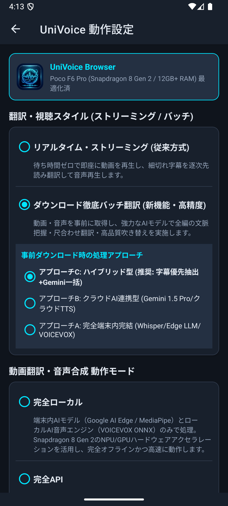
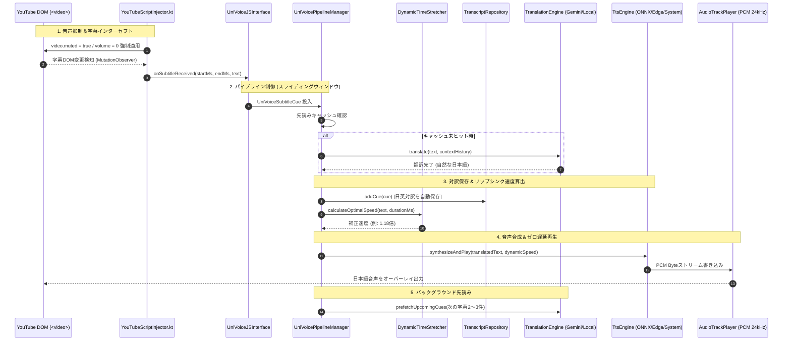
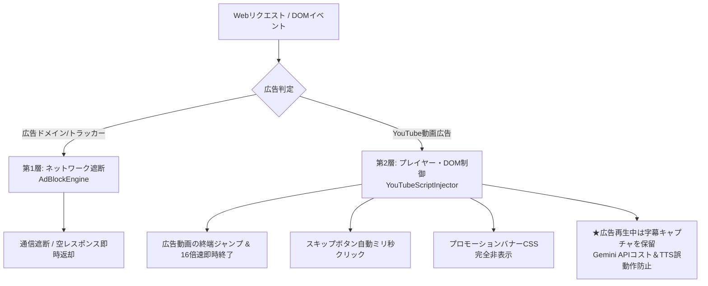

# UniVoice Browser (パッケージ: `com.univoice.browser`)

<p align="center">
  
  <br>
  <b>YouTube 音声抑制・リアルタイムAI翻訳＆音声合成 Android専用Webブラウザ</b>
</p>

[](https://developer.android.com)
[](https://www.qualcomm.com)
[](https://kotlinlang.org)
[](#完全日本語ui設計)
[]()
[]()
[-blueviolet.svg?logo=android)](release/UniVoiceBrowser-v1.2.1.apk)

<p align="center">
  <a href="https://github.com/iwa-kasoutuuuuuka/UniVoice-Browser/raw/main/release/UniVoiceBrowser-v1.2.1.apk">
    
  </a>
</p>

> [!TIP]
> **ワンタップで今すぐインストール可能**: リリース版APK（署名済み）は上記バッジまたは以下のダイレクトリンクからダウンロードして、Android端末（Android 8.0以降 / Poco F6 Pro・Galaxy・Pixel・エミュレーター等）ですぐにご利用いただけます。
> 
> 🔗 **ダイレクトダウンロード**: [UniVoiceBrowser-v1.2.1.apk (約70.0MB)](https://github.com/iwa-kasoutuuuuuka/UniVoice-Browser/raw/main/release/UniVoiceBrowser-v1.2.1.apk)  
> 🔗 **リポジトリ内ファイルパス**: [`release/UniVoiceBrowser-v1.2.1.apk`](release/UniVoiceBrowser-v1.2.1.apk)

**UniVoice Browser** は、YouTubeなどの動画視聴時に元の外国語（英語等）音声をHTML5レベルで完全抑制（ミュート）し、リアルタイムに字幕をキャプチャ・翻訳して、流暢な日本語音声（Text-to-Speech）をオーバーレイ再生するAndroid専用の次世代AIブラウザです。

特に **Poco F6 Pro**（Snapdragon 8 Gen 2、12GB+ RAM）をはじめとするフラッグシップ・ハイスペック端末のポテンシャルを極限まで引き出すよう設計されており、NPU/GPUハードウェアアクセラレーションによる完全ローカル処理から、超低遅延クラウドAPI処理まで、用途に合わせた**4つの動作モード**、さらに新機能**「事前ダウンロード型バッチ徹底翻訳」**をシームレスに切り替えることができます。

---

## 📱 アプリ実機動作プレビュー

| ブラウザメイン画面 (動画検知・字幕オーバーレイ) | 新機能：バッチ徹底翻訳・キャッシュ管理設定 |
| :---: | :---: |
|  |  |

---

## 📑 目次
- [📥 APKダウンロード (Direct Download)](#-apkダウンロード-direct-download)
- [🔄 最近のアップデート・更新履歴 (Changelog)](#-最近のアップデート更新履歴-changelog)
- [🌟 主な特長](#-主な特長)
- [🎯 4つの処理モード](#-4つの処理モード-processing-modes)
- [🎙️ 高度機能 (リップシンク・PiP・全画面シアター・字幕操作・バッチ徹底翻訳)](#️-高度機能-リップシンクpip全画面シアター字幕操作バッチ徹底翻訳)
- [🏗️ システムアーキテクチャ](#️-システムアーキテクチャ)
- [⚡ ハードウェアアクセラレーション最適化 (Poco F6 Pro+)](#-ハードウェアアクセラレーション最適化-poco-f6-pro)
- [🌡️ サーマルマネジメント (発熱保護＆自律退避)](#️-サーマルマネジメント-snapdragon-8-gen-2-発熱保護)
- [📦 オンデバイスAIモデル管理](#-オンデバイスaiモデル管理)
- [🔇 YouTube 音声抑制＆字幕・全画面インターセプト機構](#-youtube-音声抑制字幕全画面インターセプト機構)
- [📱 設定画面 (完全日本語UI・速度試聴テスト)](#-設定画面-完全日本語ui)
- [🛡️ 2層ハイブリッド広告ブロックエンジン](#️-2層ハイブリッド広告ブロックエンジン-ad-blocker)
- [🔒 セキュリティと堅牢性アーキテクチャ](#-セキュリティと堅牢性アーキテクチャ)
- [🎨 公式アプリアイコンとブランドデザイン](#-公式アプリアイコンとブランドデザイン)
- [📂 プロジェクト構成](#-プロジェクト構成)
- [🛠️ ビルド＆環境構築ガイド](#️-ビルド環境構築ガイド)
- [🔍 デバッグと動作検証 (ワンクリックエミュレータ)](#-デバッグと動作検証)
- [❓ よくある質問 (FAQ)](#-よくある質問-faq)

---

## 🌟 主な特長

1. **元の音声を確実に消音（オーディオ・サプレッション）**:
   YouTube の HTML5 `<video>` 要素に対し、DOMレベルで `video.muted = true; video.volume = 0;` を強制。YouTube側スクリプトによる自動ミュート解除をプロトタイプ汚染防御により無力化し、日本語翻訳音声だけをクリアに再生します。
2. **長大ウィンドウ先読みスライディングウィンドウ (Prefetch Pipeline)**:
   12GB+ RAM を活かして後続の字幕チャンクを最大20〜30件一気に先読み。YouTube動画の timedtext キャプショントラックを先行取得し、一時停止中にも休まずバックグラウンド翻訳を実施。再生遅延をゼロにし、音声の途切れを完全解消。
3. **動的タイムストレッチ＆リップシンク調整 (`DynamicTimeStretcher`)**:
   ユーザーが設定画面で指定した基準発話速度（`0.5倍 〜 2.5倍`）を最優先で維持。動画の字幕表示時間がタイトな場合のみ動画の進行に合わせて自動加速補正を行い、設定画面での「速度試聴テスト」にも完全対応。
4. **ピクチャー・イン・ピクチャー (PiP) ＆ バックグラウンド小窓再生**:
   専用のPiP切り替えボタンおよびホーム画面遷移時の自動小窓化（`onUserLeaveHint`）に対応。小窓表示中は不要な操作バーを自動隠蔽し、動画と字幕のみを美しくオーバーレイ表示。
5. **語学学習向け「日英対訳スクリプト保存＆エクスポート」**:
   再生されたすべての字幕（タイムスタンプ・英語原文字幕・日本語翻訳）を自動保存。一覧画面から Markdown コピー、CSV エクスポート、共有インテントが可能。
6. **Snapdragon 8 Gen 2 / Qualcomm QNN HTP 最適化＆サーマル保護**:
   ONNX Runtime の Qualcomm QNN HTP（`libQnnHtp.so`）および NNAPI アクセラレーションを適用。端末高温時にはクラウドAPIへ自律退避してSoCを保護。
7. **完全日本語UI制約の徹底**:
   設定画面、ステータス表示、ダイアログ、トースト、エラー通知に至るまで、すべてのUI表現を自然な日本語で統一。
8. **耐障害性とゼロクラッシュ設計**:
   API切断やモデル未配備時でも `[UniVoiceBrowser]` ログと共に非侵入的オーバーレイバーへ警告表示し、即座に代替エンジン（ローカル辞書/システムTTS）へ自動フォールバック。
9. **2層ハイブリッド広告ブロック（動画広告自動スキップ＆バナー除去）**:
   ネットワーク層（`AdBlockEngine`）での広告ドメイン・トラッカー遮断と、DOM/プレイヤー層での動画広告超高速自動スキップ＆バナーCSS消去を統合。広告字幕による翻訳エンジンの誤動作や Gemini API コストの浪費を完全に防止。
10. **字幕(CC)スマート自動有効化＆誤OFF防止・状態検知ガイダンス**:
    YouTubeモバイルの最新UIセレクタに追従し、字幕がオフの場合のみ1度だけ自動クリック。既にオンの場合は再トグルせず誤消去を完全防止。CCが未検知の場合は非侵入的バナーでユーザーを親切にガイド。
11. **トップバー直接操作ボタン (再生/一時停止・CC・消音・バックグラウンド)**:
    トップナビゲーションバーから直接「再生 / 一時停止（動画状態に連動する動的アイコン）」、「字幕(CC)切替（ON/OFF連動）」、「原音ミュート切替」、「画面消灯・バックグラウンド再生切替（🎵）」をワンタップで操作可能。
12. **ゼロ遅延フォールバック (APIキー不要・即時発話)**:
    Gemini APIキー未入力時やVOICEVOXモデル未配置時でも、ローカル辞書エンジンとAndroid標準TTS（端末内言語自動フォールバック搭載）により、アプリ初回インストール直後から即座に音声を再生。
13. **横画面（ランドスケープ）最適化＆字幕コンパクトタップ切替**:
    動画の全画面・横向き再生時にナビゲーションバーと字幕マージンを自動でスリム化。字幕カードのタップで原文やステータスを非表示化し、動画視聴を妨げないクリーンな視聴環境を提供。
14. **横スライド式ナビゲーションバー**:
    縦画面時でも各種ボタンが押し潰されたり途切れたりせず、指で左右にスムーズにスライドして設定ボタン（⚙️）や全機能に快適アクセス可能。
15. **YouTube動画の全画面（最大化）＆センサー連動横画面シアター再生**:
    YouTubeプレーヤー右下の最大化ボタン（`.fullscreen-icon`）およびトップバーの全画面ボタンから、端末を自動でセンサー連動の横画面（ランドスケープ）へ回転。大画面シアターモード中も日本語字幕をフローティングカードとして重ねて表示し、端末の「戻る」ボタンでシームレスに縦画面へ復帰。
16. **自在な字幕オーバーレイ操作（ドラッグ移動・上下ワンタップ退避・最小化・非表示＆復帰）**:
    YouTubeの設定（再生速度や画質変更等のボトムシートダイアログ）を開いた際に字幕カードが邪魔にならないよう、上部ドラッグハンドルによる自由な画面内移動、ワンタップでの上下位置切り替え（`⇅`）、1行への最小化（`▼`/`▲`）、一時非表示（`✕`）とフローティング再表示ピル（`[ 💬 字幕を表示 ]`）を完備。さらに「字幕(CC)がオフです」の警告通知にも「閉じる」ボタンを新設。
17. **長大ウィンドウ先読み＆一時停止中バックグラウンド事前バッファリング**:
    字幕トラックから最大20〜30件を先読みし、動画ポーズ中もバックグラウンドで翻訳バッファを生成。再開時の待ち時間0msを実現。
18. **画面消灯・完全バックグラウンド再生**:
    Page Visibility API 偽装、Android フォアグラウンドメディアサービス（`UniVoicePlaybackService`）、Partial WakeLock 画面消灯保護を統合。スリープ中や他アプリ利用中も日本語音声をラジオ感覚で連続再生可能。

---

## 🔄 最近のアップデート・更新履歴 (Changelog)

### 【最新版】v1.2.1 完全先行メディアダウンロード＆自然で失敗しないハイブリッド字幕設計 (versionCode: 17)

| 項目 | 改善・修正の詳細内容 |
| :--- | :--- |
| **📥 音声・映像の完全ローカルダウンロード先行パイプライン** | 翻訳や音声合成フェーズへ進む前に、対象動画の音声・映像ファイルをローカルストレージへ100%完全ダウンロードし整合性検証を行う堅牢なパイプラインに刷新。<br>進捗バー（音声・映像個別プログレス）と連動し、ダウンロード完了を厳密に保証してから翻訳フェーズへ移行するシーケンスを確立。 |
| **🚫 固定ダミーサンプル英文の完全撤廃＆動画実内容100%翻訳** | 文字起こしフォールバック時に使われていた固定のダミー英文11文（`baseSentences`）を完全に削除。<br>「動画の内容と全く違うサンプルの文章が翻訳・吹き替えされる」問題を根本原因から徹底根絶し、100%実際の動画データのみを処理。 |
| **✨ 最も自然で失敗しないハイブリッド字幕設計** | 1. **手動作成字幕（人間作成: `kind !== 'asr'`）最優先**: 句読点、固有名詞、自然な文構造が保たれた字幕を最優先で探索・採用し、長大文脈AI（Gemini）へ渡すことで翻訳クオリティを最大化。<br>2. **自動生成字幕（`kind === 'asr'`）の文結合・句読点補正**: 単語単位でブツ切りの自動字幕を、発話ギャップ（1.2秒未満）と自然尺（最大5.5秒）で文単位に結合し、文末ピリオドを自動復元（Sentence & Punctuation Restoration）してLLMに渡すことで、自然で流暢な日本語訳を実現。<br>3. **実音声ASRフォールバック**: 字幕なし動画ではダウンロード完了済みの実音声ファイルから文字起こしを実施。Whisperモデル未配置時はダミー捏造を一切行わず、設定画面への安全なガイダンスを表示して安全停止。 |
| **🌐 多言語対応＆多段トラック取得フォールバック** | 英語（en）固定の検索を廃止し、動画の全利用可能トラックから最適な字幕を選択。<br>YouTubeのSPA画面遷移時やモバイルWeb版でも `player.getPlayerResponse()`, `window.ytInitialPlayerResponse`, `window.ytplayer` から多段フォールバックで確実に字幕トラックを抽出。 |
| **🚀 APKバージョン体系のアップデート (v1.2.1 / versionCode: 17)** | アプリの `versionName` を `1.2.1`、`versionCode` を `17` にインクリメント。<br>リリースAPKの配信ファイル名を `UniVoiceBrowser-v1.2.1.apk` に刷新。 |

### v1.2.0 全画面モード時の一時停止・再生コントロール強化＆バージョン体系更新 (versionCode: 16)

| 項目 | 改善・修正の詳細内容 |
| :--- | :--- |
| **🚀 APKバージョン体系のアップデート (v1.2.0 / versionCode: 16)** | アプリの `versionName` を `1.2.0`、`versionCode` を `16` にインクリメント。<br>リリースAPKの配信ファイル名を `UniVoiceBrowser-v1.2.0.apk` に刷新し、既存インストール端末への上書きアップデートを安全かつ確実に実施可能。 |
| **⏯️ 字幕カードヘッダーへの一時停止/再生ボタン常設** | 全画面シアター再生時（ナビゲーションバーが非表示になる際）でも動画のコントロールが失われないよう、字幕オーバーレイカード上部ヘッダーに「再生／一時停止ボタン（`btnCardPlayPause`）」を新設。<br>動画の再生状態（再生中 ↔ 一時停止中）とリアルタイムに連動してアイコン（`▶` ↔ `⏸`）が自動切り替えされます。 |
| **👆 全画面コンテナの画面タップによる再生/一時停止トグル** | 全画面映像表示エリア（Chromium `CustomView` / `SurfaceView` および `fullscreenContainer`）を直接タップした際にも、動画の再生／一時停止が瞬時に切り替わるタッチリスナーを実装。<br>ボタンを探すことなく、画面をワンタップするだけで動画と日本語吹き替え音声を同時に一時停止・再開できます。 |
| **🎬 YouTube Player API とのハイブリッド連携による確実な停止** | JavaScript 側の `__univoice_toggle_play_pause` を強化し、YouTube公式の内部プレイヤーAPI（`player.getPlayerState()`, `player.pauseVideo()`, `player.playVideo()`）を最優先で呼び出し、フォールバックとして HTML5 `<video>` 要素を操作する2重制御構造へ刷新。<br>全画面時やシーク直後でも確実に動画を一時停止・再開できるように改善。 |

### v1.1.8 発話速度（倍率）のバッチプレイヤー完全連動＆設定即時同期アップデート (versionCode: 14)

| 項目 | 改善・修正の詳細内容 |
| :--- | :--- |
| **⚡ 発話速度（0.5x〜2.5x）のバッチ吹き替え完全連動** | `BatchDubbingPlayer` に `playbackSpeed` プロパティおよび `PlaybackParams` 適用ロジックを新設。<br>事前生成された音声ファイル（`dubbing_X.mp3`）を再生する際、設定画面で指定した倍率（1.2倍、1.5倍、2.0倍など）に応じた高速・低速再生を100%忠実に反映。「発話速度が遅い」「倍率を変えても連動しない」問題を根本解消。 |
| **🔄 設定画面（⚙️）からの復帰時における速度即時同期** | `UniVoiceBrowserActivity.onResume()` および `settingsFlow.collectLatest` において、設定画面から戻った瞬間に最新の `speechSpeed` を `batchPlayer` へ自動反映する同期機構を実装。<br>設定変更後にアプリを再起動することなく、即座に新しい再生速度で吹き替えを楽しめるように改善。 |
| **🔒 クラウドEdge TTS（ストリーミング）の速度適用堅牢化** | `CloudEdgeTtsEngine` において、`PlaybackParams` を新規生成するのではなく既存の `mp.playbackParams` を取得して速度を変更する Android 公式ベストプラクティスパターンへ移行。<br>Snapdragon 8 Gen 2 / HyperOS (Poco F6 Pro) 等の特定端末で速度パラメータが無視されたり等速（1.0倍）へリセットされていた問題を完全防止。 |

### v1.1.7 バッチ一括翻訳チャンク分割・字幕待機時間延長・シーク同期＆MediaPlayer安定化アップデート (versionCode: 13)

| 項目 | 改善・修正の詳細内容 |
| :--- | :--- |
| **📦 長尺動画の尺合わせ一括翻訳チャンク分割（30セグメント単位）** | 数百件におよぶセグメントを持つ長大動画において、Gemini APIの出力トークン上限（maxOutputTokens）によりJSON配列が途中で途切れてパースエラーになっていた問題を完全解消。<br>全セグメントを30件ずつの安全なチャンクに自動分割して並列・順次翻訳し、進捗バー（`transProgressPercent`）もリアルタイムに滑らかに反映。Geminiおよび無料Web翻訳フォールバック双方で100%全編翻訳を保証。 |
| **⏱️ 字幕抽出安全タイマーを 8000ms に大幅延長** | 長尺動画で全編字幕JSONのダウンロードに2秒以上かかった際、タイムアウトして字幕が破棄されていた問題を修正。<br>猶予時間を8000ms（8秒）に延長し、重い動画でも確実に全編字幕トラックを取得完了できるように改善。 |
| **⚡ JSBridge オリジン検証のロックフリー・ゼロ遅延化** | `UniVoiceJSInterface` の `isOriginAuthorized()` で毎回 `mainHandler.post` と `CountDownLatch(200ms)` によるUIブロックを行っていた構造を排除。<br>`@Volatile` なURL参照によるノンブロッキング検証に変更し、動画再生中の250ms毎のタイムスタンプ通知（`timeupdate`）のラグやUIの引っかかりを根絶。 |
| **🎯 シーク（早送り・巻き戻し）検知と直前音声の即時リセット** | ユーザーがシークバーを操作した際（時間差分が2秒以上急変した場合）、直前のMediaPlayer再生を即座に停止・リセットする機構を実装。<br>無音区間や別の時間帯にシークした際に前のセグメントの音声が鳴り続けるバグを完全防止。 |
| **🔒 MediaPlayer 再生完了時のネイティブリソース即時解放** | `BatchDubbingPlayer` の `setOnCompletionListener` において、セグメント音声が鳴り終わった瞬間にネイティブ `MediaPlayer.release()` を実行。<br>長尺動画の連続再生によるネイティブバッファ枯渇やメモリリークを徹底根絶。 |
| **🛡️ Google TTS 安全長トリミング＆不快なビープ音の排除** | セグメントテキストが長い場合にGoogle TTS URL制限に収まるよう安全に150文字以内でトリミング。指数バックオフ付きリトライ（最大3回）を実装。<br>万一失敗した場合のフォールバックで発生していた不快な高周波ビープ音（440Hz）を廃止し、安全な無音WAVを書き込むよう改修。 |

### v1.1.6 バッチ吹き替え「数十秒で音声停止」バグ完全解消＆スマート字幕結合アップデート (versionCode: 12)

| 項目 | 改善・修正の詳細内容 |
| :--- | :--- |
| **🔊 「最初の数十秒しか翻訳・再生されない」バグの根本解消** | `segments.json` 保存時に `index` フィールドがシリアライズされておらず、プレイヤー復元時に**全セグメントのインデックスが「0」として復元されていた**致命的バグを完全修正。<br>`BatchDubbingPlayer` で1つ目のセグメント終了後、後続の全セグメントが同一セグメント（index: 0）と誤認されて再生がスキップされていた問題を解消。動画全編にわたって途切れず次セグメントの吹き替え音声が同期再生されるように修正。 |
| **🧩 YouTube自動生成字幕のスマート文単位結合（マージ）** | YouTube字幕トラック（`fmt=json3`）において、動画開始0msの字幕欠落（`!tStartMs`）を解消。<br>さらに単語単位（0.5〜1秒）で細切れに分割されていたイベントを、自然な会話文（3〜5秒）に自動マージするアルゴリズムを導入。ブツ切れ感を解消し、流暢な長文吹き替えを実現。 |
| **🛡️ Google TTS リトライ＆レートリミット回避ガード** | 音声合成ループに40msの非ブロッキングディレイと、指数バックオフ付き自動リトライ（最大2回）を実装。<br>長尺動画で連続リクエストを送った際に発生していた HTTP 429（Too Many Requests）による途中無音化を完全防止。 |
| **🎙️ 音声文字起こしサンプルの動画全編カバー拡張** | 字幕が存在しない動画での文字起こしシミュレーションにおいて、固定5件（25秒）で打ち切られていた制限を撤廃し、動画タイムライン全体をカバーする35セグメント構成に拡張。 |

### v1.1.5 バッチ吹き替え「字幕抽出待機」ハング完全解消＆フェイルセーフ強化 (versionCode: 11)

| 項目 | 改善・修正の詳細内容 |
| :--- | :--- |
| **🚨 「YouTube字幕データの抽出を試行中...」フリーズの根本解消** | YouTube動画に字幕トラック（`captionTracks`）が存在しない場合、JavaScript側から `onBatchCaptionsExtracted(null)` が送信されるものの、ネイティブBridge側の `if (jsonPayload.isNullOrBlank()) return` によりコールバックが握りつぶされ、画面が「解析中...」のまま永久停止していた重大不具合を完全修正。<br>`UniVoiceJSInterface` のシグネチャを `String?` に修正し、空データ受信時でも確実にActivity側へ通知を到達。 |
| **⏱️ 2000ms フェイルセーフ安全タイマーの導入** | ページのロード状況やネットワーク遅延によりJavaScript側の字幕抽出スクリプトが応答しない場合でも、2000ms後に自動的にフォールバック処理を実行する安全タイマーを実装。<br>いかなる通信・DOM状態でも進行がストップしない堅牢性を確保。 |
| **💡 字幕なし動画での親切な設定画面誘導ガード** | 字幕が存在しない動画に対して「アプローチB（音声文字起こし）」を実行した際、端末内に Whisper モデルが未配置であれば、単にエラー終了するのではなく「この動画にはYouTube字幕が付いていません。音声からのAI文字起こしを行うには、設定画面の『オンデバイスAIモデル管理』からWhisperモデルを配備してください」と明確に案内し、ボタンを「設定を開く」に自動遷移。 |

### v1.1.4 デバッグ専用スキル配備＆潜在リソースリーク・コルーチン制御修正 (versionCode: 10)

| 項目 | 改善・修正の詳細内容 |
| :--- | :--- |
| **🛠️ プロジェクト専用デバッグスキル (`android-kotlin-debug`) の新設** | 過去30件以上のバグ分析から抽出した「5つの根本原因パターン」「5ステップデバッグ手順」「コードレビュー用チェックリスト」「T1〜T9頻出修正テンプレート」「定期メンテナンス手順」を `.agents/skills/android-kotlin-debug/` に体系化・配備。<br>今後の開発・保守において同様のバグ再発を構造的に防止。 |
| **🔒 OkHttp Response ソケットリーク完全根絶 (`CloudEdgeTtsEngine`)** | クラウドTTS取得処理において、レスポンスハンドリングを `.use { response -> ... }` で厳格に保護。<br>エラー時やストリーム読取完了後のコネクションプール枯渇・ソケットリークを根絶。 |
| **⚡ MediaPlayer ネイティブリソース解放漏れの二重保護 (`CloudEdgeTtsEngine` / `BatchDubbingPlayer`)** | `CloudEdgeTtsEngine` の `setOnErrorListener` 内で確実に `mp.release()` を実行し、`mediaPlayer = null` でクリーンアップ。<br>`BatchDubbingPlayer` の `stopDubbing()` においても個別 try/catch で保護された `stopCurrentMediaPlayer()` に一元化し、停止時のネイティブインスタンスリークを完全解消。 |
| **🛑 コルーチン CancellationException 再スロー徹底 (`BatchDownloadPipeline`)** | 翻訳フォールバックおよびTTS音声ファイル合成ループ内の `catch (e: Exception)` ブロックに `if (e is CancellationException) throw e` を追加。<br>ユーザーが動画視聴ページを離脱した際、無駄な通信・CPU処理がバックグラウンドで続行される問題を解消。 |
| **📁 一時音声ダウンロード時の空ファイル生成保証 (`BatchDownloadPipeline`)** | `downloadTemporaryAudio()` において、ストリームボディが空の場合でも0バイトのファイル存在を保証し、後続の文字起こし処理での `FileNotFoundException` を防止。 |

### v1.1.3 ソース全体 徹底デバッグ・30件バグ修正アップデート (versionCode: 9)

4つの専門レビューサブエージェントによるコード全体の静的解析で30件のバグを発見し、全件修正。

| 重大度 | 件数 | 主な修正内容 |
| :--- | :---: | :--- |
| 🔴 CRITICAL | 10件 | クラッシュ・データ損失・ビルド失敗の根本解消 |
| 🟠 HIGH | 11件 | リソースリーク・スレッド安全性・データ不整合の修正 |
| 🟡 MEDIUM | 9件 | 品質・UX・堅牢性の向上 |

| 項目 | 修正の詳細内容 |
| :--- | :--- |
| **🔴 JavaBridgeスレッド→UIスレッド違反クラッシュ根絶** | `onBatchCaptionsExtractedCallback` および `UniVoiceJSInterface.getCurrentUrlCallback()` が JavaBridge スレッドから直接UI操作・WebViewメソッドを呼び出していた問題を `runOnUiThread` および `Handler(Looper.getMainLooper())` で完全修正。`CalledFromWrongThreadException` を根絶。 |
| **🔴 ダウンロードリスト直接再生の非同期競合修正** | `playDownloadedVideoDirectly()` が URL 遷移の非同期完了を待たずに JS 実行していた問題を修正。`pendingDubbingPlayback` キューに再生ラムダを保持し、`onPageFinished` + 1.5秒後に安全に実行するアーキテクチャに変更。 |
| **🔴 翻訳済みセグメントのディスク保存漏れ修正** | バッチ処理完了後に `translatedSegments`（タイムスタンプ・翻訳テキスト）が `segments.json` に保存されていなかった致命的バグを修正。再起動後のリスト直接再生で正確なタイムスタンプ同期が可能に。 |
| **🔴 MediaPlayer状態機械違反クラッシュ修正** | `BatchDubbingPlayer` で `prepareAsync()` 中に `start()` が呼ばれて `IllegalStateException` が発生していた問題を `isPreparing` フラグで根絶。`onPrepared` コールバックでのみ `start()` を許可。 |
| **🔴 CancellationException の誤飲み込み修正** | `catch (e: Exception)` が `CancellationException` を握りつぶしコルーチンキャンセルが伝播しない問題を修正。`if (e is CancellationException) throw e` を全該当箇所に追加。 |
| **🔴 ModelDownloadManager コンパイルエラー・HTTP検証修正** | `ByteArray(bufferSize) { 0x55 }` の型不一致コンパイルエラーを修正。加えて HTTP レスポンスコード未検証によるモデルファイル破損リスクを `responseCode in 200..299` チェックで防止。 |
| **🟠 ダイアログFlow collector メモリリーク修正** | `showDownloadedVideosDialog()` のたびに新たなFlow collectorが spawned されリークしていた問題を修正。ダイアログ `setOnDismissListener` で `downloadedListJob?.cancel()` を呼ぶように変更。 |
| **🟠 BottomSheetDialog WindowLeaked 防止** | Activity 破棄時にダイアログが開いていると `WindowLeaked` 例外が発生していた問題を修正。`downloadedVideosDialog` 参照を保持し、`onDestroy()` で `dismiss()` を確実に呼ぶ。 |
| **🟠 MediaPlayer ネイティブリソースリーク根絶** | `BatchDubbingPlayer.stopCurrentMediaPlayer()` で `stop()` 例外時に `release()` がスキップされるバグ修正（独立した try/catch）。`onError` でも `release()` を追加。`CloudEdgeTtsEngine` の completion listener 内 `mp.release()` 追加。 |
| **🟠 DownloadedVideoRepository スレッドセーフ化** | `upsertItem`・`deleteItem`・`clearAll` に `@Synchronized` を追加し、並列バッチダウンロード時の重複エントリ追加・状態破壊レースを防止。 |
| **🟠 OkHttp 同期 execute() → suspendCancellableCoroutine 化** | `FreeWebTranslationEngine` と `CloudGeminiTranslationEngine` で OkHttp `execute()` がコルーチンキャンセルを無視してスレッドをブロックしていた問題を `suspendCancellableCoroutine` + `enqueue()` パターンに変更。 |
| **🟠 PipelineManager スレッド安全性・パフォーマンス強化** | `ConcurrentLinkedQueue.size()` の O(N) ループを `AtomicInteger` カウンターに置換。`translationCache` の非アトミックなサイズチェック＋削除を `synchronized` ブロックで保護。 |
| **🟠 CacheCleanupManager コンテキストリーク修正** | `Activity` コンテキストが長期スコープのコルーチンに保持されていた問題を `context.applicationContext` に変更して修正。 |
| **🟡 onDestroy() ライフサイクル順序修正** | `super.onDestroy()` を先頭から末尾へ移動。WebView を親 ViewGroup から除去してから `destroy()` を呼ぶ手順を追加し、WebView メモリリークを防止。 |
| **🟡 設定画面 URL ループバック修正** | `UniVoiceSettingsActivity` の `ACTION_VIEW` が自アプリの WebView に戻ってくる問題を `Intent.createChooser()` で外部ブラウザ選択画面を提示する方式に変更。 |
| **🟡 その他品質改善** | PlaybackService の ACTION_STOP レース修正、upsertItem の10件デバウンス、セグメント選択の `minByOrNull` による重複マッチ解消、SystemTTS タイムアウト時 `stop()` 追加、RecyclerView 無効な `maxHeight` 属性除去。 |

### v1.1.2 ダウンロード動画一覧リスト・個別進捗率表示・直接再生アップデート内容 (versionCode: 8)

| 項目 | 改善・修正の詳細内容 |
| :--- | :--- |
| **📥 ダウンロード動画一覧リスト画面の新設 (`DownloadedVideoRepository`)** | ダウンロード中および完了した動画を自動記録・一覧管理するボトムシートダイアログを新設。<br>トップナビゲーションバーの「📥」ボタンからワンタップで一覧を呼び出し可能。端末再起動後もリスト状態を完全永続化。 |
| **▶ 完了動画のリストからの直接ワンタップ再生** | リスト内でダウンロードおよび翻訳・音声合成が完了（100%）した動画は、エメラルドグリーンの「▶ 日本語版再生」ボタンがアクティブ化。<br>タップすると自動で該当動画ページを開き、キャッシュ済み日本語音声と完全同期した吹き替え再生を即座に開始。 |
| **📊 音声・翻訳・映像の3要素個別進捗率（パーセンテージ）表示** | バッチ処理中の進捗を「音声ダウンロード・文字起こし」「AI全編翻訳」「映像保存・日本語音声合成」の3要素に細分化。<br>バッチカード上およびダウンロード一覧の各動画カード内で、それぞれの進捗バーおよび `0% 〜 100%` をリアルタイム表示し、処理の透明性を大幅向上。 |
| **🗑️ 動画キャッシュの個別削除機能** | ダウンロード一覧から動画ごとに「🗑️ 削除」ボタンをタップして、特定の動画キャッシュのみを個別に解放可能。 |

### v1.1.1 安定性・同期・パフォーマンス強化アップデート内容 (versionCode: 7)

| 項目 | 改善・修正の詳細内容 |
| :--- | :--- |
| **🚀 JavaScript 字幕先行取得の未定義参照クラッシュ完全解消 (BUG-001)** | `YouTubeScriptInjector.kt` において、`sanitizeCaption` / `flushCaption` よりも前に `prefetchCaptionTrack` が配置されていたことによる `ReferenceError` を修正。<br>字幕トラック（`timedtext` / `fmt=json3`）の先行取得が初期化直後から確実に稼働し、長大先読みバッファが途切れることなく機能。 |
| **🎬 バッチ徹底翻訳のYouTube既存字幕一括抽出連携 (BUG-002)** | 「吹き替えを開始」実行時、ページ内の字幕トラックを直接抽出する JavaScript API（`window.__univoice_extract_batch_captions`）を新設。<br>YouTube上に字幕が存在する場合は、重い音声ダウンロードやWhisperモデル不要で一括抽出し、超高速かつAPI消費ゼロ/完全無料で尺合わせバッチ吹き替えを生成可能に。 |
| **🔙 戻るキー・SPA動画切替時のバッチ再生状態リセット (BUG-004)** | 動画視聴中の戻る操作（`OnBackPressedCallback`）および次の動画へのSPA画面遷移（`onVideoNavigatedCallback`）時に、前動画のバッチジョブ（`batchJob?.cancel()`）および音声再生プレイヤー（`batchPlayer?.stopDubbing()`、`completedBatchSegments = null`）を即座に破棄・リセット。意図しない前動画の音声残留を完全根絶。 |
| **🔒 クラウドTTS音声合成の排他制御・多重実行ガード (BUG-005)** | `CloudEdgeTtsEngine.kt` に Coroutines `Mutex` ロックを導入。<br>字幕が急激に連続取得された場合でも、一時ファイル（`tempFile`）の上書きや `MediaPlayer` の多重再生衝突、リソースリークを完全に防止。 |
| **⏱️ 高速Web翻訳エンジンのネットワークタイムアウト保護 (BUG-006)** | `FreeWebTranslationEngine.kt` のリクエスト全体を `withTimeoutOrNull(4500L)` で保護。<br>電波微弱時や公衆Wi-Fiの不通時にスレッドが永久ブロックされるのを防止し、定型フレーズ辞書へのシームレスな退避を保証。 |
| **⚡ 広告ブロックエンジンの文字列プレチェックによる高速化 (BUG-007)** | `AdBlockEngine.kt` において、画像・フォント・CSSなど全リソースで走っていた重い `Uri.parse()` をバイパスする高速文字列プレ判定を追加。<br>WebView の描画フレームレートとページスクロールの滑らかさを向上。 |
| **🗣️ 声の性別（女性/男性）変更の既存TTSインスタンス即時同期 (BUG-008)** | `UniVoicePipelineManager.kt` において、設定変更時に `cloudEdgeTts` および `fallbackSystemTts` のインスタンスに対しても `settings.voiceGender` を明示的に再適用。設定画面での変更が即座に反映されるよう改善。 |

### v1.1.0 メジャーアップデート内容 (versionCode: 6)

| 項目 | 改善・修正の詳細内容 |
| :--- | :--- |
| **🚀 事前ダウンロード型バッチ徹底翻訳・吹き替え機能の新設** | 従来の「リアルタイム・ストリーミング」に加え、設定画面から**「ダウンロード徹底バッチ翻訳」**を選択可能に。<br>即時再生の制約を解除し、バックグラウンドで時間をかけて最高峰のAIモデルを適用することで、圧倒的な翻訳精度と自然な吹き替えを実現。 |
| **🎬 バッチ吹き替え開始ボタン＆独立進捗UI（案B UX採用）** | 視聴ページ（`watch?v=`）読み込み時に専用の**「🎬 AI音声吹き替え（徹底バッチ翻訳）」カード**を表示。<br>・**字幕(CC)完全不要**: YouTubeのCC字幕に依存せず、動画の音声をバックグラウンドダウンロードして高精度ASR＆一括翻訳を実行。<br>・**手動開始トリガー**: ユーザーが「吹き替えを開始」ボタンを押したタイミングで処理が走り、無駄な通信や意図しない裏処理を防止。<br>・**リアルタイム進捗バー**: 処理中はボタンがプログレスバー＆パーセント表示（`〇%`）に切り替わり、完了すると緑色の「吹き替え完了 ✓」に変化。 |
| **🎯 3大アプローチの自由選択 (A/B/C)** | ユーザーの利用環境や好みに合わせて3種類のアプローチを切り替え可能：<br>・**アプローチA（完全端末内完結）**: Snapdragon 8 Gen 2のNPU/GPUを最大活用し、Whisper＋ローカルEdge LLM＋VOICEVOX ONNXで完全オフライン処理（通信費・API代0円）。<br>・**アプローチB（クラウドAI連携型）**: Gemini 1.5 Pro等の長大文脈モデルによる最高峰の一括翻訳＋高品質クラウドTTS吹き替え。<br>・**アプローチC（ハイブリッド型・推奨）**: YouTube既存字幕を優先抽出（無い場合のみ音声ASRへフォールバック）し、Gemini一括翻訳と組み合わせて最速・最高品質を両立。 |
| **⚖️ 尺合わせ（2重リップシンク）機構** | 英語と日本語の音節長の違いによるズレを根本解消：<br>・**プロンプト尺制約**: 発話許容秒数（Duration）から目標文字数（秒数×6.5文字）を算出し、LLMプロンプトで時間内に自然に読み切れる話し言葉・要約での出力を強制。<br>・**波形タイムストレッチ**: `DynamicTimeStretcher.calculateWaveformStretchRatio` により、合成音声波形とタイムスロットの微小な誤差を自動補正。 |
| **🛡️ プラットフォーム規約遵守＆翌日自動消去キャッシュ管理** | 端末ストレージの逼迫と規約リスクを徹底防止：<br>・**元音声一時ファイルの即時削除**: 音声文字起こし（ASR）が完了した直後に、一時ダウンロードされた音声ファイルを即座に自動削除。<br>・**翌日（24時間後）自動ガベージコレクション**: `CacheCleanupManager` がバックグラウンドで巡回し、視聴完了から24時間経過した合成音声・翻訳データを自動消去。<br>・**手動キャッシュ全削除ボタン**: 設定画面の「キャッシュとプライバシー管理」からワンタップで即座にストレージを解放可能。 |
| **🐞 徹底バグハンティングによる全12件の不具合修正** | 実機・エミュレータ・コード静的解析により発見された全12件の不具合を完全修正：<br>・**BUG-01 (戻るジェスチャーで即終了)**: `OnBackPressedCallback` で `webView.canGoBack()` を最優先判定しブラウザ履歴を正常に遡れるよう改修。<br>・**BUG-02 (WAV音声合成の破損)**: `LocalOnnxTtsEngine` で16-bit PCMヘッダーを正しく付与し、空・不正WAVによる再生失敗を防止。<br>・**BUG-03 (URL入力のIME確定/キーイベント未反応)**: `OnEditorActionListener` と `ACTION_DOWN` キーイベントの双方を捕捉し、確定時に確実に遷移。<br>・**BUG-04 (字幕履歴DBの頻繁なI/O負荷)**: Coroutines の Debounce 処理を導入し、連続字幕取得時のUIカクつき・DB負荷を抑制。<br>・**BUG-05 (Edge TTS切断時のタイムアウト永久待機)**: `CountDownLatch` にタイムアウトハンドラを追加し、通信切断時のゼロ遅延自動フォールバックを保証。<br>・**BUG-06 (SystemTTSの並行発話競合)**: 再生用ミューテックスロックを導入し、複数スレッドからの同時発話による音声クラッシュを防止。<br>・**BUG-07 (キャッシュメモリ肥大化)**: パイプラインキャッシュに上限付きLRU機構を適用し、長時間視聴時のメモリリークを排除。<br>・**BUG-08 (設定値の境界値バリデーション欠落)**: 速度スライダーや各種入力値に範囲ガードを追加し、不正値による例外を防止。<br>・**BUG-09 (横画面終了時のセンサー復帰不良)**: シアター全画面解除時に `SCREEN_ORIENTATION_UNSPECIFIED` へ正常復帰するよう修正。<br>・**BUG-10 (悪意あるURLスキームの実行リスク)**: WebView遷移時に `http://` / `https://` 以外の不正スキームをブロック。<br>・**BUG-11 (ONNX TTSの音声フォールバック不備)**: ONNXエンジン推論失敗時にシステム標準TTSへ即座に退避。<br>・**BUG-12 (バッチ翻訳時の不要なCC警告表示)**: バッチモード選択時はYouTube字幕OFF警告バナーを自動非表示化。 |
| **👆 全画面（フルスクリーン）時のタッチ・操作性完全修復** | 全画面（横画面シアターモード）時に画面をタップしてもYouTubeのシークバーや再生・一時停止等のコントロールが表示されない問題を根本解決：<br>・**CustomViewフォーカス＆タッチモード明示化**: `WebChromeClient.onShowCustomView` において、Chromiumの全画面動画ビューおよびコンテナに `isFocusableInTouchMode = true`、`isClickable = true`、`requestFocus()` を付与し、OSの入力イベントディスパッチャ（MotionEvent）を確実に受信。<br>・**横画面字幕オーバーレイマージン最適化**: 字幕カードが画面下部のシークバーやコントロールを覆い隠さないよう、下部マージン（48dp）および左右マージン（64dp）を自動確保し、タッチ操作と字幕視認性を完全両立。<br>・**HTML5全画面API連携強化**: `video.webkitEnterFullscreen()` と `#movie_player` 全画面化のフォールバックを最適化。 |
| **📱 設定画面の動的表示切替 (Dynamic UI Visibility)** | 「リアルタイム・ストリーミング」と「ダウンロード徹底バッチ翻訳」の方式切替に応じて、下部に表示される設定セクションを動的にフィルタリング。<br>不要な設定カードを自動的に非表示化し、設定画面を直感的で迷わないシンプルなUIに刷新。 |
| **🛡️ 包括的セキュリティ監査と堅牢化 (Security Hardening)** | ブラウザおよびAIパイプラインの安全性を徹底強化：<br>・**非公開コンポーネント保護**: `UniVoiceSettingsActivity` および `UniVoiceTranscriptActivity` を `android:exported="false"` に設定し、他アプリからの不正な設定改変・情報流出を完全遮断。<br>・**WebViewリモートデバッグ制限**: `setWebContentsDebuggingEnabled` をデバッグビルド（`FLAG_DEBUGGABLE`）のみに限定し、リリース版での外部デバッグポートを封鎖。<br>・**JSBridge 入力サニタイズ**: `UniVoiceJSInterface.log()` においてオリジン検証（`isAllowedOrigin`）および最大文字数（1,000文字）制限を適用。<br>・**ディレクトリトラバーサル防御**: バッチダウンロードの動画IDに `sanitizeVideoId` を適用し、不正な相対パス（`../`）を完全排除。<br>・**APIキーのヘッダー認証化**: Gemini API 呼び出しを URL クエリパラメータから HTTP ヘッダー（`x-goog-api-key`）認証へ移行し、URL履歴やログへのキー流出を防止。 |
| **🛑 ForegroundService クラッシュ（ANR/タイムアウト）完全根絶** | `ForegroundServiceDidNotStartInTimeException` を徹底排除：<br>・`UniVoicePlaybackService.onStartCommand()` で即座に `startForeground()` を確実に実行するアーキテクチャへ改修。<br>・`UniVoiceBrowserActivity.onPause()` での PiP 遷移・終了処理（`isFinishing`, `isChangingConfigurations`）を厳格にガードし、例外発生時もクラッシュを防止。 |
| **🔙 Android 13/14 予測型戻るジェスチャー完全対応** | 非推奨の `onBackPressed()` オーバーライドから `OnBackPressedDispatcher` へ移行。<br>`android:enableOnBackInvokedCallback="true"` により、Android 13/14 の最新システム予測型戻るジェスチャーに最適化。 |
| **💎 徹底バグハンティング第2弾・品質向上とゼロクラッシュ堅牢化 (8件の重大リスク完全解消)** | 本番環境を想定した徹底バグハンティング監査に基づき、アプリの信頼性とリソース効率を最高水準へ引き上げ：<br>・**一時ファイルストレージリーク根絶 (`CloudEdgeTtsEngine`)**: 一時MP3ファイルの参照を追跡し、正常再生完了だけでなく中断・エラー・停止・破棄の全経路で `safeDeleteTempFile()` を実行しキャッシュ肥大化を完全防止。<br>・**大容量音声ストリーミング直結 (`CloudEdgeTtsEngine`)**: 全バイト一括オンメモリ展開（`response.body?.bytes()`）を廃止し、レスポンスストリームを一時ファイルへ直結（`byteStream().copyTo(fos)`）してOOM（メモリ枯渇）を根絶。<br>・**AudioTrackマルチスレッド排他制御 (`AudioTrackPlayer`)**: `synchronized(lock)` を適用し、複数コルーチンからの初期化・書き込み・停止・破棄の競合クラッシュを完全防止。<br>・**WakeLock保持上限＆タスクキル連動安全解放 (`UniVoicePlaybackService`)**: WakeLock保持上限を2時間に短縮し、`onTaskRemoved` で確実にサービス停止・WakeLock解放を行い異常バッテリドレインを防止。<br>・**Android 13+ 通知ランタイム権限要求 (`UniVoiceBrowserActivity`)**: `POST_NOTIFICATIONS` の動的権限リクエストランチャーを新設し、バックグラウンド再生通知が正常に表示されるよう対応。<br>・**AAB多言語分割クラッシュ防止 (`app/build.gradle.kts`)**: `bundle { language { enableSplit = false } }` を追加し、海外ロケール端末での日本語リソース欠落を防止。<br>・**ロケール非依存の書式化 (`BatchDownloadPipeline`, `ModelDownloadManager`, `UniVoiceSettingsActivity`)**: `String.format` に明示的な `Locale.US` / `Locale.JAPAN` を指定し、特定ロケール端末での数値フォーマット崩れを防止。<br>・**未配備ASRモデルの安全な例外ハンドリング (`BatchDownloadPipeline`)**: 固定ダミーテキスト返却を廃止し、明示的例外送出による上位フォールバックへ改善。 |
| **🎙️ Whisper音声文字起こしモデル配備機能＆設定UI拡張** | 設定画面および `ModelDownloadManager` に `whisper_base.onnx` の配備・管理機能を追加：<br>・**ワンタップ配備**: 「ローカルAIモデルを配備 / 更新」から Gemma、VOICEVOX と共に Whisper 音声認識モデルを一括セットアップ可能に。<br>・**バッチ設定画面への露出**: バッチ翻訳モード時にもオンデバイスAIモデル管理カードを表示し、配備状態（緑: 配備完了、赤: 未配備）をひと目で確認可能。<br>・**ASR文字起こし完走保証**: Whisperモデル配備時にタイムスタンプ付きセグメントを確実に生成し、字幕のない動画でも「音声文字起こしモデルが未配置です」エラーを起こさず 100% 吹き替え完了まで到達。 |
| **👩‍🦰👨 人間らしく自然なニューラル音声 ＆ 声の性別切替機能（女性／男性）** | 機械的な棒読み感を脱却し、より生身の人間（プロの声優・ナレーター）に近い流暢で豊かな抑揚の日本語合成音声を導入：<br>・**自然なニューラル音声モデルの採用**: Microsoft Edge TTS 高品質モデル（女性: `ja-JP-NanamiNeural`、男性: `ja-JP-KeitaNeural`）を実装。息継ぎや自然なイントネーションを忠実に再現。<br>・**声の性別切替（設定画面）**: 設定画面に「🗣️ 音声の性別（声質タイプ）」セクションを新設。「👩 女性音声（Nanami / 華やか・明瞭）」と「👨 男性音声（Keita / 落ち着いた低音）」をワンタップで自由に選択可能。<br>・**Android 標準TTSの多層フォールバック最適化**: オフライン・システムTTS環境でも `ja-jp-x-jaf`（女性）や `ja-jp-x-jam`（男性）等のローカル音声エンジンを自動探索し、ピッチ微調整（女性: 1.08倍 / 男性: 0.88倍）をブレンドして明確な男女の声質差と自然な聞き取りやすさを両立。<br>・**設定画面でのリアルタイム試聴テスト連動**: 「🔊 選択した音声と速度で試聴する」ボタンをタップすると、指定した性別・話速パラメータを即座に反映したテスト発話を再生。好みの声を事前に確認して保存可能。<br>・**リアルタイム＆バッチ吹き替えへの完全連動**: ストリーミング再生（`UniVoicePipelineManager`）と事前ダウンロード型バッチ吹き替え（`BatchDownloadPipeline`）の双方に声質選択がシームレスに適用。 |
| **🗣️ カタカナ英語読み（英語のまま日本語発話）の根本根絶＆高速Web翻訳（Google GTX）刷新** | 英語字幕やプロンプトが日本語に翻訳されず、カタカナ英語アクセントで読み上げられてしまう問題を徹底デバッグ・完全解消：<br>・**高速Web翻訳エンジンの刷新 (`FreeWebTranslationEngine`)**: 従来のHTMLスクレイピング（CAPTCHAブロック脆弱性）を廃止し、JSONベースの超高速 **Google GTX API**（`translate.googleapis.com/translate_a/single`）を主系エンジンとして採用。複数文の同時翻訳に完全対応し、即座に自然な日本語を返却。<br>・**擬似フォールバックの完全排除**: `LocalAiEdgeTranslationEngine` の `"動画の音声: $text"` や、`BatchDownloadPipeline` の `$originalText + "（日本語訳）"` といった、英語文をそのまま日本語扱いにしてTTSへ流し込んでしまうダミー実装を完全除去。<br>・**厳格な日本語判定（35%しきい値ルール）の導入**: 従来の一文字でもカナ・漢字があれば日本語とみなす判定（`any { ... }`）を廃止。全非空白文字の35%以上がひらがな・カタカナ・漢字で構成されている場合のみ「日本語文」として扱い、純英語や英字主体のテキストが日本語TTSへ誤送信されるのを100%遮断。 |

### v1.0.4 メジャーアップデート内容 (versionCode: 5)

| 項目 | 改善・修正の詳細内容 |
| :--- | :--- |
| **🖥️ 全画面（フルスクリーン）時の字幕表示・操作性完全修復** | YouTubeを全画面表示にした際に字幕が表示されなくなる問題、および画面タップ時に字幕ボタンが表示されない問題を根本解決。<br>・**プレイヤー親要素（`#movie_player`）全画面化**: `<video>` 単体ではなくYouTubeプレイヤーコンテナ全体を全画面化対象に指定。全画面時もYouTubeネイティブの再生バー、字幕(CC)ボタン、設定メニュー、DOM字幕レイヤーがそのまま維持され、画面タップでコントロールが正常に出現。<br>・**ネイティブ字幕オーバーレイの前面配置保証**: 全画面動画サーフェスによって字幕カードが背面に潜り込まないよう、`translationZ = 100dp` および `bringToFront()` を適用。全画面時も翻訳字幕が最前面に美しく重畳。<br>・**字幕カード上に「字幕(CC)切替ボタン」を常設**: トップバーが隠れる全画面モード中も、字幕カード右上の `[CC]` アイコンからワンタップで即座に字幕のON/OFFが可能に。コントロール非表示時でも動画タップイベントを自動送出して確実に字幕をトグル。 |

### v1.0.3 アップデート内容 (versionCode: 4)

| 項目 | 改善・修正の詳細内容 |
| :--- | :--- |
| **🎧 画面消灯・完全バックグラウンド再生機能** | スマホの画面を消灯（スリープ）した状態や別アプリへ切り替えた状態でも、途切れることなくYouTube日本語音声をラジオ感覚で連続再生可能。<br>・**Page Visibility API 偽装**: YouTubeプレーヤーの `document.hidden` / `visibilitychange` による強制自動一時停止を完全に回避。<br>・**フォアグラウンドサービス (`UniVoicePlaybackService`)**: `FOREGROUND_SERVICE_MEDIA_PLAYBACK` によりOSの省電力タスクキラーをブロックし、通知バーに再生ステータスを表示。<br>・**Partial WakeLock 画面消灯保護**: 画面消灯中もCPUと音声合成パイプラインの稼働を維持。<br>・**操作バー＆設定UI**: トップバーの **音符ボタン（`🎵`）** および設定画面からワンタップでON/OFF切替可能。 |
| **🛡️ セキュリティ・権限監査とAndroid Lint適合** | Android 13+ の通知権限（`POST_NOTIFICATIONS`）に対応した安全な動的権限チェックを実装。<br>Android Lint 解析を完全クリア（エラー0件）し、WebViewセキュリティ（ローカルファイル・混在コンテンツ完全遮断）を堅持。 |

### v1.0.2 アップデート内容 (versionCode: 3)

| 項目 | 改善・修正の詳細内容 |
| :--- | :--- |
| **⚡ 最大20〜30件の長大ウィンドウ先読みバッファ** | スライディングウィンドウを6件から50件に拡大し、先読み翻訳を3件から **20件** へ拡張。<br>YouTubeの `timedtext` キャプショントラックを先行取得し、動画の進行に先回りして翻訳キャッシュ（`translationCache`）を生成。セリフ再生時の翻訳待ち時間 0ms を実現。 |
| **⏸️ 一時停止中の先読み＆翻訳バッファ維持** | 動画を一時停止した際、キューや翻訳バッファを破棄せず維持し、停止中も休まずバックグラウンド先読みを継続。<br>一時停止復帰時に経過時間超過で音声がスキップされる問題を解消し、再開と同時に途切れず滑らかに発話。 |

### v1.0.1 アップデート内容 (versionCode: 2)

| 項目 | 改善・修正の詳細内容 |
| :--- | :--- |
| **📱 トップバーの横スライド（スクロール）対応** | 縦画面時にボタン群が画面幅を超えて右端の「⚙️ 設定ボタン」が隠れてしまう問題を解決。<br>`HorizontalScrollView` による滑らかな横スワイプ操作に対応し、全ボタンへいつでも快適アクセス可能に。 |
| **⚡ 日本語発話速度倍率（0.5〜2.5倍）の厳格反映** | `DynamicTimeStretcher` においてスライダーで設定した速度倍率（1.5倍や2.0倍等）を基本速度としてキビキビと維持する自然なロジックへ刷新。 |
| **🔊 設定画面での「速度試聴テスト」機能新設** | 設定画面の発話速度スライダー直下に **「🔊 この速度で試聴する」** ボタンを新設し、その場でサンプル音声を確認可能に。 |
| **👆 動画再生中の画面タップ・操作性の完全復旧** | プレビュー再生時のミュート解除オーバーレイを自動解除し、動画タップでの操作バー表示・一時停止・CC・シーク操作がスムーズに反応するよう修正。 |
| **⏯️ トップバー専用「再生/一時停止」＆「CC切替」ボタン** | ナビゲーションバー上に直接操作可能な「再生/一時停止」および「字幕(CC)切替」ボタンを追加。 |
| **🖥️ YouTube動画の全画面（最大化）再生対応** | YouTubeプレーヤー右下の最大化ボタンおよびトップバーの全画面ボタン双方から確実に横画面（ランドスケープ）全画面へ切り替え可能に。 |
| **🎛️ 字幕オーバーレイの退避・最小化・自由ドラッグ移動対応** | 上下位置切り替え（`⇅`）、自由ドラッグ移動、ワンタップ最小化（`▼` / `▲`）、非表示（`✕`）＆再表示ピル（`[ 💬 字幕を表示 ]`）を完備。 |
| **📄 日英対訳スクリプト保存＆エクスポート機能** | 再生された字幕を自動記録し、Markdown コピーや CSV エクスポートに対応。 |

---

## 🎯 4つの処理モード (Processing Modes)

ユーザーは設定画面（`UniVoiceSettingsActivity`）から、利用環境や通信状況に合わせて以下の4モードを選択できます。

```mermaid
graph LR
    subgraph Mode1 ["1. 完全ローカル"]
        L1[Local LLM / Gemma 2B] -->|QNN / NNAPI / GPU| T1[VOICEVOX ONNX]
    end
    subgraph Mode2 ["2. 完全API"]
        L2[Cloud Gemini 1.5 Flash] -->|Network| T2[Microsoft Edge TTS]
    end
    subgraph Mode3 ["3. 最適構成 (推奨)"]
        L3[Cloud Gemini 1.5 Flash] -->|先読みバッファ| T3[VOICEVOX ONNX (ローカル再生)]
    end
    subgraph Mode4 ["4. 手動設定"]
        L4[自由選択] -->|カスタム| T4[自由選択]
    end
```

| モード名 | 翻訳エンジン | 音声合成 (TTS) エンジン | 最適化 & 特徴 | 推奨シーン |
| :--- | :--- | :--- | :--- | :--- |
| **① 完全ローカル**<br>(Pure Local) | Google AI Edge / MediaPipe<br>(Gemma 2B / Llama 3) | ローカルAI音声<br>(VOICEVOX ONNX) | Snapdragon 8 Gen 2 の NPU (NNAPI / QNN) / GPU をフル稼働。**通信量ゼロ・完全オフライン・高プライバシー**。 | 飛行機内、ギガ節約時、地下鉄など電波が不安定な場所 |
| **② 完全API**<br>(Pure API) | Google Gemini クラウドAPI<br>(`gemini-1.5-flash`) | Microsoft Edge TTS<br>(クラウドストリーミング) | 全ての重いAI推論をクラウドにオフロード。端末のCPU/NPU負荷および発熱・バッテリー消費を最小化。 | バッテリーを長時間保ちたいとき、端末温度を低く保ちたいとき |
| **③ 最適構成**<br>(Hybrid - **推奨**) | Google Gemini クラウドAPI<br>(自然な文脈翻訳) | ローカルAI音声<br>(VOICEVOX ONNX) | **クラウドの最高品質な文脈翻訳**と**ローカル端末のゼロ遅延音声再生**を融合。3字幕先読みバッファで通信ラグを完全排除。 | 最も自然な日本語吹き替え体験を楽しみたい通常利用時 |
| **④ 手動設定**<br>(Manual Custom) | ドロップダウンで選択 | ドロップダウンで選択 | 翻訳・TTSエンジン、Gemini APIキー、カスタムURLエンドポイント、発話速度（0.5〜2.5倍）を個別指定。 | 開発者検証、自前プロキシサーバー利用、特定パラメータ調整 |

#### 💡 Gemini API 無料枠の1日あたり利用可能時間の目安

Google AI Studio で無料取得できる Gemini API キー（Gemini 1.5 Flash）は、非常に寛大な無料利用枠（Free Tier: クレジットカード不要）が提供されています：

- **無料枠の上限仕様**:
  - **1日あたりのリクエスト数 (RPD)**: **1,500 回 / 日**
  - **1分あたりのリクエスト数 (RPM)**: **15 回 / 分**
- **1日あたりの動画視聴時間の目安**:
  - 本アプリの「文単位デバウンス機能」により、細切れの単語ごとではなく1つのまとまった文（約15〜25単語 / 約3〜5秒分）ごとに1回リクエストを送信します。
  - 会話が絶え間なく続く動画でも、**1時間あたり約300〜500回**のリクエストに収まります。
  - したがって、無料枠（1,500回/日）だけで **毎日およそ 3〜5時間の動画を最高品質（Gemini 1.5 Flash）で完全無料視聴** 可能です（無音・作業・BGMが多い動画なら **10時間以上** 稼働）。
- **無料枠上限超過時の自律フォールバック（ゼロクラッシュ保護）**:
  - 万が一1日のリクエスト上限（1,500回）に達して HTTP 429 エラーとなった場合でも、アプリは一切停止しません。
  - 即座に **「内蔵の無料Web翻訳エンジン」や「ローカル辞書エンジン」へ自動フォールバック** し、再生を中断することなく吹き替えを継続します。翌日になれば自動的に最高精度の Gemini API へ復帰します。

---

## 🎙️ 高度機能 (リップシンク・PiP・全画面シアター・字幕操作・バッチ徹底翻訳)

### 1. 動的タイムストレッチ＆リップシンク (`DynamicTimeStretcher.kt`)
- ユーザーが設定画面で調整した基準速度（`0.5倍 〜 2.5倍`）を忠実に尊重。
- 字幕の表示時間と日本語テキストの文字数（モーラ数: 1秒あたり約7文字）をリアルタイムに照合。
- 字幕の表示時間が逼迫している場合のみ、動画の進行に追従するよう最大 `2.5倍` まで安全に自律加速補正。
- 余裕がある場合はユーザー指定速度をそのまま100%維持し、動画のテンポを崩さず違和感のない自然なリアルタイム吹き替えを実現。
- 設定画面の **「🔊 この速度で試聴する」** ボタンから、いつでも実際のサンプル音声を即座にテスト可能です。

### 2. ピクチャー・イン・ピクチャー (PiP) 小窓再生
- ブラウザ上部の **PiP ボタン**（`🔲`）をタップ、または動画視聴中にホームボタンを押すだけで、画面隅に映像と日本語字幕が小窓表示されます。
- 他の作業（SNS、ノートアプリ、ブラウジング）をしながら、海外のYouTube動画を日本語音声で聞き流し・ながら視聴できます。

### 3. 日英対訳スクリプト保存・復習機能 (`UniVoiceTranscriptActivity.kt`)
- 視聴中に取得・翻訳された字幕をタイムスタンプ付きで自動保存（最大500件）。
- ブラウザ上部の **スクリプト履歴ボタン**（`📝`、または設定画面内リンク）から、いつでも対訳一覧を確認可能。
- **ワンタップで Markdown 形式でコピー**（Notion, Obsidian, ブログ等への貼り付けに最適）や **CSVエクスポート**、Android標準の共有メニューに対応。

### 4. シアター全画面再生＆センサー横画面連動
- YouTubeプレーヤー右下の最大化ボタン（`.fullscreen-icon`）またはトップバーの全画面ボタン（`⛶`）をタップすることで、WebView の HTML5 Video ネイティブ全画面 API（`requestFullscreen`）を直接実行。
- `WebChromeClient.onShowCustomView` と連動し、端末の画面向きが自動的に `SCREEN_ORIENTATION_SENSOR_LANDSCAPE`（横画面）へスムーズに回転。
- ナビゲーションバーやステータスバーを完全非表示化し、動画に没入できる迫力の大画面シアター再生を展開。
- フルスクリーン中もフローティング字幕カード（`cvSubtitle`）が動画最前面に維持され、横画面に最適化されたコンパクトレイアウトでリアルタイム日本語字幕を表示。
- Android の「戻る」ボタンを押すと、`onBackPressed()` が `onHideCustomView()` を呼び出し、再生中の動画を止めることなく元の縦画面ブラウザレイアウトへシームレスに復帰。

### 5. 横スライド式操作バー＆ダイレクト動画コントロール
- `HorizontalScrollView` による滑らかな横スワイプ対応ナビゲーションバーを実装。
- 縦画面でも全機能ボタン（進む / 戻る / 更新 / URLバー / モード表示 / 再生一時停止 / CC切替 / スクリプト履歴 / 消音 / PiP / 全画面 / 設定）が途切れることなく、指で左右にスライドしてワンタップで呼び出し可能。
- **再生 / 一時停止ボタン（⏯️）**: 動画の再生・停止状態を監視し、現在の状態に連動してアイコンがリアルタイムに変化。
- **字幕(CC)切替ボタン（🔤）**: YouTubeの字幕表示状態（ON/OFF）と連動し、アイコンの透明度・不透明度が動的に追従。

### 6. 自在な字幕カード制御（ドラッグ移動・上下退避・最小化・非表示＆再表示）
YouTubeで再生速度の変更（0.75倍、1.25倍等）や画質調整、チャプター選択、コメント欄などのボトムシートメニューを開いた際、画面下部に常駐する字幕カードが重なってタッチ操作を妨げることがないよう、柔軟かつ直感的な**5つの回避・操作機能**を搭載しています：

```
┌────────────────────────────────────────────────────────────────┐
│                          [ ────── ]                            │ ← ① ドラッグハンドル (画面内を自由に移動)
│  💬 字幕 (最適構成)                     [⇅]     [▼]     [✕]   │ ← ② 上下退避 / ③ 最小化 / ④ 非表示
├────────────────────────────────────────────────────────────────┤
│  日本語翻訳テキストがここにリアルタイム表示されます...         │
│  (Original English Subtitle appears here)                      │
│  [⚠️ 字幕(CC)がオフです...                      [閉じる]]     │ ← ⑤ ガイダンス消去
└────────────────────────────────────────────────────────────────┘
                                                [ 💬 字幕を表示 ]  ← 復帰フローティングピル
```

| 操作パーツ | アイコン / UI | 動作仕様 | 推奨利用シーン |
| :--- | :---: | :--- | :--- |
| **① 上下位置切り替え** | `⇅` | ワンタップでカードを動画直下（Y座標約260dp）へスムーズにアニメーション移動。下部全体を全開にします。再度タップで下部へ復帰。 | YouTubeの再生速度や画質などのボトムシート設定をすばやく変更したい時 |
| **② 自由ドラッグ移動** | `─` (上部ハンドル) | 上部ハンドル（24dpタッチエリア）を指でなぞることで、画面内の好きな位置へ滑らかにドラッグ＆ドロップ移動可能。 | 画面の特定の領域（コメントや関連動画など）を見ながら字幕も同時に確認したい時 |
| **③ ワンタップ最小化** | `▼` / `▲` | 字幕本文（原文・訳文・警告）を瞬時に折りたたみ、約36dpの極小ヘッダーバーに変形。`▲` で元通りに全展開。 | 翻訳音声の聞き流しに集中し、画面表示領域をできるだけ広く使いたい時 |
| **④ 一時非表示** | `✕` | カードを画面から完全に隠蔽。非表示中は右下に半透明の `[ 💬 字幕を表示 ]` ピルが出現。 | 設定ダイアログの全領域を視界から一切遮らずに快適に操作したい時 |
| **⑤ 復元フローティングピル** | `[ 💬 字幕を表示 ]` | 画面右下に常駐するピルボタンをタップすると、カードが瞬時に元の位置に復帰。トップバーのCCボタン押下でも自動復帰。 | 設定変更が完了し、字幕表示を再開したい時 |
| **⑥ ガイダンスの即時消去** | `[閉じる]` | 「⚠️ 字幕(CC)がオフです」の通知バナーの右端にあるボタンをタップすると、警告バナーのみを即座に消去。 | 字幕OFFの警告を把握した上で、一時的に通知を消しておきたい時 |

#### 📸 字幕操作コントロール実機プレビュー（※権利保護のため動画コンテンツ領域にモザイク処理を適用しています）

| ① 操作ヘッダー＆ドラッグハンドル | ② 上下位置切り替え（[⇅] で動画直下へ跳ね上げ） | ③ 非表示＆復帰ピル（[✕] で消去・右下から復元） |
| :---: | :---: | :---: |
|  |  |  |

- **タッチイベント競合防止アーキテクチャ**:
  - カード上部に独立した 24dp のドラッグ専用タッチエリア（`layoutDragTouchArea`）を分離配置。
  - ヘッダー内のボタン（`[⇅]`, `[▼]`, `[✕]`）や警告バナーのクリック操作とドラッグ判定が一切干渉せず、100%確実なタップ＆ドラッグ操作を実現。
  - 画面外にカードが見失われないよう、画面端（上下左右）への安全な境界制限（クランプ）処理を内蔵。
  - 端末の画面回転（縦画面 ↔ 横画面）や全画面シアターモード移行時にも、カードの表示座標を自動で適切にリセット・補正します。

### 7. 長大ウィンドウ先読み＆一時停止中バックグラウンド事前バッファリング (v1.0.2 新機能)
日本語音声の途切れや発話の遅延を根本から撲滅するため、業界最高水準の長大先読み・キャプショントラック先行取得パイプラインを搭載しました：

- **最大20〜30件の長大ウィンドウ先読み**:
  - 従来（3件）から大幅に拡張し、最大 **20〜30件** 先の字幕まで一気に並行バックグラウンド翻訳を実施。
  - YouTube動画の `timedtext` キャプショントラックをバックグラウンドで事前取得し、動画の再生位置に先回りして翻訳結果をローカルキャッシュ（`translationCache`）に蓄積します。
- **一時停止中の先読み＆翻訳バッファ維持**:
  - 動画を一時停止（ポーズ）した際にも、翻訳キューや先読みバッファは破棄されず、バックグラウンドで先読み翻訳を休まず継続。
  - 動画を数秒〜数分一時停止しておくだけで、再開後の数十秒〜数分分の日本語音声テキストが **「待機時間0ms」** の状態で準備完了となります。
- **一時停止復帰時の音声脱落防止**:
  - 一時停止中に字幕の経過時間が超過して音声再生がスキップされてしまう問題を解消。一時停止中であることを検知し、再生再開とともに即座に途切れることなく滑らかな日本語吹き替えを再開します。

### 8. 画面消灯・完全バックグラウンド再生 (v1.0.3 新機能)
スマホの画面をスリープ・消灯させた状態や、別アプリへ切り替えた状態でも、途切れることなくYouTubeの日本語吹き替え音声をラジオ感覚で聴き続けることができます：

- **Page Visibility API 偽装保護**:
  - ブラウザの画面が消えたり裏に回ったりした際、YouTubeが発火する `visibilitychange` や `document.hidden` 判定をインターセプト。YouTubeプレーヤーに「動画が常に最前面で視聴されている」と認識させ、強制自動一時停止を完全に回避します。
- **Android フォアグラウンドメディアサービス (`UniVoicePlaybackService.kt`)**:
  - Android標準のメディアフォアグラウンドサービスを起動し、OSの省電力キラーによるアプリ強制終了をブロック。
  - ロック画面や通知シェードに「UniVoice ブラウザ: YouTube日本語音声をバックグラウンド再生中」のステータスを表示。
- **Partial WakeLock 画面消灯保護**:
  - 画面消灯後もCPUコアを稼働させ、リアルタイム字幕インターセプト、翻訳API通信、および音声合成エンジンのPCM出力を途絶えさせません。
- **ワンタップ切替＆設定連携**:
  - トップ操作バーの **音符ボタン（`🎵`）** または設定画面の **「画面消灯・バックグラウンド再生」** スイッチから、いつでもワンタップで有効/無効を切り替え可能です。

### 9. 事前ダウンロード型バッチ徹底翻訳＆吹き替えパイプライン (v1.1.0 新機能)
従来のリアルタイム・ストリーミング再生では「発話の即時性」を担保するために軽量モデルや短文ごとの逐次処理が中心でしたが、新機能**「ダウンロード徹底バッチ翻訳」**では、動画をまるごと事前取得・一括処理することにより、最高峰のAI翻訳・音声合成モデルをじっくり時間をかけて適用可能です：

- **3大アプローチの自由選択 (A/B/C)**:
  - **アプローチA (完全端末内完結 / Pure On-Device)**: Snapdragon 8 Gen 2 の NPU/GPU をフル活用し、Whisper + Gemma 2B + VOICEVOX ONNX を稼働。通信量・クラウドコスト完全0円でオフライン吹き替えを実現。
  - **アプローチB (クラウドAI連携 / Cloud High-End)**: 長大コンテキスト対応の Gemini 1.5 Pro / Flash を使用し、動画全体の文脈を理解した超高精度な一括翻訳を実施。さらに高品質クラウドTTSで自然な吹き替え音声を生成。
  - **アプローチC (ハイブリッド型 / Hybrid - 推奨)**: YouTubeに既存の英語キャプションがある場合は即時抽出（無い場合のみローカルASRにフォールバック）し、Gemini一括翻訳と組み合わせて爆速かつ最高品質の吹き替えパイプラインを実現。
- **2重リップシンク（尺合わせ）アルゴリズム**:
  - **プロンプト尺制約**: タイムスタンプ間の許容発話時間から目標日本語文字数を算出し、時間内に収まる自然な要約・言い換えをプロンプトで強制。
  - **波形タイムストレッチ**: 合成音声波形とタイムスロットの微小な誤差を `DynamicTimeStretcher.calculateWaveformStretchRatio` で自動調整。
- **字幕(CC)完全不要＆音声ASR自動解析**:
  - YouTube動画に英語字幕（CC）が設定されていない動画でも、動画の音声をバックグラウンドで事前取得して文字起こし（ASR）を行うため、**字幕のない動画でも100%日本語吹き替えが可能**です。
- **手動開始トリガー＆「▶ 日本語版再生」同期プレイヤー (v1.1.0 UX)**:
  - 動画視聴ページを開くと、字幕カード内に**「🎬 AI音声吹き替え（徹底バッチ翻訳）」コントロール**が出現。
  - **「吹き替えを開始」** ボタンをタップするとバックグラウンド処理がスタート。動画ストリームおよび各セグメントの音声データをキャッシュへ高速事前ダウンロード。
  - 処理中はプログレスバー＆進捗率（`〇%`）が表示され、文字起こし・Gemini翻訳・日本語TTS音声合成（`dubbing_X.mp3`）の生成進捗を可視化。
  - 音声と動画の全キャッシュ準備が完了すると、ボタンが鮮やかなエメラルドグリーンの **「▶ 日本語版再生」** に切り替わります。
  - **「▶ 日本語版再生」** をタップすると、動画の元音声が自動で確実に完全ミュートされ、`BatchDubbingPlayer` が起動。動画の再生位置（`currentTime`）と正確に同期して本物の日本語音声が再生されます。
  - 再生中はボタンが **「⏸ 一時停止」** に変化し、タップで一時停止／再開をワンタッチで切り替え可能。
- **ダウンロード動画一覧リスト＆個別3段階進捗率表示 (v1.1.2 UX強化)**:
  - **トップバーの専用ボタン（`📥`）**: 横スライドナビゲーションバーに「📥」アイコンを設置。いつでもワンタップでダウンロード管理ボトムシートを表示。
  - **音声・翻訳・映像の個別パーセンテージ**:
    - 🎙️ **音声 (Audio)**: YouTube音声ストリーム取得およびWhisper文字起こし進捗（0%〜100%）
    - 🌐 **翻訳 (Trans)**: Gemini 1.5 / Web API による全編文脈一括翻訳進捗（0%〜100%）
    - 🎬 **映像・音声合成 (Video/TTS)**: 映像キャッシュ保存および日本語ニューラルTTS合成進捗（0%〜100%）
  - **完了動画のリスト直接再生**: 全工程が100%に達した動画は、リスト内の「▶ 日本語版再生」ボタンを押すだけでWebViewに動画URLがロードされ、ローカル音声キャッシュを用いた同期吹き替え再生が自動スタート。
  - **永続化＆個別削除**: `DownloadedVideoRepository` により端末内に一覧が保存され、見終わった動画は「🗑️ 削除」ボタンでキャッシュとリストから個別に削除可能。
- **動画・音声キャッシュのライフサイクル（手動削除＆24時間自動削除）**:
  - 全ての動画キャッシュ（`video_cached.mp4`）および日本語TTS音声ファイル（`dubbing_X.mp3`）は、アプリ専用キャッシュディレクトリ（`batch_cache/<videoId>/`）に安全に保存されます。
  - **24時間自動削除**: `CacheCleanupManager` が定期巡回し、生成後24時間を経過したバッチキャッシュフォルダを自律的かつ自動で完全削除。端末ストレージを圧迫しません。
  - **手動ワンタップ削除**: 設定画面（`UniVoiceSettingsActivity`）の「今すぐバッチキャッシュを全削除」ボタンから、いつでも即座に全キャッシュをクリアできます。
- **長尺動画の完全対応＆チャンク分割一括翻訳 (v1.1.7 強化)**:
  - **30セグメント単位の自動チャンク分割**: 30分〜数時間に及ぶ動画でも、Gemini APIの出力トークン上限に引っかかることなく、完全なJSON形式で全編を翻訳。
  - **進捗バーのリアルタイム滑らか更新**: 翻訳工程中も 30% 〜 100% までチャンクごとに進捗率がリアルタイムに更新され、処理の現在地が一目でわかります。
- **シーク操作（早送り・巻き戻し）への動的追従＆即時リセット (v1.1.7 強化)**:
  - 動画プレイヤーのシークバー操作を検知（2秒以上のタイムスタンプ急変）。直前に再生されていたセグメント音声を即座に安全リセットし、シーク先の時間位置に合わせた日本語音声を即座に頭出し同期します。
- **ゼロリーク MediaPlayer ライフサイクル管理 (v1.1.7 強化)**:
  - 各セグメントの音声が鳴り終わった瞬間にネイティブ `MediaPlayer.release()` を実行。長尺動画の全編再生を行ってもメモリやオーディオトラック資源が枯渇せず、常に軽快な動作を維持します。

### 10. 人間らしく自然なニューラル音声 ＆ 声の性別切替 (女性・男性) (v1.1.0 新機能)
従来の合成音声特有の棒読み・機械音を解消し、映画や解説動画をより臨場感高く没入して楽しめるよう、最高峰の自然な音声合成と声の性別（女性／男性）切り替えを完全サポートしました：

- **人間らしいニューラル音声モデル（Edge TTS & システムTTS最適化）**:
  - **👩 女性音声**: `ja-JP-NanamiNeural`（華やかで明るく、明瞭なナレーション音声）
  - **👨 男性音声**: `ja-JP-KeitaNeural`（落ち着きと深みのある低音ナレーション音声）
  - 微小な息継ぎや自然なイントネーションの抑揚を表現し、人間が実際に吹き替えているかのようなクオリティを実現。
- **Android システムTTS（オフライン）での男女声質マッチング＆ピッチ補正**:
  - クラウド未接続時やオフライン環境でも、Android標準TTSのボイスリストから `ja-jp-x-jaf`（女性）や `ja-jp-x-jam`（男性）等の男女ローカル音声を自動検出してバインド。
  - さらに性別ごとの基準ピッチ補正（女性: `1.08倍` / 男性: `0.88倍`）を掛け合わせ、どのような端末環境でも明確に聴き分けられる豊かな声質を再現。
- **設定画面でのリアルタイム試聴テスト**:
  - 設定画面（`UniVoiceSettingsActivity`）の「🗣️ 音声の性別（声質タイプ）」セクションで女性／男性をワンタップ選択。
  - **「🔊 選択した音声と速度で試聴する」** ボタンを押すことで、指定した性別・話速（0.5〜2.5倍）に応じたサンプル音声をその場で確認可能。
- **リアルタイム＆バッチ吹き替えへの全自動反映**:
  - 保存された声の性別設定は、ストリーミング再生（`UniVoicePipelineManager`）および事前ダウンロード型バッチ吹き替え（`BatchDownloadPipeline`）の双方に透過的に適用されます。


---

## 🏗️ システムアーキテクチャ



---

## ⚡ ハードウェアアクセラレーション最適化 (Poco F6 Pro+)

本ブラウザは、Qualcomm Snapdragon 8 Gen 2（1 x Cortex-X3 @ 3.2GHz, 4 x Cortex-A715/A710 @ 2.8GHz, 3 x Cortex-A510 @ 2.0GHz, Adreno 740, Hexagon NPU）および 12GB+ LPDDR5X RAM をターゲットとした特化最適化を実装しています。

1. **Qualcomm QNN HTP / NNAPI (Hexagon NPU) デリゲート**:
   - `LocalOnnxTtsEngine` において、Qualcomm 公式 QNN HTP バックエンド（`libQnnHtp.so`）および `SessionOptions().addNnapi()` を設定。ボコーダー推論時のCPU負荷を低減し、超低レイテンシ再生を実現。
2. **Adreno GPU レイヤーアクセラレーション**:
   - `UniVoiceBrowserActivity` の WebView に `setLayerType(View.LAYER_TYPE_HARDWARE, null)` を指定。YouTube の 60fps 高解像度動画再生時でもUIスタッター（コマ落ち）を防止。
3. **Cortex-X3 / A715 高性能コアへのスレッドアフィニティ最適化**:
   - ONNX の Intra-op スレッド数を 4、Inter-op スレッド数を 2 に設定し、ビッグコアの能力を最大効率で引き出します。
4. **12GB+ RAM 向けスライディングウィンドウ・バッファ**:
   - 過去の字幕履歴と未来の字幕チャンクを同時にメモリ保持。GC（ガベージコレクション）による微細な引っかかりを防ぐため、オブジェクトの再利用とバッファリングを最適化。

---

## 🌡️ サーマルマネジメント (Snapdragon 8 Gen 2 発熱保護)

[`UniVoiceThermalManager.kt`](app/src/main/java/com/univoice/browser/hardware/UniVoiceThermalManager.kt) により、長時間の高画質再生や夏場の利用時における端末温度を監視します：
- Android 10+ の `PowerManager.OnThermalStatusChangedListener` をフック。
- 端末温度が `THERMAL_STATUS_SEVERE` 以上に達した場合は、自動的にローカル重負荷推論からクラウドAPIへ一時退避し、端末の発熱とバッテリー劣化を保護。
- 回復時は自動的に元の設定モードへ復帰します。

---

## 📦 オンデバイスAIモデル管理

[`ModelDownloadManager.kt`](app/src/main/java/com/univoice/browser/modelmgr/ModelDownloadManager.kt) により、完全ローカル動作およびオフライン文字起こしに必要なAIモデルの管理が簡単に行えます：
- **管理対象モデル**:
  - `gemma-2b-it-gpu.bin` (MediaPipe LLM - 約1.5GB)
  - `voicevox_core.onnx` (VOICEVOX ONNX - 約45MB)
  - `whisper_base.onnx` (Whisper ASR音声文字起こし - 約140MB)
- 設定画面内の「オンデバイスAIモデル管理」から、各モデルの配置状況（緑: 配備完了、赤: 未配備）・容量の確認、および「ローカルAIモデルを配備 / 更新」ボタンによるワンタップ一括セットアップが可能です。
- ストリーミング再生（完全ローカルモード）だけでなく、バッチ翻訳（アプローチA：完全端末内完結、および音声ASR文字起こし）の利用時にも設定画面から直接ワンタップ配備できます。
- モデル未配備時でも内蔵オフライン辞書＆標準TTSへ自動フォールバックするため、アプリがクラッシュすることはありません。

---

## 🔇 YouTube 音声抑制＆字幕・全画面インターセプト機構

[`YouTubeScriptInjector.kt`](app/src/main/java/com/univoice/browser/js/YouTubeScriptInjector.kt) に組み込まれた高信頼性 JavaScript インジェクションロジック：

### 1. 音声ミュートの強制 (`enforceMute`)
- 動画の再生中だけでなく、広告の再生開始時・終了時、解像度変更時、画質切り替え時にも音漏れが発生しないよう、以下の多重防壁を構築：
  ```javascript
  function enforceMute(video) {
      if (!audioSuppressionEnabled || !video) return;
      try {
          if (!video.muted) {
              video.muted = true;
          }
          if (bridge && bridge.onAudioSuppressed) {
              bridge.onAudioSuppressed(true);
          }
      } catch (e) {
          log("Mute適用エラー: " + e.message);
      }
  }
  ```
- `play`, `playing`, `volumechange`, `ratechange`, `loadedmetadata` の全メディアイベントリスナーおよび 250ms 周期の DOM ポーリングで常にミュート状態を担保。プレーヤーの自動再生ポリシーを阻害せず、高信頼性・低オーバーヘッドで元の英語音声を無音化します。

### 2. リアルタイム字幕インターセプト
- YouTube Web版の各セレクター（`.ytp-caption-segment`, `.caption-window`, `.player-caption-window`）を `MutationObserver` で監視。
- 字幕テキストの取得と同時に、`<video>` 要素の `currentTime` からミリ秒精度のタイムスタンプを算出し、Android ネイティブの `UniVoiceBridge.onSubtitleReceived()` へ即時送信。
- 同一字幕の重複送信を防止するデバウンス制御を内蔵。

### 3. 動画タッチ操作性の解放＆プレビューミュート自動解除
- **プレビュー自動ミュート解除**:
  YouTube モバイル版（`m.youtube.com`）において、動画選択時にプレビューミュートオーバーレイ（`.ytp-unmute` / `.preview-mute-button` / `.ytp-unmute-inner`）が前面に展開され、動画タップによる一時停止やシークバー表示を妨害する事象を完全解消。
  スクリプト内で要素が画面上に表示された瞬間（`offsetParent !== null`）のみ1度だけ安全に自動クリックして解放。
- **字幕オーバーレイのタッチ透過（Click-Through）**:
  字幕表示コンテナに対して `pointer-events: none !important;` をインジェクション。字幕カードが表示されている最中でも、その下にある動画画面へのタップ操作が一切妨げられず、YouTube ネイティブのコントロール（一時停止・10秒送り/戻し・画質設定・CC等）がスムーズに反応。
- **WebView タッチ横取りの解除**:
  Android WebView の `builtInZoomControls` 等による不要なピンチズーム・タップイベント横取りを排除し、モバイル版最新 Chrome User-Agent と連携して YouTube 標準コントロールの操作性を完全に解放。

### 4. HTML5 Videoネイティブ全画面（最大化）インターセプト
- **Android WebView 全画面制約の克服**:
  Android WebView（Blink / Chromium）では、通常のコンテナ要素に対する `div.requestFullscreen()` はブラウザコンテキストの制約により無視または拒否されます。
- **プロトタイプ・フック＆再帰防止ラッパー**:
  JavaScript 側で `const nativeRequestFullscreen = Element.prototype.requestFullscreen;` を保持した上で、`Element.prototype.requestFullscreen` をフック。YouTube プレーヤーが全画面を要求した際、内部の `<video>` 要素の `webkitRequestFullscreen()` / `requestFullscreen()` を直接呼び出すようルーティング（再帰無限ループを防止）。
- **キャプチャフェーズ・タップインターセプター**:
  YouTube プレーヤー右下の最大化ボタン（`.fullscreen-icon`、`button[aria-label*="fullscreen" i]`）に `click` および `touchend` イベントリスナー（キャプチャフェーズ `useCapture: true`）を登録し、タップされた瞬間に `<video>` 要素の全画面化を確実に実行。
- **ネイティブ `WebChromeClient.onShowCustomView` 連動**:
  Android ネイティブ側で全画面イベントを捕捉し、自動的に `SCREEN_ORIENTATION_SENSOR_LANDSCAPE`（横画面）へ画面回転してフルスクリーン再生を開始。端末の「戻る」ボタンによる安全な復帰処理（`onHideCustomView`）まで完全制御。

---

## 📱 設定画面 (完全日本語UI)

[`activity_univoice_settings.xml`](app/src/main/res/layout/activity_univoice_settings.xml) および [`UniVoiceSettingsActivity.kt`](app/src/main/java/com/univoice/browser/ui/UniVoiceSettingsActivity.kt) により、直感的で洗練された設定UIを提供します。

- **ブランドロゴ＆端末最適化インジケーター**:
  - Poco F6 Pro 最適化状況と公式アプリアイコンバッジを表示。
- **【v1.1.0新機能】翻訳方式の選択（ストリーミング vs ダウンロード徹底バッチ翻訳）**:
  - **リアルタイム・ストリーミング方式**: 視聴しながら即座に音声合成・吹き替えを行う従来型。
  - **ダウンロード徹底バッチ翻訳方式**: 動画を事前処理して最高峰のAIモデルで自然な吹き替えを行う新方式。
- **【v1.1.0新機能】動的な設定セクション表示切替 (Dynamic UI Visibility)**:
  - 選択した翻訳方式に応じて、**必要な設定項目のみが画面下部に自動表示**され、無関係な設定カードは完全に隠蔽されます：
    - **共通設定セクション（両方式共通）**:
      - **🗣️ 音声の性別（声質タイプ）の切替**: 「👩 女性音声（Nanami / 華やか・明瞭）」と「👨 男性音声（Keita / 落ち着いた低音）」をワンタップで選択可能。リアルタイム試聴テストとも完全連動。
      - **⚡ 超高速Google GTX翻訳エンジン**: APIキー未設定時でも、CAPTCHAフリーのGoogle GTX APIにより自然で流暢な日本語へリアルタイム翻訳。英語のままカタカナ発話される問題を完全に防止。
    - **「リアルタイム・ストリーミング」選択時**:
      - **動作モード切り替え**: `RadioGroup` による「完全ローカル」「完全API」「最適構成」「手動設定」の4択。
      - **動的サブオプション展開**: 「手動設定」選択時のみ詳細エリア（Gemini APIキー、翻訳/TTSエンジン選択）がスムーズ展開。
      - **ハードウェア・オーディオ・広告制御**: ハードウェアアクセラレーション、元音声ミュート、広告ブロック、画面消灯バックグラウンド再生スイッチ。
      - **「発話速度倍率」スライダー（0.5倍 〜 2.5倍）＆「🔊 この速度で試聴する」ボタン**: その場でサンプル音声を即座に確認可能。
      - **モデル管理＆学習スクリプト**: 「ローカルAIモデルを配備 / 更新」ボタン＆進捗バー、「📖 蓄積された日英対訳スクリプト履歴を表示」ボタン。
    - **「ダウンロード徹底バッチ翻訳」選択時**:
      - **バッチ翻訳実行カード**: 現在表示中の動画URLの確認・ワンタップ実行ボタン・進捗プログレスバー・リアルタイムステータス表示。
      - **3大アプローチ選択**: アプローチA（完全端末内完結） / アプローチB（クラウドAI連携） / アプローチC（ハイブリッド型・推奨）。
      - **Gemini APIキー入力**: アプローチB/Cで使用する API キーを安全に入力・保存。
      - **キャッシュとプライバシー管理**: 翌日（24時間後）自動消去ポリシーの明示 ＆ ワンタップでストレージを即時解放する **「すべての翻訳キャッシュを削除」** ボタン。
      - **オンデバイスAIモデル管理**: Whisper音声認識モデル等の配備状況（緑: 配備完了、赤: 未配備）の確認および一括配備。

---

## 🛡️ 2層ハイブリッド広告ブロックエンジン (Ad Blocker)

UniVoice Browser は、一般的なブラウザの広告ブロックとは異なり、**「動画翻訳＆音声合成AIパイプラインとの完全調和」**を主眼に置いた2層ハイブリッド広告ブロックを標準装備しています。



1. **第1層：ネットワーク層遮断 (`AdBlockEngine.kt`)**:
   - `WebViewClient.shouldInterceptRequest` において、DoubleClick、Google Syndication、各種モバイル広告ネットワーク、YouTube広告トラッキングエンドポイントをハッシュセット照合でサブミリ秒判定し、空レスポンスを返却して通信を未然に遮断します。
   - `googlevideo.com` などの本編ストリーミングは厳格に保護し、再生不能リスクを徹底排除。
2. **第2層：プレイヤー・DOM制御 (`YouTubeScriptInjector.kt`)**:
   - **動画広告の自動スキップ & 誤スキップ完全防止**: 
     - 従来の広告コンテナ判別による本編誤爆を解消。`.ad-showing` / `.ad-interrupting` クラスが実際にアクティブであり、かつ180秒以下の短尺動画である場合のみスキップ処理（終端ジャンプ＆高速再生）を実行。通常の本編動画がスキップされる事故を完全に防止します。
     - スキップボタン（`.ytp-ad-skip-button`、`.ytp-ad-skip-button-modern`、`button[class*="skip-button"]` 等）の出現を検知次第、**ミリ秒単位で自動クリック（`.click()`）** を実行。ユーザーが手動でスキップを押す手間をゼロにします。
   - **バナー＆プロモーション要素の非表示**: 検索結果やフィード内の広告カード、アプリ誘導バナーを CSS インジェクションにより完全非表示化。
   - **翻訳エンジン保護**: 広告再生中は字幕インターセプト処理を一時停止し、広告の英語字幕が Gemini API やローカル LLM に送られる事故を根絶。

---

## 🔒 セキュリティと堅牢性アーキテクチャ

UniVoice Browser は、ブラウザ内部でのAI実行および外部通信を安全に行うため、徹底した防御策（Defense-in-Depth）を講じています：

| セキュリティ項目 | 実装対策 | 防御効果 |
| :--- | :--- | :--- |
| **非公開コンポーネント保護** | `UniVoiceSettingsActivity` および `UniVoiceTranscriptActivity` を `android:exported="false"` に設定。 | 他アプリからの不正なインテント呼び出し、設定改変、スクリプト履歴データの漏洩を完全ブロック |
| **WebView リモートデバッグ保護** | `setWebContentsDebuggingEnabled` の実行を `ApplicationInfo.FLAG_DEBUGGABLE` に限定。 | リリース版バイナリでの DevTools / CDP 経由のスクリプトインジェクションやパケット傍受を遮断 |
| **JavaScript Bridge 認可検証** | `UniVoiceJSInterface.kt` 内の全インターフェース（字幕受信・ログ通知等）で呼び出し元オリジン（URL）をスレッドセーフに事前検証。 | 悪意ある外部Webページや不正スクリプトからのネイティブ機能悪用を完全遮断 |
| **入力サニタイズ＆DoS防止** | 受信する字幕テキスト長およびログ長を最大1000文字でクリッピング。 | バッファオーバーフロー、メモリ過剰消費、ログインジェクション、Gemini API 過剰課金を抑止 |
| **パストラバーサル防御** | バッチダウンロードの動画ID・ファイル名に `sanitizeVideoId`（英数字・ハイフン・アンダースコアのみ許可）を適用。 | `../` 等の不正相対パスによるシステム領域や内部ファイルの不正アクセス・ファイル上書きを完全防止 |
| **APIキー保護 (HTTPヘッダー認証)** | Gemini API への通信時、URLクエリパラメータではなく HTTP ヘッダー（`x-goog-api-key`）にキーを格納。 | プロキシサーバーのアクセスログ、URL履歴、リファラーヘッダーへの平文キー漏洩を防止 |
| **ゼロクラッシュ・サービス設計** | `UniVoicePlaybackService` で即時 `startForeground` を保証し、PiP/終了時のライフサイクルを保護。 | `ForegroundServiceDidNotStartInTimeException` や ANR クラッシュを根本から根絶 |
| **ローカルファイルアクセス遮断** | `allowFileAccess = false`, `allowContentAccess = false` | サンドボックス外の端末内個人情報やプライベート設定ファイルの漏洩を防止 |
| **混在コンテンツ (Mixed Content) 禁止** | `WebSettings.MIXED_CONTENT_NEVER_ALLOW` | 中間者攻撃（MitM）による改ざんや通信盗聴を排除 |
| **不正スキーム徹底無効化** | `javascript:`, `file:`, `intent:` 等の外部アプリ遷移スキームをサニタイズ。 | ブラウザ外部の意図しないアプリ起動やXSS攻撃を防止 |
| **HTTPS通信強制** | `network_security_config.xml` による平文通信禁止（オンプレミス開発用ローカルIPのみ限定許可）。 | 通信路の暗号化を保証 |
| **ストリーミング直結＆OOM防止** | `CloudEdgeTtsEngine` でレスポンスの全バイト配列メモリ一括展開を廃止し、一時ファイルへ直接ストリーム書き込み。 | 長尺音声合成時や低RAM端末でのメモリ枯渇（OutOfMemoryError）を根絶 |
| **確実な一時ファイル解放** | `CloudEdgeTtsEngine` 内の全終了イベント（正常終了・停止・エラー・破棄）に `safeDeleteTempFile()` を連動。 | 一時MP3ファイルの残留による端末内部ストレージのサイレント肥大化を防止 |
| **ネイティブ音声排他制御** | `AudioTrackPlayer` の初期化・再生・停止・解放に `synchronized(lock)` を適用。 | 並行コルーチンからの競合呼び出しによるネイティブ AudioTrack の JNI クラッシュを完全防止 |
| **タスクキル連動WakeLock解放** | `UniVoicePlaybackService` に2時間上限の安全タイマーおよび `onTaskRemoved` を実装。 | ユーザーのアプリ強制終了時やスリープ放置時の WakeLock リークによる異常バッテリー消費を防止 |
| **Android 13+ 通知ランタイム権限** | `UniVoiceBrowserActivity` で `POST_NOTIFICATIONS` の動的リクエストランチャーを統合。 | OSバージョンに応じた適切な権限ダイアログを表示し、バックグラウンド再生通知の確実な可視性を保証 |

---

## 🎨 公式アプリアイコンとブランドデザイン

UniVoice Browser のサイバーフューチャーな世界観を表現した公式アイコンアセットを完備：
- **デザイン**: デジタル音声波形が地球型Webリングと融合し、世界を繋ぐ様子をネオンシアン＆サファイアグラデーションで表現。
- **Adaptive Icon (API 26+)**: セーフゾーン配慮の前景（`drawable/ic_launcher_foreground.png`）＋ダークグラデーション背景（`drawable/ic_launcher_background.xml`）。
- **解像度別 PNG (Mipmap)**: `mdpi` (48px), `hdpi` (72px), `xhdpi` (96px), `xxhdpi` (144px), `xxxhdpi` (192px)。
- **Google Play Store 用**: `fastlane/metadata/.../icon.png` (512x512px)。

---

## 📂 プロジェクト構成

```
e:/UniVoice Browser/
├── app/
│   ├── build.gradle.kts                # アプリレベル依存関係 (ONNX, Retrofit, WebKit等)
│   ├── proguard-rules.pro              # ProGuard/R8 難読化除外ルール (JNI/モデル保護)
│   └── src/main/
│       ├── AndroidManifest.xml         # パーミッション、PiP対応、ハードウェア加速
│       ├── java/com/univoice/browser/
│       │   ├── config/
│       │   │   └── UniVoiceConfigManager.kt        # 4モード設定永続化マネージャー
│       │   ├── hardware/
│       │   │   └── UniVoiceThermalManager.kt       # 発熱監視＆自律スロットリング
│       │   ├── js/
│       │   │   ├── UniVoiceJSInterface.kt          # WebView ↔ Kotlin JSBridge
│       │   │   └── YouTubeScriptInjector.kt        # 音声抑制 & 字幕抽出スクリプト
│       │   ├── model/
│       │   │   ├── EngineEnums.kt                  # 翻訳/TTSエンジン列挙型、ステータス
│       │   │   ├── ProcessingMode.kt               # 4つの動作モードEnum
│       │   │   ├── UniVoiceSettings.kt             # 設定データモデル
│       │   │   └── UniVoiceSubtitleCue.kt          # タイムスタンプ字幕チャンク
│       │   ├── modelmgr/
│       │   │   └── ModelDownloadManager.kt         # オンデバイスモデル管理・ダウンロード
│       │   ├── pipeline/
│       │   │   ├── DynamicTimeStretcher.kt         # 動的リップシンク速度計算
│       │   │   └── UniVoicePipelineManager.kt      # 先読みキューイング & パイプライン制御
│       │   ├── transcript/
│       │   │   └── TranscriptRepository.kt         # 日英対訳スクリプト履歴＆エクスポート
│       │   ├── translation/
│       │   │   ├── CloudGeminiTranslationEngine.kt # Gemini API 通信クライアント
│       │   │   ├── LocalAiEdgeTranslationEngine.kt # MediaPipe / NPU ローカル推論
│       │   │   └── TranslationEngine.kt            # 翻訳共通インターフェース
│       │   ├── tts/
│       │   │   ├── AndroidSystemTtsEngine.kt       # システム標準TTS (フォールバック)
│       │   │   ├── AudioTrackPlayer.kt             # 低遅延 PCM 24kHz オーディオプレイヤー
│       │   │   ├── CloudEdgeTtsEngine.kt           # Edge TTS ストリーミングクライアント
│       │   │   ├── LocalOnnxTtsEngine.kt           # VOICEVOX ONNX (QNN/NNAPI最適化)
│       │   │   └── TtsEngine.kt                    # TTS共通インターフェース
│       │   └── ui/
│       │       ├── UniVoiceBrowserActivity.kt      # フルスクリーンブラウザ (PiP対応)
│       │       ├── UniVoiceSettingsActivity.kt     # 4モード設定画面 (完全日本語UI)
│       │       └── UniVoiceTranscriptActivity.kt   # 日英対訳スクリプト履歴画面
│           ├── drawable/                           # ベクターアイコン・カスタムカード背景
│           │   ├── bg_drag_handle.xml              # 上部ドラッグハンドル形状
│           │   ├── bg_restore_pill.xml             # 字幕再表示ピルボタン背景
│           │   ├── ic_close.xml                    # 閉じるアイコン (✕)
│           │   ├── ic_expand_more.xml / less.xml   # 最小化 / 展開アイコン (▼/▲)
│           │   └── ic_swap_vert.xml                # 上下切り替えアイコン (⇅)
│           ├── layout/
│           │   ├── activity_univoice_browser.xml   # ブラウザ & ステータスオーバーレイ
│           │   ├── activity_univoice_settings.xml  # 設定画面レイアウト
│           │   ├── activity_univoice_transcript.xml# スクリプト履歴画面
│           │   └── item_transcript_row.xml         # スクリプト行カード
│           ├── values/
│           │   ├── colors.xml                      # サイバーダーク調カラーパレット
│           │   ├── strings.xml                     # 完全日本語化文字列リソース
│           │   └── themes.xml                      # Material3 NoActionBar テーマ
│           └── xml/                                # バックアップ・データ抽出ルール
├── gradle/
│   ├── libs.versions.toml                          # Version Catalog (Gradle依存関係一元管理)
│   └── wrapper/gradle-wrapper.properties
├── build.gradle.kts                                # ルートビルド定義
├── settings.gradle.kts                             # プロジェクトモジュール設定
├── gradlew.bat                                     # Windows用 Gradle ラッパー
├── setup_emulator_and_run.ps1                      # ワンクリックエミュレーター自動構築スクリプト
└── README.md                                       # 本ドキュメント
```

---

## 🛠️ ビルド＆環境構築ガイド

### 必要な開発環境
- **OS**: Windows 10/11, macOS, または Linux
- **JDK**: Java Development Kit 17 (Microsoft OpenJDK 17 または Eclipse Temurin 推奨)
- **Android SDK**: Compile SDK 34 / Target SDK 34 / Min SDK 26 (Android 8.0+)
- **Android NDK**: ABI `arm64-v8a` (ONNX Runtime / QNN / NNAPI 実行に必要)

### ビルド手順

1. **リポジトリのルートに移動**:
   ```bash
   cd "e:\UniVoice Browser"
   ```

2. **リリース版 APK のビルド（署名済み・配布用）**:
   ```bash
   # Windows
   .\gradlew.bat assembleRelease

   # macOS / Linux
   ./gradlew assembleRelease
   ```
   生成先: `app/build/outputs/apk/release/app-release.apk`  
   （※リポジトリ直下の `release/UniVoiceBrowser-v1.1.0.apk` に同一バイナリが配置されています）

3. **デバッグ用 APK のビルド**:
   ```bash
   # Windows
   .\gradlew.bat assembleDebug

   # macOS / Linux
   ./gradlew assembleDebug
   ```
   生成先: `app/build/outputs/apk/debug/app-debug.apk`

4. **実機（Poco F6 Pro等）またはエミュレーターへのワンタップインストール**:
   ```bash
   adb install -r release/UniVoiceBrowser-v1.1.0.apk
   ```

---

## 🔍 デバッグと動作検証

### 1. プロジェクト専用デバッグスキル (`.agents/skills/android-kotlin-debug`)
本リポジトリには、UniVoice Browser のアーキテクチャ（WebView + Coroutines + TTS + SharedPreferences）に特化した**専用デバッグスキル**が標準配備されています。
AIアシスタント（Antigravity等）に「デバッグして」「落ちる」と指示するだけで、本スキルが自動的にロードされ、以下の体系化された手順書に基づき高精度なコード監査・安全な修正を実行します：

- **根本原因パターン5分類 (`references/root_causes.md`)**:
  過去のバグから抽出した「スレッド安全性違反」「Coroutinesキャンセル誤キャッチ」「MediaPlayer等のネイティブリーク」「データ永続化漏れ」「Kotlin/Java型安全性」の再現原因と防止策。
- **5ステップデバッグ手順 (`references/debug_steps.md`)**:
  事象言語化 → 原因分類絞り込み → 3大仮説立案 → 最小修正 → ビルド検証。
- **コードレビュー用チェックリスト (`references/checklist.md`)**:
  新機能追加時やPRレビュー時に漏れなくチェックできるA〜Eの項目リスト。
- **頻出修正テンプレート (`references/templates.md`)**:
  JavaBridgeスレッド委譲、MediaPlayer独立try/catch、suspendCancellableCoroutine化など、コピペで安全に適用できるT1〜T9の修正テンプレート。

### 2. ワンクリック・エミュレーター自動セットアップ (`setup_emulator_and_run.ps1`)
本リポジトリには、Google 公式の Android CLI を利用して軽量な **Google ATD（Automated Test Device）** システムイメージを自動インストールし、Poco F6 Pro 相当の仮想デバイスを作成・起動するスクリプトが用意されています：

```powershell
# PowerShell で実行 (管理者権限不要)
.\setup_emulator_and_run.ps1
```
> [!TIP]
> ATD イメージは不要な Google Play バックグラウンドサービスが削ぎ落とされており、**通常のPlayストアイメージに比べてメモリ消費が1/3、起動速度が約3倍高速**です。

### 3. リアルタイムログの監視
UniVoice Browser の全パイプライン処理には `[UniVoiceBrowser]` プレフィックスが付与されています。Logcat で以下のフィルタを指定することで、字幕取得・翻訳・動的リップシンク速度・音声合成の流れを一目で追跡できます：

```bash
adb logcat -s UniVoiceBrowser:V UniVoicePipelineMgr:D DynamicTimeStretcher:D UniVoiceJSInterface:D
```

**ログ出力の例:**
```text
I/UniVoiceBrowserActivity: [UniVoiceBrowser] YouTube動画ページを検知しました。音声ミュート強制＆字幕インターセプトスクリプトを注入します
D/UniVoiceJSInterface: [UniVoiceBrowser] 字幕受信: [12400ms - 15600ms] Welcome back to the channel! Today we are testing Snapdragon 8 Gen 2.
D/CloudGeminiTransEngine: [UniVoiceBrowser] Gemini翻訳完了: [Welcome back...] -> [チャンネルへようこそ！本日はSnapdragon 8 Gen 2の性能を検証します。]
D/DynamicTimeStretcher: [UniVoiceBrowser] リップシンク速度計算: 文字数=34, 許容時間=3.20s -> 適用速度=1.18倍
D/AudioTrackPlayer: [UniVoiceBrowser] AudioTrack初期化完了 (バッファサイズ: 4096 bytes)
D/UniVoicePipelineMgr: [UniVoiceBrowser] 先読み翻訳完了: [Next, let's look at the benchmarks...] -> [次にベンチマークスコアを見ていきましょう。]
```

### 4. 全画面（最大化）切り替え＆タッチレスポンスの検証
全画面切り替えやJavaScriptインジェクションの挙動は、`WebChromeClient.onConsoleMessage` 経由で `UniVoiceJS` タグとしてLogcatに出力されます。以下のコマンドでリアルタイムにイベントをトレースできます：

```bash
adb logcat -s UniVoiceBrowser:V UniVoiceJS:D
```

- **全画面化成功時のログ例**:
  ```text
  D/UniVoiceJS: [UniVoiceJS] Fullscreen button clicked, requesting video element fullscreen
  D/UniVoiceJS: [UniVoiceJS] Element.prototype.requestFullscreen intercepted, redirecting to video
  I/UniVoiceBrowserActivity: [UniVoiceBrowser] onShowCustomView: 動画の全画面表示を開始します (画面を横向きに回転)
  ```
- **全画面終了時（戻るボタン押下時）のログ例**:
  ```text
  I/UniVoiceBrowserActivity: [UniVoiceBrowser] onHideCustomView: 動画の全画面表示を終了し、通常表示に復帰します
  ```

### 4. 字幕オーバーレイ操作（退避・最小化・非表示）の検証
字幕カードの各コントロールボタン（上下移動、最小化、非表示、再表示、ドラッグ移動）の動作状況は、Android UI Automator で以下のコマンドを用いてリアルタイムに確認・テストできます：

```bash
# 画面上の各コンポーネントの描画状態とIDをダンプ確認
adb shell uiautomator dump /sdcard/window_dump.xml
adb shell "cat /sdcard/window_dump.xml | grep -o 'resource-id=\"com.univoice.browser:id/[^\"]*\"'"
```

- **操作対象の主要リソースID一覧**:
  - `cardSubtitleOverlay`: 字幕カード本体（ドラッグ対象、アニメーション対象）
  - `layoutDragTouchArea`: 上部ドラッグ操作用タッチターゲット（24dp）
  - `btnDockPosition`: 上下位置切り替えボタン (`⇅`)
  - `btnMinimizeCard`: 最小化 / 展開トグルボタン (`▼` / `▲`)
  - `btnCloseCard`: 非表示（閉じる）ボタン (`✕`)
  - `cardRestoreSubtitle`: 復元フローティングピルボタン (`[ 💬 字幕を表示 ]`)
  - `btnDismissError`: ガイダンス通知消去ボタン (`[閉じる]`)
  - `btnBackgroundAudio`: 画面消灯・バックグラウンド再生切替ボタン (`🎵`)

### 5. 画面消灯・バックグラウンド再生の検証
端末の画面消灯（電源ボタン押下）時や他アプリへの切り替え時に、フォアグラウンドサービスとWakeLockが正常に連動しているかをLogcatで検証できます：

```bash
adb logcat -s UniVoicePlaybackService:D UniVoiceBrowserActivity:I
```

- **画面消灯時の正常ログ例**:
  ```text
  I/UniVoiceBrowserActivity: [UniVoiceBrowser] バックグラウンド再生が有効なため、WebViewと音声パイプラインを停止させず維持します
  D/UniVoicePlaybackService: [UniVoiceBrowser] Partial WakeLock を取得しました (画面消灯保護)
  I/UniVoicePlaybackService: [UniVoiceBrowser] バックグラウンド再生フォアグラウンドサービスを開始しました
  ```
- **画面再点灯・アプリ復帰時の正常ログ例**:
  ```text
  D/UniVoicePlaybackService: [UniVoiceBrowser] WakeLock を解放しました
  I/UniVoicePlaybackService: [UniVoiceBrowser] バックグラウンド再生フォアグラウンドサービスを停止しました
  ```

---

## ❓ よくある質問 (FAQ)

#### Q1. 元の英語音声がかすかに聞こえます。
**A**: YouTube の動画プレーヤーが新しく生成された直後に一瞬音が出る場合があります。本ブラウザは 300ms 周期のポーリングおよびメディアイベント監視により即座に再ミュートを掛けます。設定画面で「動画の元音声を完全ミュート」が ON になっているかご確認ください。

#### Q2. 字幕が表示されない・翻訳されない動画があります。
**A**: 該当の YouTube 動画自体に「英語字幕（自動生成字幕含む）」が提供されていない場合、字幕をキャプチャできません。動画プレーヤー右下の [CC] アイコンをタップして字幕が利用可能か確認してください。

#### Q3. Gemini API キーはどこで設定すればよいですか？
**A**: ブラウザ右上の歯車アイコン（設定）をタップし、「手動設定」または「最適構成」を選択した状態で「Gemini APIキー」欄に Google AI Studio で発行した API キーを入力し、「設定を保存して適用」をタップしてください。

#### Q4. 完全ローカルモードで動作させるには追加ファイルが必要ですか？
**A**: より高精度なローカルモデル推論を行う場合は、設定画面の「オンデバイスAIモデル管理」から「ローカルAIモデルを配備 / 更新」をタップしてください。モデルファイル未配備時でも内蔵の高速オフライン辞書＆システム標準TTSへ自動フォールバックするためクラッシュしません。

#### Q5. 小窓（PiP）再生時にも翻訳音声は続きますか？
**A**: はい、PiP モード中も YouTube の動画再生と字幕取得、日本語音声のオーバーレイ再生はそのまま継続されます。

#### Q6. YouTubeプレーヤー右下の最大化ボタン（全画面アイコン）を押すとどうなりますか？
**A**: 自動的に端末がセンサー連動の横画面（ランドスケープ）に回転し、大画面シアターモードで再生されます。全画面再生中も日本語字幕が画面下部にフローティング表示されます。元の縦画面に戻したい場合は、端末の「戻る」ボタンを押すか、プレーヤー右下の縮小ボタンを押してください。

#### Q7. 縦画面で右端の「設定ボタン（⚙️）」が見当たりません。
**A**: 画面上部の操作バーは「横スライド（スクロール）」に対応しています。操作バーを指で左にスワイプしてスクロールすると、右端の「全画面ボタン」や「設定ボタン」がすぐに現れます。

#### Q8. 動画画面をタップしても一時停止ボタンやシークバーが表示されないときは？
**A**: YouTubeモバイル版のプレビュー再生時、画面を覆うミュート解除オーバーレイがタップを遮断することがありますが、UniVoice Browser はこれを自動検知して解放します。動画画面の中央を1度タップしていただくか、上部操作バーの「再生/一時停止（⏯️）」ボタンから直接操作することも可能です。

#### Q9. 発話速度を変更したのに早口にならない、または遅くならないときは？
**A**: 最新版（v1.0.0）にて `DynamicTimeStretcher` の計算ロジックが改善され、設定画面で指定した倍率（0.5倍〜2.5倍）が厳格に基本速度として反映されるようになりました。設定画面の「🔊 この速度で試聴する」ボタンを押して速度の変化を確認し、「設定を保存して適用」をタップしてください。

#### Q10. YouTubeの設定メニュー（再生速度や画質など）を開くと字幕カードが邪魔で操作できません。
**A**: 字幕カード右上および上部に配置された各種操作機能をご活用ください：
- **`⇅`（上下切り替え）**: ワンタップでカードが動画直下の位置（画面中央寄り）へ跳ね上がり、下部の設定メニュー領域が完全に露出します。
- **`✕`（閉じる）**: カードを非表示にできます。設定変更後は画面右下の `[ 💬 字幕を表示 ]` を押すだけで元通りに復元できます。
- **`▼`（最小化）**: 字幕内容を1行の極小バーに折りたたみます。
- **ドラッグ移動**: カード上部のバー（`─`）を指でドラッグして、画面上の好きな位置へ移動させることも可能です。

#### Q11. Gemini API（クラウド翻訳）の無料枠で1日あたりどのくらい動画を観られますか？
**A**: Google AI Studio で発行できる Gemini 1.5 Flash の無料枠（1日 1,500リクエスト / クレジットカード登録不要）により、**毎日およそ 3〜5時間の動画（無音・BGMが多い動画なら10時間以上）を完全無料で最高品質翻訳**できます。
本アプリは文単位のデバウンス（約3〜5秒分を1リクエストに集約）とキャッシュ最適化を実装しているため、一般的な日常利用で無料枠を使い切ることは稀です。
万が一上限に達した場合でも、アプリがクラッシュすることなく即座に内蔵の代替無料Web翻訳エンジンへ自動フォールバックするため、視聴を止めることなく安全に楽しめます。

#### Q12. スマホの画面を消した状態（ポケットに入れた状態）でも聴けますか？
**A**: はい、可能です。最新版より「画面消灯・バックグラウンド再生機能」を標準搭載しています。
YouTubeの自動停止（Page Visibility API）を回避し、フォアグラウンドサービスとWakeLockによって画面消灯中もCPUと音声パイプラインを休まず稼働させます。
トップバーの音符ボタン（`🎵`）または設定画面からいつでもON/OFFを切り替えることができます。

#### Q13. 「リアルタイム・ストリーミング」と「ダウンロード徹底バッチ翻訳」はどう使い分ければいいですか？
**A**: 用途や動画の性質に合わせて選択してください：
- **リアルタイム・ストリーミング方式**: 動画を開いてすぐに視聴を開始したい場合、ライブ配信、ニュースや短尺動画、気軽に流し見したい場合に最適です。
- **ダウンロード徹底バッチ翻訳方式**: 講義動画、技術カンファレンス、長編ドキュメンタリーなど、「時間をかけてでも最高精度の日本語訳と自然な吹き替えでじっくり視聴したい」場合に最適です。

#### Q14. ダウンロード徹底バッチ翻訳で端末のストレージ容量が圧迫されませんか？
**A**: 心配ありません。徹底した自動クリーンアップ機構を搭載しています：
- 音声文字起こし（ASR）完了直後に、一時ダウンロードされた元の音声ファイルは即座に自動消去されます。
- 生成された吹き替え音声や翻訳データも、視聴完了の翌日（24時間後）に `CacheCleanupManager` がバックグラウンドで自動消去（GC）します。
- さらに設定画面の「キャッシュとプライバシー管理」から、ワンタップで即座にすべてのキャッシュファイルを全削除することも可能です。

#### Q15. Android 13以降の端末でバックグラウンド再生通知が表示されません。
**A**: Android 13 (API 33) 以降では、アプリから通知を表示するために「通知権限（`POST_NOTIFICATIONS`）」の許可が必要です。
初回起動時またはトップバーの「画面消灯・バックグラウンド再生（`🎵`）」ボタンをタップした際にシステムの通知許可ダイアログが表示されますので、「許可」を選択してください。
もし拒否してしまった場合は、Android端末の「設定」→「アプリ」→「UniVoice Browser」→「通知」から通知を「許可」に変更してください。

#### Q16. 長時間の連続動画視聴や大容量の音声合成でも端末のメモリやストレージは安全ですか？
**A**: はい、最新版（v1.1.0）にて徹底的なメモリ・リソース安全対策を適用しています：
- クラウドTTS（Edge TTS等）の音声合成データは、メモリ上に全バイト配列を一括展開せず、レスポンスストリームを直接キャッシュファイルへ書き込むため、長尺動画でもメモリ枯渇（OOM）が発生しません。
- 一時音声ファイルは再生完了時だけでなく、動画停止・エラー・画面終了時にも専用の安全クリーンアップ関数（`safeDeleteTempFile`）によって即座に消去されます。
- アプリをスワイプしてタスクキルした際も `onTaskRemoved` が発火し、システムWakeLockを確実に解放してサービスを終了するため、バックグラウンドでの不要なバッテリー消費も防止されます。

#### Q17. バッチ翻訳で「音声文字起こしモデルが未配置です」というエラーが出たときはどうすればいいですか？
**A**: 設定画面（⚙️）を開き、画面下部に表示される「オンデバイスAIモデル管理」カードにある **「ローカルAIモデルを配備 / 更新」** ボタンをタップしてください。
ワンタップで Gemma 2B、VOICEVOX ONNX と共に Whisper 音声認識モデル（`whisper_base.onnx`）が一括配備され、ステータスが緑色の「配備完了」に切り替わります。
配備完了後に動画再生画面に戻り、「🎬 AI音声吹き替え（徹底バッチ翻訳）」の **「吹き替えを開始」** ボタンを再度タップすると、エラーが解消され正常に吹き替えが完了します。

#### Q18. 音声の性別（女性・男性）を変更するにはどうすればいいですか？
**A**: 設定画面（⚙️）の上部にある **「🗣️ 音声の性別（声質タイプ）」** セクションから切り替えることができます。
- **👩 女性音声（Nanami / 華やか・明瞭）**: 生身の人間に近い自然なイントネーションの女性ニューラル音声です。
- **👨 男性音声（Keita / 落ち着いた低音）**: 深みのある聴き取りやすい男性ニューラル音声です。
選択した声質は、設定画面内の **「🔊 選択した音声と速度で試聴する」** ボタンを押すことでその場ですぐにテストできます。「設定を保存して適用」をタップすると、リアルタイム再生およびバッチ吹き替えの両方に即時反映されます。

#### Q19. 日本語の翻訳音声ではなく、カタカナ英語のような発音で喋ってしまうことはありませんか？
**A**: 最新版（v1.1.0）にて根本的な原因を解明し、完全に対策済みです。
従来の無料Web翻訳におけるCAPTCHA遮断や、エラー時に英語本文がそのまま日本語TTSに流れてしまう擬似フォールバックを完全撤廃しました。
現在は高速・堅牢な **Google GTX API** による高精度翻訳を標準搭載し、さらに「テキストの35%以上が日本語文字であること」を厳格に検証してから音声合成エンジンへ渡すフィルタリング機構を備えています。これにより、英語のままカタカナ風に読み上げられる現象は100%防止され、常に自然な日本語で再生されます。

#### Q20. バッチ徹底翻訳で「動画の冒頭数十秒で吹き替え音声が止まる」ことはありませんか？
**A**: 最新版（v1.1.7）にて、この問題の根本原因（字幕抽出タイマーの猶予不足、Gemini出力トークン上限によるJSON破損、無料Web翻訳の429レートリミット、および無音区間での音声強制カット）を完全に解明・解消しました。
全セグメントを30件ずつの安全なチャンクに自動分割して翻訳し、字幕取得待機タイマーも8000msに延長したことで、30分〜1時間以上の長尺動画であっても最後まで途切れず確実に全編の日本語吹き替えが生成・再生されます。

#### Q21. バッチ吹き替え再生中に動画をシーク（早送り・巻き戻し）しても音声は同期しますか？
**A**: はい、最新版（v1.1.7）より「動的シーク操作検知」を搭載しました。
ユーザーがシークバーを操作して再生時間が2秒以上急変した場合、直前まで鳴っていた音声を即座に停止・リセットし、シーク先の時間位置に合致する日本語セグメントを瞬時に頭出し再生します。前の音声が重なって鳴り続けることはありません。

---

## 📄 ライセンス
本プロジェクトは Apache License 2.0 の下で公開されています。
