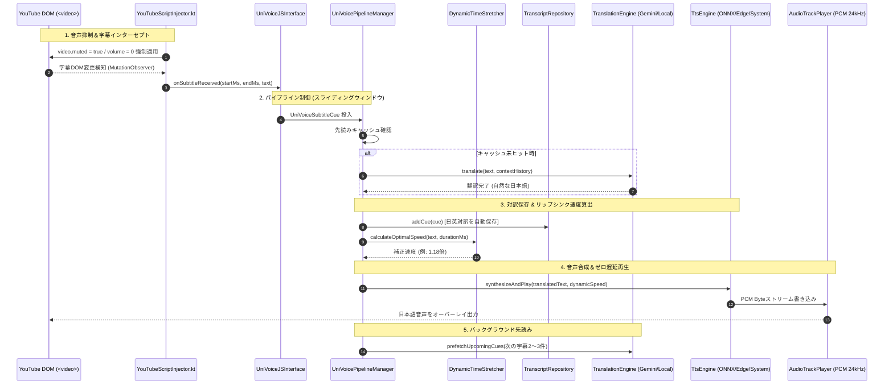
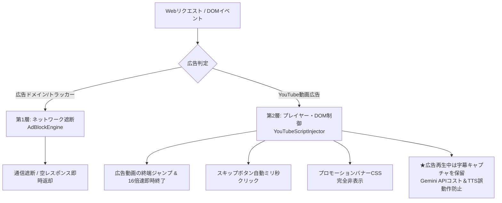

# UniVoice Browser (パッケージ: `com.univoice.browser`)

<p align="center">
  
  <br>
  <b>YouTube 音声抑制・リアルタイムAI翻訳＆音声合成 Android専用Webブラウザ</b>
</p>

[](https://developer.android.com)
[](https://www.qualcomm.com)
[](https://kotlinlang.org)
[](#完全日本語ui設計)
[]()
[]()
[-blueviolet.svg?logo=android)](release/UniVoiceBrowser-v1.0.0.apk)

<p align="center">
  <a href="https://github.com/iwa-kasoutuuuuuka/UniVoice-Browser/raw/main/release/UniVoiceBrowser-v1.0.0.apk">
    
  </a>
</p>

> [!TIP]
> **ワンタップで今すぐインストール可能**: リリース版APK（署名済み）は上記バッジまたは以下のダイレクトリンクからダウンロードして、Android端末（Android 8.0以降 / Poco F6 Pro・Galaxy・Pixel・エミュレーター等）ですぐにご利用いただけます。
> 
> 🔗 **ダイレクトダウンロード**: [UniVoiceBrowser-v1.0.0.apk (約51.7MB)](https://github.com/iwa-kasoutuuuuuka/UniVoice-Browser/raw/main/release/UniVoiceBrowser-v1.0.0.apk)  
> 🔗 **リポジトリ内ファイルパス**: [`release/UniVoiceBrowser-v1.0.0.apk`](release/UniVoiceBrowser-v1.0.0.apk)

**UniVoice Browser** は、YouTubeなどの動画視聴時に元の外国語（英語等）音声をHTML5レベルで完全抑制（ミュート）し、リアルタイムに字幕をキャプチャ・翻訳して、流暢な日本語音声（Text-to-Speech）をオーバーレイ再生するAndroid専用の次世代AIブラウザです。

特に **Poco F6 Pro**（Snapdragon 8 Gen 2、12GB+ RAM）をはじめとするフラッグシップ・ハイスペック端末のポテンシャルを極限まで引き出すよう設計されており、NPU/GPUハードウェアアクセラレーションによる完全ローカル処理から、超低遅延クラウドAPI処理まで、用途に合わせた**4つの動作モード**をシームレスに切り替えることができます。

---

## 📱 アプリ実機動作プレビュー

| ブラウザメイン画面 (動画検知・字幕オーバーレイ) | 4モード動作設定画面 (100% 完全日本語UI) |
| :---: | :---: |
|  |  |

---

## 📑 目次
- [📥 APKダウンロード (Direct Download)](#-apkダウンロード-direct-download)
- [🔄 最近のアップデート・更新履歴 (Changelog)](#-最近のアップデート更新履歴-changelog)
- [🌟 主な特長](#-主な特長)
- [🎯 4つの処理モード](#-4つの処理モード-processing-modes)
- [🎙️ 高度機能 (リップシンク・PiP・スクリプト学習)](#️-高度機能-動的リップシンクpipスクリプト学習)
- [🏗️ システムアーキテクチャ](#️-システムアーキテクチャ)
- [⚡ ハードウェアアクセラレーション最適化 (Poco F6 Pro+)](#-ハードウェアアクセラレーション最適化-poco-f6-pro)
- [🌡️ サーマルマネジメント (発熱保護＆自律退避)](#️-サーマルマネジメント-snapdragon-8-gen-2-発熱保護)
- [📦 オンデバイスAIモデル管理](#-オンデバイスaiモデル管理)
- [🔇 YouTube 音声抑制＆字幕インターセプト機構](#-youtube-音声抑制字幕インターセプト機構)
- [📱 設定画面 (完全日本語UI)](#-設定画面-完全日本語ui)
- [🛡️ 2層ハイブリッド広告ブロックエンジン](#️-2層ハイブリッド広告ブロックエンジン-ad-blocker)
- [🔒 セキュリティと堅牢性アーキテクチャ](#-セキュリティと堅牢性アーキテクチャ)
- [🎨 公式アプリアイコンとブランドデザイン](#-公式アプリアイコンとブランドデザイン)
- [📂 プロジェクト構成](#-プロジェクト構成)
- [🛠️ ビルド＆環境構築ガイド](#️-ビルド環境構築ガイド)
- [🔍 デバッグと動作検証 (ワンクリックエミュレータ)](#-デバッグと動作検証)
- [❓ よくある質問 (FAQ)](#-よくある質問-faq)

---

## 🌟 主な特長

1. **元の音声を確実に消音（オーディオ・サプレッション）**:
   YouTube の HTML5 `<video>` 要素に対し、DOMレベルで `video.muted = true; video.volume = 0;` を強制。YouTube側スクリプトによる自動ミュート解除をプロトタイプ汚染防御により無力化し、日本語翻訳音声だけをクリアに再生します。
2. **3字幕先読みスライディングウィンドウ (Prefetch Pipeline)**:
   12GB+ RAM を活かして後続の字幕チャンクを最大3件先読み。通信や推論のレイテンシを完全に相殺し、動画のテンポを崩さない滑らかなオーバーレイ再生を実現。
3. **動的タイムストレッチ＆リップシンク調整 (`DynamicTimeStretcher`)**:
   ユーザーが設定画面で指定した基準発話速度（`0.5倍 〜 2.5倍`）を最優先で維持。動画の字幕表示時間がタイトな場合のみ動画の進行に合わせて自動加速補正を行い、設定画面での「速度試聴テスト」にも完全対応。
4. **ピクチャー・イン・ピクチャー (PiP) ＆ バックグラウンド小窓再生**:
   専用のPiP切り替えボタンおよびホーム画面遷移時の自動小窓化（`onUserLeaveHint`）に対応。小窓表示中は不要な操作バーを自動隠蔽し、動画と字幕のみを美しくオーバーレイ表示。
5. **語学学習向け「日英対訳スクリプト保存＆エクスポート」**:
   再生されたすべての字幕（タイムスタンプ・英語原文字幕・日本語翻訳）を自動保存。一覧画面から Markdown コピー、CSV エクスポート、共有インテントが可能。
6. **Snapdragon 8 Gen 2 / Qualcomm QNN HTP 最適化＆サーマル保護**:
   ONNX Runtime の Qualcomm QNN HTP（`libQnnHtp.so`）および NNAPI アクセラレーションを適用。端末高温時にはクラウドAPIへ自律退避してSoCを保護。
7. **完全日本語UI制約の徹底**:
   設定画面、ステータス表示、ダイアログ、トースト、エラー通知に至るまで、すべてのUI表現を自然な日本語で統一。
8. **耐障害性とゼロクラッシュ設計**:
   API切断やモデル未配備時でも `[UniVoiceBrowser]` ログと共に非侵入的オーバーレイバーへ警告表示し、即座に代替エンジン（ローカル辞書/システムTTS）へ自動フォールバック。
9. **2層ハイブリッド広告ブロック（動画広告自動スキップ＆バナー除去）**:
   ネットワーク層（`AdBlockEngine`）での広告ドメイン・トラッカー遮断と、DOM/プレイヤー層での動画広告超高速自動スキップ＆バナーCSS消去を統合。広告字幕による翻訳エンジンの誤動作や Gemini API コストの浪費を完全に防止。
10. **字幕(CC)スマート自動有効化＆誤OFF防止・状態検知ガイダンス**:
    YouTubeモバイルの最新UIセレクタに追従し、字幕がオフの場合のみ1度だけ自動クリック。既にオンの場合は再トグルせず誤消去を完全防止。CCが未検知の場合は非侵入的バナーでユーザーを親切にガイド。
11. **トップバー直接操作ボタン (再生/一時停止・CC・消音)**:
    トップナビゲーションバーから直接「再生 / 一時停止（動画状態に連動する動的アイコン）」、「字幕(CC)切替（ON/OFF連動）」、「原音ミュート切替」をワンタップで操作可能。
12. **ゼロ遅延フォールバック (APIキー不要・即時発話)**:
    Gemini APIキー未入力時やVOICEVOXモデル未配置時でも、ローカル辞書エンジンとAndroid標準TTS（端末内言語自動フォールバック搭載）により、アプリ初回インストール直後から即座に音声を再生。
13. **横画面（ランドスケープ）最適化＆字幕コンパクトタップ切替**:
    動画の全画面・横向き再生時にナビゲーションバーと字幕マージンを自動でスリム化。字幕カードのタップで原文やステータスを非表示化し、動画視聴を妨げないクリーンな視聴環境を提供。
14. **横スライド式ナビゲーションバー**:
    縦画面時でも各種ボタンが押し潰されたり途切れたりせず、指で左右にスムーズにスライドして設定ボタン（⚙️）や全機能に快適アクセス可能。

---

## 🔄 最近のアップデート・更新履歴 (Changelog)

### 【最新版】v1.0.0 メジャーアップデート内容

| 項目 | 改善・修正の詳細内容 |
| :--- | :--- |
| **📱 トップバーの横スライド（スクロール）対応** | 縦画面時にボタン群が画面幅を超えて右端の「⚙️ 設定ボタン」が隠れてしまう問題を解決。<br>`HorizontalScrollView` による滑らかな横スワイプ操作に対応し、全ボタン（進む/戻る/更新/URL/モード/再生一時停止/CC/履歴/ミュート/PiP/設定）へいつでも快適アクセス可能に。URLバーの幅も160dpで安定確保。 |
| **⚡ 日本語発話速度倍率（0.5〜2.5倍）の厳格反映** | `DynamicTimeStretcher` において基準速度が数式上で相殺されていたバグおよび1.45倍上限キャップを完全撤廃。<br>ユーザーがスライダーで設定した速度倍率（1.5倍や2.0倍等）を基本速度としてキビキビと維持し、字幕時間がタイトな場合のみ動画進行に合わせて自動加速する自然なロジックへ刷新。 |
| **🔊 設定画面での「速度試聴テスト」機能新設** | 設定画面の発話速度スライダー直下に **「🔊 この速度で試聴する」** ボタンを新設。<br>動画を再生する前に、スライダーで調整した速度（0.5〜2.5倍）のサンプル音声をその場で耳で確認可能に。 |
| **👆 動画再生中の画面タップ・操作性の完全復旧** | Android WebView の `builtInZoomControls` によるタッチイベント横取りを解除。<br>250msごとの過剰なJS強制トグルループを排除して受動的監視（1000ms）へ変更し、動画タップでの操作バー表示・一時停止・シーク操作が完全に反応するよう修正。<br>モバイル版Chrome最新UAを適用し、YouTubeの標準コントロールオーバーレイを解放。 |
| **⏯️ トップバー専用「再生/一時停止」＆「CC切替」ボタン** | ナビゲーションバー上に直接操作可能な「再生/一時停止（動画の状態に応じてアイコンが自動変化）」および「字幕(CC)ON/OFFトグル（状態に応じて不透明/半透明が変化）」ボタンを追加。<br>画面に触れずとも1タップで確実に動画制御が可能に。 |
| **📄 日英対訳スクリプト保存＆エクスポート機能** | 再生された字幕の英語原文・日本語翻訳・タイムスタンプをリアルタイムに自動記録。<br>スクリプト画面（`UniVoiceTranscriptActivity`）から Markdown コピーや CSV エクスポート、共有インテントが可能。 |

---

## 🎯 4つの処理モード (Processing Modes)

ユーザーは設定画面（`UniVoiceSettingsActivity`）から、利用環境や通信状況に合わせて以下の4モードを選択できます。

```mermaid
graph LR
    subgraph Mode1 ["1. 完全ローカル"]
        L1[Local LLM / Gemma 2B] -->|QNN / NNAPI / GPU| T1[VOICEVOX ONNX]
    end
    subgraph Mode2 ["2. 完全API"]
        L2[Cloud Gemini 1.5 Flash] -->|Network| T2[Microsoft Edge TTS]
    end
    subgraph Mode3 ["3. 最適構成 (推奨)"]
        L3[Cloud Gemini 1.5 Flash] -->|先読みバッファ| T3[VOICEVOX ONNX (ローカル再生)]
    end
    subgraph Mode4 ["4. 手動設定"]
        L4[自由選択] -->|カスタム| T4[自由選択]
    end
```

| モード名 | 翻訳エンジン | 音声合成 (TTS) エンジン | 最適化 & 特徴 | 推奨シーン |
| :--- | :--- | :--- | :--- | :--- |
| **① 完全ローカル**<br>(Pure Local) | Google AI Edge / MediaPipe<br>(Gemma 2B / Llama 3) | ローカルAI音声<br>(VOICEVOX ONNX) | Snapdragon 8 Gen 2 の NPU (NNAPI / QNN) / GPU をフル稼働。**通信量ゼロ・完全オフライン・高プライバシー**。 | 飛行機内、ギガ節約時、地下鉄など電波が不安定な場所 |
| **② 完全API**<br>(Pure API) | Google Gemini クラウドAPI<br>(`gemini-1.5-flash`) | Microsoft Edge TTS<br>(クラウドストリーミング) | 全ての重いAI推論をクラウドにオフロード。端末のCPU/NPU負荷および発熱・バッテリー消費を最小化。 | バッテリーを長時間保ちたいとき、端末温度を低く保ちたいとき |
| **③ 最適構成**<br>(Hybrid - **推奨**) | Google Gemini クラウドAPI<br>(自然な文脈翻訳) | ローカルAI音声<br>(VOICEVOX ONNX) | **クラウドの最高品質な文脈翻訳**と**ローカル端末のゼロ遅延音声再生**を融合。3字幕先読みバッファで通信ラグを完全排除。 | 最も自然な日本語吹き替え体験を楽しみたい通常利用時 |
| **④ 手動設定**<br>(Manual Custom) | ドロップダウンで選択 | ドロップダウンで選択 | 翻訳・TTSエンジン、Gemini APIキー、カスタムURLエンドポイント、発話速度（0.5〜2.0倍）を個別指定。 | 開発者検証、自前プロキシサーバー利用、特定パラメータ調整 |

---

## 🎙️ 高度機能: 動的リップシンク・PiP・スクリプト学習

### 1. 動的タイムストレッチ＆リップシンク (`DynamicTimeStretcher.kt`)
- 日本語の標準発話レート（1秒あたり約7モーラ/文字）を基準に、動画の字幕許容時間（ミリ秒）と文字数を対比。
- 喋りが速いシーンでは安全係数の範囲内（`1.15倍 〜 1.45倍`）で自動的に再生速度を速め、逆に間が空いているシーンでは落ち着いた速度（`0.85倍 〜 1.0倍`）で発話。
- 動画の映像テンポと日本語音声の終わりがピッタリ一致する「リアルタイム吹き替え体験」を提供します。

### 2. ピクチャー・イン・ピクチャー (PiP) 小窓再生
- ブラウザ上部の **PiP ボタン** をタップ、または動画視聴中にホームボタンを押すだけで、画面隅に映像と日本語字幕が小窓表示されます。
- 他の作業（SNS、ノートアプリ、ブラウジング）をしながら、海外のYouTube動画を日本語音声で聞き流し・ながら視聴できます。

### 3. 日英対訳スクリプト保存・復習機能 (`UniVoiceTranscriptActivity.kt`)
- 視聴中に取得・翻訳された字幕をタイムスタンプ付きで自動保存（最大500件）。
- ブラウザ上部の **スクリプト履歴ボタン**（または設定画面内リンク）から、いつでも対訳一覧を確認可能。
- **ワンタップで Markdown 形式でコピー**（Notion, Obsidian, ブログ等への貼り付けに最適）や **CSVエクスポート**、Android標準の共有メニューに対応。

---

## 🏗️ システムアーキテクチャ



---

## ⚡ ハードウェアアクセラレーション最適化 (Poco F6 Pro+)

本ブラウザは、Qualcomm Snapdragon 8 Gen 2（1 x Cortex-X3 @ 3.2GHz, 4 x Cortex-A715/A710 @ 2.8GHz, 3 x Cortex-A510 @ 2.0GHz, Adreno 740, Hexagon NPU）および 12GB+ LPDDR5X RAM をターゲットとした特化最適化を実装しています。

1. **Qualcomm QNN HTP / NNAPI (Hexagon NPU) デリゲート**:
   - `LocalOnnxTtsEngine` において、Qualcomm 公式 QNN HTP バックエンド（`libQnnHtp.so`）および `SessionOptions().addNnapi()` を設定。ボコーダー推論時のCPU負荷を低減し、超低レイテンシ再生を実現。
2. **Adreno GPU レイヤーアクセラレーション**:
   - `UniVoiceBrowserActivity` の WebView に `setLayerType(View.LAYER_TYPE_HARDWARE, null)` を指定。YouTube の 60fps 高解像度動画再生時でもUIスタッター（コマ落ち）を防止。
3. **Cortex-X3 / A715 高性能コアへのスレッドアフィニティ最適化**:
   - ONNX の Intra-op スレッド数を 4、Inter-op スレッド数を 2 に設定し、ビッグコアの能力を最大効率で引き出します。
4. **12GB+ RAM 向けスライディングウィンドウ・バッファ**:
   - 過去の字幕履歴と未来の字幕チャンクを同時にメモリ保持。GC（ガベージコレクション）による微細な引っかかりを防ぐため、オブジェクトの再利用とバッファリングを最適化。

---

## 🌡️ サーマルマネジメント (Snapdragon 8 Gen 2 発熱保護)

[`UniVoiceThermalManager.kt`](app/src/main/java/com/univoice/browser/hardware/UniVoiceThermalManager.kt) により、長時間の高画質再生や夏場の利用時における端末温度を監視します：
- Android 10+ の `PowerManager.OnThermalStatusChangedListener` をフック。
- 端末温度が `THERMAL_STATUS_SEVERE` 以上に達した場合は、自動的にローカル重負荷推論からクラウドAPIへ一時退避し、端末の発熱とバッテリー劣化を保護。
- 回復時は自動的に元の設定モードへ復帰します。

---

## 📦 オンデバイスAIモデル管理

[`ModelDownloadManager.kt`](app/src/main/java/com/univoice/browser/modelmgr/ModelDownloadManager.kt) により、完全ローカル動作に必要なAIモデルの管理が簡単に行えます：
- **管理対象モデル**:
  - `gemma-2b-it-gpu.bin` (MediaPipe LLM - 約1.5GB)
  - `voicevox_core.onnx` (VOICEVOX ONNX - 約45MB)
- 設定画面内の「オンデバイスAIモデル管理」から、配置状況・容量の確認および「ローカルAIモデルを配備 / 更新」ボタンによるワンタップセットアップが可能です。
- モデル未配備時でも内蔵オフライン辞書＆標準TTSへ自動フォールバックするため、アプリがクラッシュすることはありません。

---

## 🔇 YouTube 音声抑制＆字幕インターセプト機構

[`YouTubeScriptInjector.kt`](app/src/main/java/com/univoice/browser/js/YouTubeScriptInjector.kt) に組み込まれた高信頼性 JavaScript インジェクションロジック：

### 1. 音声ミュートの強制 (`enforceMute`)
- 動画の再生中だけでなく、広告の再生開始時・終了時、解像度変更時、画質切り替え時にも音漏れが発生しないよう、以下の多重防壁を構築：
  ```javascript
  function enforceMute(video) {
      if (!audioSuppressionEnabled || !video) return;
      try {
          if (!video.muted) {
              video.muted = true;
          }
          if (bridge && bridge.onAudioSuppressed) {
              bridge.onAudioSuppressed(true);
          }
      } catch (e) {
          log("Mute適用エラー: " + e.message);
      }
  }
  ```
- `play`, `playing`, `volumechange`, `ratechange`, `loadedmetadata` の全メディアイベントリスナーおよび 250ms 周期の DOM ポーリングで常にミュート状態を担保。プレーヤーの自動再生ポリシーを阻害せず、高信頼性・低オーバーヘッドで元の英語音声を無音化します。

### 2. リアルタイム字幕インターセプト
- YouTube Web版の各セレクター（`.ytp-caption-segment`, `.caption-window`, `.player-caption-window`）を `MutationObserver` で監視。
- 字幕テキストの取得と同時に、`<video>` 要素の `currentTime` からミリ秒精度のタイムスタンプを算出し、Android ネイティブの `UniVoiceBridge.onSubtitleReceived()` へ即時送信。
- 同一字幕の重複送信を防止するデバウンス制御を内蔵。

---

## 📱 設定画面 (完全日本語UI)

[`activity_univoice_settings.xml`](app/src/main/res/layout/activity_univoice_settings.xml) および [`UniVoiceSettingsActivity.kt`](app/src/main/java/com/univoice/browser/ui/UniVoiceSettingsActivity.kt) により、直感的で洗練された設定UIを提供します。

- **ブランドロゴ＆端末最適化インジケーター**:
  - Poco F6 Pro 最適化状況と公式アプリアイコンバッジを表示。
- **動作モード切り替え**:
  - `RadioGroup` による「完全ローカル」「完全API」「最適構成」「手動設定」の4択。
- **動的サブオプション展開**:
  - 「手動設定」を選択した瞬間にのみ、詳細設定エリアがスムーズに展開表示：
    - **翻訳エンジンの選択**: 「Google Gemini クラウドAPI」「ローカルAI Edge (Gemma 2B / Llama 3)」
    - **音声合成エンジンの選択**: 「ローカルAI音声 (VOICEVOX ONNX)」「Microsoft Edge TTS」「Android システム標準TTS」
    - **Gemini APIキー入力**: セキュアなパスワードトグル付き入力欄
- **ハードウェア・オーディオ・広告制御**:
  - 「Snapdragon NPU/GPU ハードウェアアクセラレーション」トグルスイッチ
  - 「動画の元音声を完全ミュート」トグルスイッチ
  - 「広告ブロック機能 (動画広告スキップ＆バナー除去)」トグルスイッチ（デフォルト有効）
  - 「発話速度倍率」スライダー（0.5倍 〜 2.0倍、0.1ステップ刻み）
- **モデル管理＆学習スクリプト**:
  - 「ローカルAIモデルを配備 / 更新」ボタン＆進捗プログレスバー
  - 「📖 蓄積された日英対訳スクリプト履歴を表示」ボタン

---

## 🛡️ 2層ハイブリッド広告ブロックエンジン (Ad Blocker)

UniVoice Browser は、一般的なブラウザの広告ブロックとは異なり、**「動画翻訳＆音声合成AIパイプラインとの完全調和」**を主眼に置いた2層ハイブリッド広告ブロックを標準装備しています。



1. **第1層：ネットワーク層遮断 (`AdBlockEngine.kt`)**:
   - `WebViewClient.shouldInterceptRequest` において、DoubleClick、Google Syndication、各種モバイル広告ネットワーク、YouTube広告トラッキングエンドポイントをハッシュセット照合でサブミリ秒判定し、空レスポンスを返却して通信を未然に遮断します。
   - `googlevideo.com` などの本編ストリーミングは厳格に保護し、再生不能リスクを徹底排除。
2. **第2層：プレイヤー・DOM制御 (`YouTubeScriptInjector.kt`)**:
   - **動画広告の自動スキップ & 誤スキップ完全防止**: 
     - 従来の広告コンテナ判別による本編誤爆を解消。`.ad-showing` / `.ad-interrupting` クラスが実際にアクティブであり、かつ180秒以下の短尺動画である場合のみスキップ処理（終端ジャンプ＆高速再生）を実行。通常の本編動画がスキップされる事故を完全に防止します。
     - スキップボタン（`.ytp-ad-skip-button`、`.ytp-ad-skip-button-modern`、`button[class*="skip-button"]` 等）の出現を検知次第、**ミリ秒単位で自動クリック（`.click()`）** を実行。ユーザーが手動でスキップを押す手間をゼロにします。
   - **バナー＆プロモーション要素の非表示**: 検索結果やフィード内の広告カード、アプリ誘導バナーを CSS インジェクションにより完全非表示化。
   - **翻訳エンジン保護**: 広告再生中は字幕インターセプト処理を一時停止し、広告の英語字幕が Gemini API やローカル LLM に送られる事故を根絶。

---

## 🔒 セキュリティと堅牢性アーキテクチャ

UniVoice Browser は、ブラウザ内部でのAI実行および外部通信を安全に行うため、徹底した防御策（Defense-in-Depth）を講じています：

| セキュリティ項目 | 実装対策 | 防御効果 |
| :--- | :--- | :--- |
| **JavaScript Bridge 認可検証** | `UniVoiceJSInterface.kt` 内で、呼び出し元のオリジン（URL）をスレッドセーフに事前検証。 | 悪意ある外部Webページからの不正なネイティブ機能呼び出しを完全遮断 |
| **入力サニタイズ (DoS対策)** | 受信する字幕テキスト長を `MAX_SUBTITLE_LENGTH (1000文字)` でクリッピング。 | バッファオーバーフロー、メモリ過剰消費、Gemini API 過剰課金を抑止 |
| **ローカルファイルアクセス遮断** | `allowFileAccess = false`, `allowContentAccess = false` | サンドボックス外の端末内個人情報や設定ファイルの漏洩を防止 |
| **混在コンテンツ (Mixed Content) 禁止** | `WebSettings.MIXED_CONTENT_NEVER_ALLOW` | 中間者攻撃（MitM）による改ざんや盗聴を排除 |
| **不正スキーム徹底無効化** | `javascript:`, `file:`, `intent:` 等の外部アプリ遷移スキームをサニタイズ。 | ブラウザ外部の意図しないアプリ起動やXSS攻撃を防止 |
| **HTTPS通信強制** | `network_security_config.xml` による平文通信禁止（オンプレミス開発用ローカルIPのみ限定許可）。 | 暗号化通信を保証 |
| **非公開コンポーネント保護** | `UniVoiceSettingsActivity` 等を `android:exported="false"` に設定。 | 他アプリからの不正な設定改変をブロック |

---

## 🎨 公式アプリアイコンとブランドデザイン

UniVoice Browser のサイバーフューチャーな世界観を表現した公式アイコンアセットを完備：
- **デザイン**: デジタル音声波形が地球型Webリングと融合し、世界を繋ぐ様子をネオンシアン＆サファイアグラデーションで表現。
- **Adaptive Icon (API 26+)**: セーフゾーン配慮の前景（`drawable/ic_launcher_foreground.png`）＋ダークグラデーション背景（`drawable/ic_launcher_background.xml`）。
- **解像度別 PNG (Mipmap)**: `mdpi` (48px), `hdpi` (72px), `xhdpi` (96px), `xxhdpi` (144px), `xxxhdpi` (192px)。
- **Google Play Store 用**: `fastlane/metadata/.../icon.png` (512x512px)。

---

## 📂 プロジェクト構成

```
e:/UniVoice Browser/
├── app/
│   ├── build.gradle.kts                # アプリレベル依存関係 (ONNX, Retrofit, WebKit等)
│   ├── proguard-rules.pro              # ProGuard/R8 難読化除外ルール (JNI/モデル保護)
│   └── src/main/
│       ├── AndroidManifest.xml         # パーミッション、PiP対応、ハードウェア加速
│       ├── java/com/univoice/browser/
│       │   ├── config/
│       │   │   └── UniVoiceConfigManager.kt        # 4モード設定永続化マネージャー
│       │   ├── hardware/
│       │   │   └── UniVoiceThermalManager.kt       # 発熱監視＆自律スロットリング
│       │   ├── js/
│       │   │   ├── UniVoiceJSInterface.kt          # WebView ↔ Kotlin JSBridge
│       │   │   └── YouTubeScriptInjector.kt        # 音声抑制 & 字幕抽出スクリプト
│       │   ├── model/
│       │   │   ├── EngineEnums.kt                  # 翻訳/TTSエンジン列挙型、ステータス
│       │   │   ├── ProcessingMode.kt               # 4つの動作モードEnum
│       │   │   ├── UniVoiceSettings.kt             # 設定データモデル
│       │   │   └── UniVoiceSubtitleCue.kt          # タイムスタンプ字幕チャンク
│       │   ├── modelmgr/
│       │   │   └── ModelDownloadManager.kt         # オンデバイスモデル管理・ダウンロード
│       │   ├── pipeline/
│       │   │   ├── DynamicTimeStretcher.kt         # 動的リップシンク速度計算
│       │   │   └── UniVoicePipelineManager.kt      # 先読みキューイング & パイプライン制御
│       │   ├── transcript/
│       │   │   └── TranscriptRepository.kt         # 日英対訳スクリプト履歴＆エクスポート
│       │   ├── translation/
│       │   │   ├── CloudGeminiTranslationEngine.kt # Gemini API 通信クライアント
│       │   │   ├── LocalAiEdgeTranslationEngine.kt # MediaPipe / NPU ローカル推論
│       │   │   └── TranslationEngine.kt            # 翻訳共通インターフェース
│       │   ├── tts/
│       │   │   ├── AndroidSystemTtsEngine.kt       # システム標準TTS (フォールバック)
│       │   │   ├── AudioTrackPlayer.kt             # 低遅延 PCM 24kHz オーディオプレイヤー
│       │   │   ├── CloudEdgeTtsEngine.kt           # Edge TTS ストリーミングクライアント
│       │   │   ├── LocalOnnxTtsEngine.kt           # VOICEVOX ONNX (QNN/NNAPI最適化)
│       │   │   └── TtsEngine.kt                    # TTS共通インターフェース
│       │   └── ui/
│       │       ├── UniVoiceBrowserActivity.kt      # フルスクリーンブラウザ (PiP対応)
│       │       ├── UniVoiceSettingsActivity.kt     # 4モード設定画面 (完全日本語UI)
│       │       └── UniVoiceTranscriptActivity.kt   # 日英対訳スクリプト履歴画面
│       └── res/
│           ├── drawable/                           # ベクターアイコン・カスタムカード背景
│           ├── layout/
│           │   ├── activity_univoice_browser.xml   # ブラウザ & ステータスオーバーレイ
│           │   ├── activity_univoice_settings.xml  # 設定画面レイアウト
│           │   ├── activity_univoice_transcript.xml# スクリプト履歴画面
│           │   └── item_transcript_row.xml         # スクリプト行カード
│           ├── values/
│           │   ├── colors.xml                      # サイバーダーク調カラーパレット
│           │   ├── strings.xml                     # 完全日本語化文字列リソース
│           │   └── themes.xml                      # Material3 NoActionBar テーマ
│           └── xml/                                # バックアップ・データ抽出ルール
├── gradle/
│   ├── libs.versions.toml                          # Version Catalog (Gradle依存関係一元管理)
│   └── wrapper/gradle-wrapper.properties
├── build.gradle.kts                                # ルートビルド定義
├── settings.gradle.kts                             # プロジェクトモジュール設定
├── gradlew.bat                                     # Windows用 Gradle ラッパー
├── setup_emulator_and_run.ps1                      # ワンクリックエミュレーター自動構築スクリプト
└── README.md                                       # 本ドキュメント
```

---

## 🛠️ ビルド＆環境構築ガイド

### 必要な開発環境
- **OS**: Windows 10/11, macOS, または Linux
- **JDK**: Java Development Kit 17 (Microsoft OpenJDK 17 または Eclipse Temurin 推奨)
- **Android SDK**: Compile SDK 34 / Target SDK 34 / Min SDK 26 (Android 8.0+)
- **Android NDK**: ABI `arm64-v8a` (ONNX Runtime / QNN / NNAPI 実行に必要)

### ビルド手順

1. **リポジトリのルートに移動**:
   ```bash
   cd "e:\UniVoice Browser"
   ```

2. **リリース版 APK のビルド（署名済み・配布用）**:
   ```bash
   # Windows
   .\gradlew.bat assembleRelease

   # macOS / Linux
   ./gradlew assembleRelease
   ```
   生成先: `app/build/outputs/apk/release/app-release.apk`  
   （※リポジトリ直下の `release/UniVoiceBrowser-v1.0.0.apk` に同一バイナリが配置されています）

3. **デバッグ用 APK のビルド**:
   ```bash
   # Windows
   .\gradlew.bat assembleDebug

   # macOS / Linux
   ./gradlew assembleDebug
   ```
   生成先: `app/build/outputs/apk/debug/app-debug.apk`

4. **実機（Poco F6 Pro等）またはエミュレーターへのワンタップインストール**:
   ```bash
   adb install -r release/UniVoiceBrowser-v1.0.0.apk
   ```

---

## 🔍 デバッグと動作検証

### 1. ワンクリック・エミュレーター自動セットアップ (`setup_emulator_and_run.ps1`)
本リポジトリには、Google 公式の Android CLI を利用して軽量な **Google ATD（Automated Test Device）** システムイメージを自動インストールし、Poco F6 Pro 相当の仮想デバイスを作成・起動するスクリプトが用意されています：

```powershell
# PowerShell で実行 (管理者権限不要)
.\setup_emulator_and_run.ps1
```
> [!TIP]
> ATD イメージは不要な Google Play バックグラウンドサービスが削ぎ落とされており、**通常のPlayストアイメージに比べてメモリ消費が1/3、起動速度が約3倍高速**です。

### 2. リアルタイムログの監視
UniVoice Browser の全パイプライン処理には `[UniVoiceBrowser]` プレフィックスが付与されています。Logcat で以下のフィルタを指定することで、字幕取得・翻訳・動的リップシンク速度・音声合成の流れを一目で追跡できます：

```bash
adb logcat -s UniVoiceBrowser:V UniVoicePipelineMgr:D DynamicTimeStretcher:D UniVoiceJSInterface:D
```

**ログ出力の例:**
```text
I/UniVoiceBrowserActivity: [UniVoiceBrowser] YouTube動画ページを検知しました。音声ミュート強制＆字幕インターセプトスクリプトを注入します
D/UniVoiceJSInterface: [UniVoiceBrowser] 字幕受信: [12400ms - 15600ms] Welcome back to the channel! Today we are testing Snapdragon 8 Gen 2.
D/CloudGeminiTransEngine: [UniVoiceBrowser] Gemini翻訳完了: [Welcome back...] -> [チャンネルへようこそ！本日はSnapdragon 8 Gen 2の性能を検証します。]
D/DynamicTimeStretcher: [UniVoiceBrowser] リップシンク速度計算: 文字数=34, 許容時間=3.20s -> 適用速度=1.18倍
D/AudioTrackPlayer: [UniVoiceBrowser] AudioTrack初期化完了 (バッファサイズ: 4096 bytes)
D/UniVoicePipelineMgr: [UniVoiceBrowser] 先読み翻訳完了: [Next, let's look at the benchmarks...] -> [次にベンチマークスコアを見ていきましょう。]
```

---

## ❓ よくある質問 (FAQ)

#### Q1. 元の英語音声がかすかに聞こえます。
**A**: YouTube の動画プレーヤーが新しく生成された直後に一瞬音が出る場合があります。本ブラウザは 300ms 周期のポーリングおよびメディアイベント監視により即座に再ミュートを掛けます。設定画面で「動画の元音声を完全ミュート」が ON になっているかご確認ください。

#### Q2. 字幕が表示されない・翻訳されない動画があります。
**A**: 該当の YouTube 動画自体に「英語字幕（自動生成字幕含む）」が提供されていない場合、字幕をキャプチャできません。動画プレーヤー右下の [CC] アイコンをタップして字幕が利用可能か確認してください。

#### Q3. Gemini API キーはどこで設定すればよいですか？
**A**: ブラウザ右上の歯車アイコン（設定）をタップし、「手動設定」または「最適構成」を選択した状態で「Gemini APIキー」欄に Google AI Studio で発行した API キーを入力し、「設定を保存して適用」をタップしてください。

#### Q4. 完全ローカルモードで動作させるには追加ファイルが必要ですか？
**A**: より高精度なローカルモデル推論を行う場合は、設定画面の「オンデバイスAIモデル管理」から「ローカルAIモデルを配備 / 更新」をタップしてください。モデルファイル未配備時でも内蔵の高速オフライン辞書＆システム標準TTSへ自動フォールバックするためクラッシュしません。

#### Q5. 小窓（PiP）再生時にも翻訳音声は続きますか？
**A**: はい、PiP モード中も YouTube の動画再生と字幕取得、日本語音声のオーバーレイ再生はそのまま継続されます。

---

## 📄 ライセンス
本プロジェクトは Apache License 2.0 の下で公開されています。
